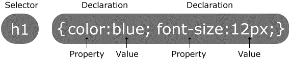

## CSS

A cascading style sheet comprises a set of style properties and values which are applied to selected HTML elements.

The range of style **properties** available and their valid lists of **values** are assimilated through usage.  A cheatsheet list these as a convenient point of reference.

You can find a range of cheat-sheets at [cheat-sheets.org](http://www.cheat-sheets.org/) or [cheatography](https://cheatography.com/programming/).

A cheatsheet for css can be seen at [Cheatography](https://cheatography.com/davechild/cheat-sheets/css2/).

A CSS rule-set consists of a **selector** and a **declaration** block.

* The selector points to the HTML element you want to style.
* The declaration blocks contains one or more declarations separated by semicolons.
* Each declaration includes a CSS property name and a value, separated by a colon.
* A CSS declaration always ends with a semicolon.
* Declarations blocks are surrounded by curly brackets.

In the following example all `<h1>` elements in a page will be given a font size of 12px, with a blue text colour:



### external stylesheet

Styles can be added to a file by adding a `<link>` to an **external** stylesheet.  This is good to define styles which are general to the whole site.

```html
<head>
    <link rel="stylesheet" type="text/css" href=“MYSTYLESHEET.css">
</head>
```
### internal stylesheet

Styles can be added to a file by adding `<style></style>` elements in the `<head>` of an html document.  This is good to define styles which are specific to the page, and some of these may overide the more general style set in the external stylesheet.

```html
<style>
    body {background-color: linen;}
    h1   {color: maroon; margin-left: 40px;} 
</style>
```

### inline style 

Styles can be added to a file by adding a style attribute to any individual elemet in the HTML document.  This is useful when you want to add a style to a single specific element on the page overiding any style set by the external file or the internal style.

```html
<h1 style="color:blue;margin-left:30px;">
	This is a heading
</h1>
```


If you want to use external or internal style you need to master selectors which determine which elements are affected by styles together with the valid combinations of elements and style attributes and values.

For example a file named style.html is in the public folder,  This file also includes style inline within an HTML element.

```html
<h1 style="color:blue;margin-left:30px;">
```

This style is close to the header and wins if there is any contention with an inline or external stylesheet.

## selectors

Selectors are needed to determine what is to be affected by the style in the case of an external or intenal stylesheet.  If you apply style inline using a style attribute the style is applied directly to the element so there is no need to use a selector here.


|CSS2 Selectors | applied to elements   |
| -------       | -------               |
| *             | All elements              |
| div            |`<div>`
|div span       | `<span>`nested in `<div>`        |
|div, span      |both `<div>` and `<span>`           |
|div > span     | `<span>` which is a child of `<div>` |
|div + span     | `<span>` preceded by `<div>` |
| .class        |  All elements with class = "class" |
|div.class      | `<div>` element with class =  "class"|
|#unique        | Element with id "unique" |
|div#itemid     |`<div>` with id "itemid" |
|a[attr]        |`<a>` with attribute "attr"|
|a[attr='x']    | `<a>` when "attr" is "x" |
|a[class~='x']  |`<a>` when class is a list containing 'x'|
|a[lang='en']  |`<a>` when lang begins "en" |

Example

```css
 div.insheet h1{ color:maroon; margin-left:40px;}
```
This line uses the descendants selector to find an `<h1>` element which is inside a `<div>` with class = "insheet".

An external css file **myStyle.css**

```css
body{  background-color:lightblue;}
h1{     color:navy; 
        margin-left:20px;
}
```

is linked within a `<link>' element.

```html
<link rel="stylesheet" type="text/css" href="CSS/myStyle.css">
```

In general an external stylesheet provides overall style to a full site.  An inline stylesheet provides a local override for a particular page within the site.

Inline style provides a small number of localised or unique style adjustments which override both the external and internal stylesheet.

The full listing of **style.htm**l is:

```html
<!DOCTYPE html>
<html>
    <head>
        <title>Page Title</title>
        <link rel="stylesheet" type="text/css" href="CSS/myStyle.css">
    
        <style> 
            div.insheet{ background-color:linen;}
            div.insheet h1{ color:maroon; margin-left:40px;}
        </style>
    
    </head>
    <body>
        <h1>First Level Heading</h1>
        <p>Opening paragraph.</p>

        <div class ="insheet">
            <h1>Inline stylesheet</h1>
        <p>Inline Stylesheet added to head</p>
        </div>

        <h1 style="color:blue;margin-left:30px;">
            This is a heading with inline style
        </h1>
        
    </body>
</html>
```

Which produces:

<iframe 
    height="250" 
    width="100%" 
    scrolling="no" 
    title="Hello.html" 
    src="Block_1/section_2/public/style.html" 
    frameborder="no" 
    loading="lazy" 
    allowtransparency="true" 
    allowfullscreen="true">
</iframe>