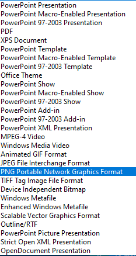

## MarkDown

Markdown is a good format to write up details of Internet Technology topics or to present tutorials.

Markdown is a simple syntax which is stored in a text file with .md format this can then be converted by an application into HTML.  Visual studio recognises markdown and will show a preview of a markdown file in the right hand column which shows the HTML version.  This means that you can use a markdown site to document a programme in the editor, and for that purpose you do not need to upload to any web server.

Applications such as [pandoc](https://pandoc.org/) are available to convert markdown into a range of other formats utilising a stylesheet to provide output formatting.  

Github has a [pages](https://pages.github.com/) feature which allows a website to be displayed from files in an identified directory or repository.

[Jekyll](https://jekyllrb.com/) is a well established page generator which takes in markdown and generates websites.  Github is ready to use Jekyll and recognises files starting with underscore as having a special significance.  

[Docsify](https://docsify.js.org/#/) is a website generator which will take markdown pages and dynamically convert them to an HTML site by using the VUE framework.  This has a range of options, one of which is a sidebar navigation which operates using a file named _sidebar.md. 

A site generated by docsify can be previewed in visual studio code by using the Live Server plugin.  You may subsequently upload it to a server or github pages.

If you wish to present a docsify site on github pages you will need to add an empty file named **.nojekyll ** into folders which use filenames stating with underscore.  This prevents github pages from interpreting these according to the jekyll scheme.

There are many [guides to markdown](https://www.markdownguide.org/) and some extra features are available in various versions, but the spirit of markdown is to produce simple, easy to write script so it is better to stay with the basic elements. A quick reference [cheat sheet](https://www.markdownguide.org/cheat-sheet/) shows the main syntax and I have used this as a basis for the illustration below.

The best way to pick up markdown is to use it. Her is a simple guide to some of the code

## Markdown code

### Headings
Levels of heading are indicated by hash signs
<pre>
# Heading 1

normal text

## Heading 2

normal text

### Heading 3

normal text
</pre>

# Heading 1

normal text

## Heading 2

normal text

### Heading 3

normal text

### Italic and Bold

Different text emphasis effects are achieved by bracketing text between on or two asterixes.
Do not include any space between the asterix and the enclosed text.

<pre>
*Single asterix italicices*

**Double asterix enboldens**

*Single asterix italicices***Double asterix enboldens**
</pre>

*Single asterix italicices*

**Double asterix enboldens**

*Single asterix italicices***Double asterix enboldens**

 
### Lists

A list can be ordered by an index number.  Include a space after numbering before the text.

A numbered list will keep numbering continuously even if you try to force the numbering unless you end the list with something else such as normal text.  Here are two lists which are not intended to run together.

<pre>
1. First item  
2. Second item
3. Third item

normal text

1. First item  
2. Second item 
3. Third item

Not like this!

1. First item  
2. Second item
3. Third item

1. First item  
2. Second item 
3. Third item
</pre>

1. First item  
2. Second item
3. Third item

normal text

1. First item  
2. Second item 
3. Third item

Not like this!

1. First item  
2. Second item
3. Third item

1. First item  
2. Second item 
3. Third item

An unordered list is easy to create, but there are options on the symbol to use to generate the bullet point. I usually prefer to use the asterix. You should not care at this point whether the bulet points are round or square, that is a formatting aspect to consider later.

<pre>
- First item
- Second item
- Third item

or

* First item
* Second item
* Third item

or 

+ First item
+ Second item
+ Third item
</pre>

- First item
- Second item
- Third item

or

* First item
* Second item
* Third item

or 

+ First item
+ Second item
+ Third item


### Blockquote

A blockqooute section is useful to indicate to a reader the code which they should enter in a tutorial context.

<pre>> node --version</pre>

> node --version

### code

Take care to use the tick symbol to identify code blocks.  For me, this is to the left of the nuber 1 key on a PC keyboard.  On the Mac it is to the left of Z.

The code block is useful to show the output of a process in response to user input.

<pre>```code
Output listing
```</pre>

```code
Output listing
```

To document programmes it is useful to copy extracts across from programmes being developed in the visual studio code editor.  Some languages are recognised and the enclosed code extracts will gain basic syntax highlighting by using the language name instead of 'code'.  The highlighting scheme which you see in visual studio code may differ from what you see online, for example in a github page as a different stylesheet is being applied.  If you use pandoc for document conversion you can apply your own spreadsheet.

<pre>
```javascript
// syntax highligted javascript
```

```html
&lt;!-- syntax highlighted html -->
```

```json
{"name":"syntax highlighted json"}
```
</pre>

```javascript
// syntax highligted javascript
```

```html
<!-- syntax highlighted html -->
```

```json
{"name":"syntax highlighted json"}
```
### Links

Links to external websites are attatched to text using square and round brackets.  

Links to images are achieved by adding an exclamation mark in front of the link.  The image address can be relative to the markdown document of a full URL of an external image.

<pre>
[Markdown Guide](https://www.markdownguide.org)


</pre>

[Markdown Guide](https://www.markdownguide.org)


### Table

Information can be organised into tables.  White space can be used to impropve the readability of the markdown file, but this does not affect the converted version.

<pre>
| Syntax      | Description |
| ----------- | ----------- |
| Header      | Title       |
| Paragraph   | Text        |
</pre>

| Syntax      | Description |
| ----------- | ----------- |
| Header      | Title       |
| Paragraph   | Text        |


You will find other elements of extended syntax in the markdown guide and other references.  If you want to use these you will need to try them out in visual studio code to see what works and what does not.

### Horizontal Rule

A document may be sectioned using a horizontal rule.  The heading level 1 adds one by default.  This just needs three hyphens, but is won't matter if you add more so that the line is clearer in the markdown version of your text.

<pre>---</pre>

---

### HTML

Markdown converts text to HTML so you can freely include any HTML in the markdown file and it will be interpreted.  

In order to show, in this document, the unconverted markdown text I have enclosed the markdown in HTML `<pre></pre>` tags.

If you want to display html as text rather than interpret it this cand be bracketed by a single tick.

<pre>
`&lt;pre>&lt;/pre>`
</pre>

Also you may need to replace HTML brackets <> by literals ampesand lt; and ampesand gt;

```code
<pre>
`&lt;pre>&lt;/pre>`
</pre>
```

You could also use a fenced code block (using the tick symbol) without specifying a language type.


&prime;&prime;&prime;

&lt;pre>&lt;/pre>

&prime;&prime;&prime;

```
<pre></pre>
```

## Powerpoint

It is relatively easy to include powerpoint slide images in a markdown presentation by using the "Save As" feature and selecting png format.  Copy the resulting files into your working markdown folder.



Then include the images

<pre>

Descriptive text here


Descriptive text here


Descriptive text here
</pre>


Descriptive text here


Descriptive text here


Descriptive text here

### Github page

Try to create a github page based on a topic in internet technologies including presentation slides with additional text details and elements of a tutorial with code extracts.

### React Markdown

React has a component which can render markdown.  

Retool have a tutorial for [react markdown](https://retool.com/blog/react-markdown-component-the-easy-way-to-create-rich-text/)

A longer read with more detail is at [copy cat](https://www.copycat.dev/blog/react-markdown/).