## Using Docker

## The docker development environment

Docker setup has already been so run docker desktop and wait until it is fully running.  Sometimes I find it best to start docker before loading the machine with other applications such as code editors and browsers.  Whe whale icon in the system tray becomes static when the docker engine is running and the icon in docker dashboard turns from amber to green.

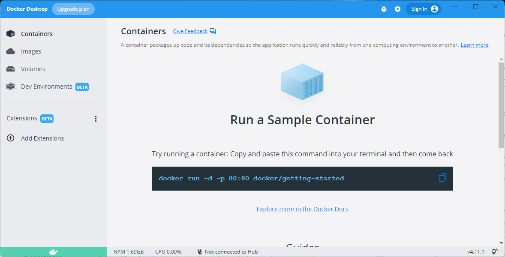

At the time of writing the current docker version is 4.11.1

If you want to run a sample container or look to see what tutorial materials are provided for docker take a brief detour before continuing.

## Running Babylon.js with Docker

Docker is good for development and deployment.  The development environment works well with github and visual studio code.

Containers need a more detailed knowledge of docker to use, but applications running in containers can be uploaded and run on many web services including [Heroku](https://www.heroku.com/deploy-with-docker), [Amazon Web Services](https://www.docker.com/partners/aws/), [Azure](https://azure.microsoft.com/en-gb/services/kubernetes-service/docker/) and [Digital Ocean](https://www.digitalocean.com/community/tutorials/what-is-docker)

Docker can be difficult at times and using it can seem to put a layer of code between you and your application under development.  However, docker has become so widely used that you should know it and its' benefits are worth the initial discomfort.

For this section I am going to use the docker development environment.  Although this is listed as Beta, it has been available for over a year and widely tested.

### Prepare github repository

Start by logging in to your github account online and creating a new repository.  The image shows a new repository named tictac you should provide your own name, I will use **babylonDev** in place of tictac.

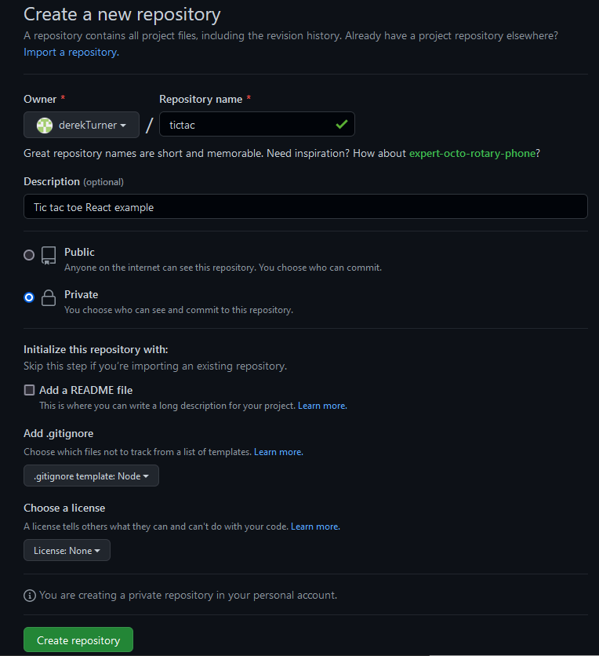

I have made my repository private, that does not matter too much, but it is important to add a .gitnore file choosing node from the drop down list of templates.


In the github browser, from the Add file button create a new file named **.docker/config.json** Take care not to omit the full stop before docker.

Add the text:

```JSON
{
    "image": "node"
}
```


This is probably the simplest config file you could state and it just refers to the current version of node.

Scroll down and commit the new file.

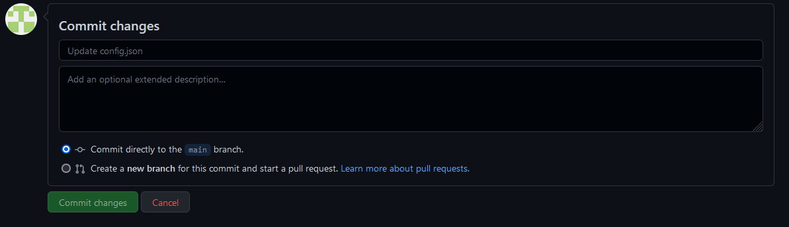

you now have two files and one folder in your repository.

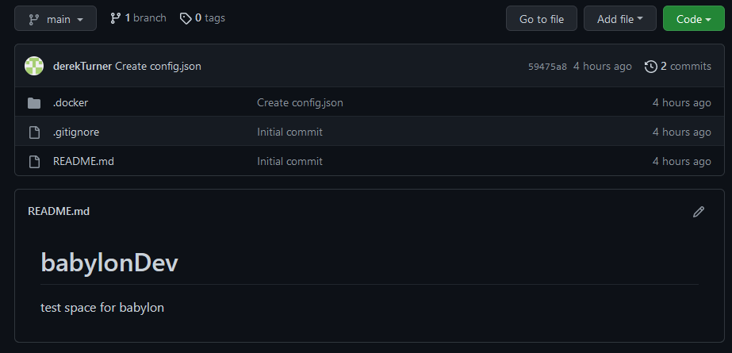

Now a docker environment will be created which is linked to the github site.  Code written on Docker will be stored to github.  That means Docker can be discarded and nothing is lost.  It is easy to open Docker fresh on a new machine and continue working.

### create a docker environment

Open the docker environment page and click to create a new environment.

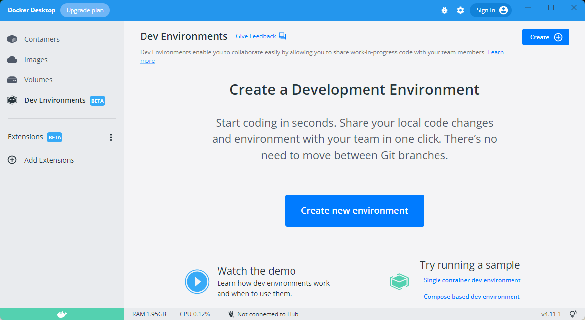

Step one just lists some benefits of the environment.

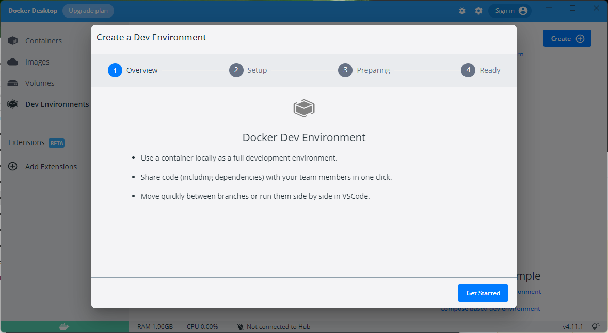

Click "Get started".

Enter the address of your own existing git repository. Following the pattern:
> https://github.com/yourName/babylonDev

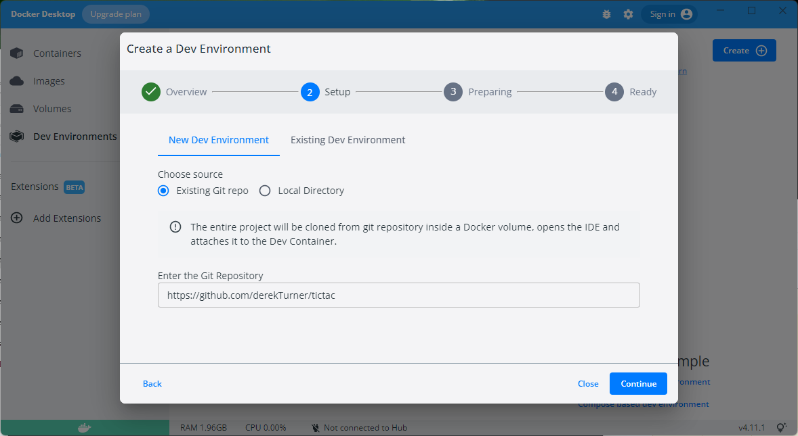

Click "continue".


It takes a while to complete the preparation stage,  this involves downloading a linux environment with node from docker hub.  All this happens behind the scenes.

Docker will try to detect what language your repository is using, but we have not written any code yet so it can't succeed in that.


When the "preparing" message is replaced with "successful" click "continue".

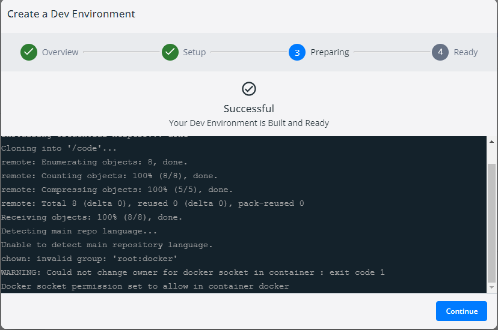

You should now be all set.  The development system will have some auto-generated names which will vary from mine, but they should still start with babylonDev.

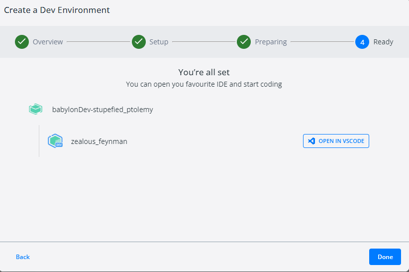

Click on "done".

You can now see the dev envoronments and if you hang the mouse to the right of the dev icon a button will appear and allow you to open in vscode.

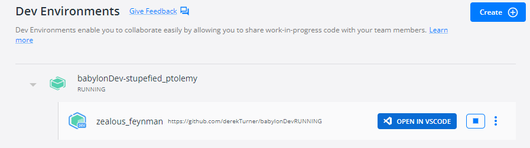

If you missed out any to the stages in the setup you will be prompted to install pre-requisites.  Once the setup is correct you should see your view of the container.

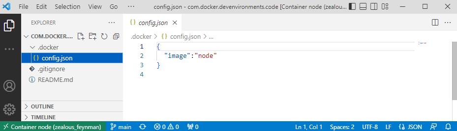

You can see the files you added to github and below these you have a bash shell (because you are now working inside a linux environment in the container).

If the bash shell does not appear you can open it by clicking on the the toggle layout CTRL + J button.

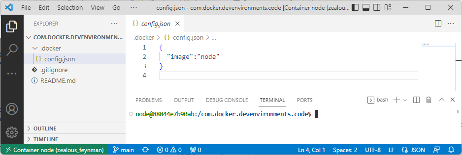

In the shell enter

>node@18a06ef076ee:/com.docker.devenvironments.code$ node --version

```code
v18.11.0
```
The most recent node version is used unless a different one is specified in the config file.

Check the file structure of the shell and see Linux folders and files.

> node@18a06ef076ee:/com.docker.devenvironments.code$ cd ..

>node@18a06ef076ee:/$ ls

```code
bin   com.docker.devenvironments.code  etc   lib    media  opt   root  sbin  sys  usr
boot  dev                              home  lib64  mnt    proc  run   srv   tmp  var
```

Try out some linux commands and refer to a [Linux command cheat sheet](https://phoenixnap.com/kb/linux-commands-cheat-sheet)

When you have had a look around move back to the com.docker.devenvironments.code folder and work on from there.

### Installing babylon

Returning to the development environment folder in the terminal you can now issue commands to install babylonjs.

These will follow the steps outlined in chapter 2 of [Going the Distance with Babylon.js](https://www.packtpub.com/product/going-the-distance-with-babylonjs/9781801076586) by Josh Elster which is a recommended purchase.

Create folders src, dist, public and assets.


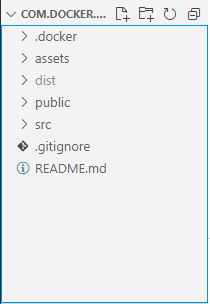

Run npn init 

> npm init

```code
This utility will walk you through creating a package.json file.
It only covers the most common items, and tries to guess sensible defaults.

See `npm help init` for definitive documentation on these fields
and exactly what they do.

Use `npm install <pkg>` afterwards to install a package and
save it as a dependency in the package.json file.

Press ^C at any time to quit.
package name: (com.docker.devenvironments.code) 
version: (1.0.0) 
description: babylonDev
entry point: (index.js) 
test command: test
git repository: (https://github.com/derekTurner/babylonDev) 
keywords: babylon
author: Derek Turner
license: (ISC) 
About to write to /com.docker.devenvironments.code/package.json:

{
  "name": "com.docker.devenvironments.code",
  "version": "1.0.0",
  "description": "babylonDev",
  "main": "index.js",
  "scripts": {
    "test": "test"
  },
  "repository": {
    "type": "git",
    "url": "git+https://github.com/derekTurner/babylonDev.git"
  },
  "keywords": [
    "babylon"
  ],
  "author": "Derek Turner",
  "license": "ISC",
  "bugs": {
    "url": "https://github.com/derekTurner/babylonDev/issues"
  },
  "homepage": "https://github.com/derekTurner/babylonDev#readme"
}


Is this OK? (yes) yes
```

A package json file is created which can be editted subsequintly.

```json
{
  "name": "com.docker.devenvironments.code",
  "version": "1.0.0",
  "description": "babylonDev",
  "main": "index.js",
  "scripts": {
    "test": "test"
  },
  "repository": {
    "type": "git",
    "url": "git+https://github.com/derekTurner/babylonDev.git"
  },
  "keywords": [
    "babylon"
  ],
  "author": "Derek Turner",
  "license": "ISC",
  "bugs": {
    "url": "https://github.com/derekTurner/babylonDev/issues"
  },
  "homepage": "https://github.com/derekTurner/babylonDev#readme"
}
```

Next install webpack and core Babylon.js libraries.

> npm install --save-dev webpack webpack-cli webpack-dev-server webpack-merge clean-webpack-plugin file-loader html-webpack-plugin source-map-loader url-loader eslint


> npm install @babylonjs/core

```code
added 1 package, and audited 444 packages in 6s

71 packages are looking for funding
  run `npm fund` for details

found 0 vulnerabilities
```

Then install additional Babylon.js modules for use:

> npm install --save-dev @babylonjs/materials @babylonjs/loaders @babylonjs/gui @babylonjs/procedural-textures @babylonjs/post-processes @babylonjs/serializers @babylonjs/inspector

```code
added 18 packages, and audited 462 packages in 22s

71 packages are looking for funding
  run `npm fund` for details

found 0 vulnerabilities
```
The installation of these dependancies is reflected in the update of package.json

```json
{
  "name": "com.docker.devenvironments.code",
  "version": "1.0.0",
  "description": "babylonDev",
  "main": "index.js",
  "scripts": {
    "test": "test"
  },
  "repository": {
    "type": "git",
    "url": "git+https://github.com/derekTurner/babylonDev.git"
  },
  "keywords": [
    "babylon"
  ],
  "author": "Derek Turner",
  "license": "ISC",
  "bugs": {
    "url": "https://github.com/derekTurner/babylonDev/issues"
  },
  "homepage": "https://github.com/derekTurner/babylonDev#readme",
  "devDependencies": {
    "@babylonjs/gui": "^5.28.0",
    "@babylonjs/inspector": "^5.28.0",
    "@babylonjs/loaders": "^5.28.0",
    "@babylonjs/materials": "^5.28.0",
    "@babylonjs/post-processes": "^5.28.0",
    "@babylonjs/procedural-textures": "^5.28.0",
    "@babylonjs/serializers": "^5.28.0",
    "clean-webpack-plugin": "^4.0.0",
    "eslint": "^8.25.0",
    "file-loader": "^6.2.0",
    "html-webpack-plugin": "^5.5.0",
    "source-map-loader": "^4.0.1",
    "url-loader": "^4.1.1",
    "webpack": "^5.74.0",
    "webpack-cli": "^4.10.0",
    "webpack-dev-server": "^4.11.1",
    "webpack-merge": "^5.8.0"
  },
  "dependencies": {
    "@babylonjs/core": "^5.28.0"
  }
}
```
To this add the following three scripts.  Start will allow webpack to serve in development mode.  Build will perform packing and lint will check for errors.

```json
"scripts": {
    "test": "test",
    "start": "npx webpack serve --mode development",
    "build": "npx webpack --mode production",
    "lint":  "npx eslint"
  },
```

Add a configuration file for eslint to the root folder of the repository named **.eslintignore** do not omit the initial full stop.  We want the linter to ignore the many node modules created and also not to try to error check the final distribution.

**.eslintignore**
```code
node_modules
dist
```
### configure webpack

Add three files to the root directory **webpack.dev.js**, **webpack.prod.js and **webpack.common.js**

Add a new file to the src directory **index.js**

Add a new file to the public directory **index.html** 

Webpack will be used at build time to bundle the javascript for our application into the dist folder.  The js scripts from the src folder will be output to the dist folder and the applications entry point, index.js wil be injected into the index.html file in the public folder.

During development, there is no bundling, the webpack server will build and cache output, rebuilding what is required as edits are made.A websocket connection to the browser is used to refresh the page.  Javascript sourdce maps will be emitted for debugging.

The webpack.common.js will ensure through the CleanWebpack Plugin that any old source files are cleared out of the destination directory.  the HTMLWebpackPlugin will inject the start script reference into teh inex.html template.

Edit **webpack.common.js** to read:

```javascript
const path = require("path");
const HtmlWebpackPlugin = require("html-webpack-plugin");
const { CleanWebpackPlugin } = require("clean-webpack-plugin");
const appDirectory = __dirname;
```
This does not use ES6 module syntax.

The configuration requires an entry object to identify the script which will launch the app on the client which will be injected itno a `<script>` tag in the index.html page.

The entry item needs to know what base paths to use for reading and writing files.

An output object indicates where to emit packed results.

Plugin instances are instantiated.

Edit **webpack.common.js** adding:

```javascript
module.exports = {
    entry: "./src/index.js",
    output: {
        filename: "js/babylonBundle.js",
        path: path.resolve(appDirectory, "dist")
    },
    plugins: [
        new CleanWebpackPlugin(),
        new HtmlWebpackPlugin({
            template: path.resolve(appDirectory, "public/index.html"),
            inject: true
        })
    ]
};
```

As a test of this code run in the terminal:

>npx webpack --config webpack.common.js

```code
asset index.html 70 bytes [emitted]
asset js/babylonBundle.js 0 bytes [emitted] [minimized] (name: main)
./src/index.js 1 bytes [built] [code generated]

WARNING in configuration
The 'mode' option has not been set, webpack will fallback to 'production' for this value.
Set 'mode' option to 'development' or 'production' to enable defaults for each environment.
You can also set it to 'none' to disable any default behavior. Learn more: https://webpack.js.org/configuration/mode/

webpack 5.74.0 compiled with 1 warning in 354 ms
```
This works but there is a warning about the lack of a mode option so still work to do in the webpack.common.js file.

Full listing of **webpack.common.js**
```javascript
const path = require("path");
const HtmlWebpackPlugin = require("html-webpack-plugin");
const { CleanWebpackPlugin } = require("clean-webpack-plugin");
const appDirectory = __dirname;

module.exports = {
    entry: "./src/index.js",
    output: {
        filename: "js/babylonBundle.js",
        path: path.resolve(appDirectory, "dist")
    },
    resolve: {
        extensions: [".ts", ".js"],
        fallback: {
            fs: false,
            path: false,
        },
    },
    module: {
        rules: [
            {
                test: /\.m?js/,
                resolve: {
                    fullySpecified: false,
                },
            },
            {
                test: /\.(js|mjs|jsx|ts|tsx)$/,
                loader: "source-map-loader",
                enforce: "pre",
            },
            {
                test: /\.(png|jpg|gif|env|glb|stl)$/i,
                use: [
                    {
                        loader: "url-loader",
                        options: {
                            limit: 8192,
                        },
                    },
                ],
            },
        ],
    },
    plugins: [
        new CleanWebpackPlugin(),
        new HtmlWebpackPlugin({
            template: path.resolve(appDirectory, "public/index.html"),
            inject: true
        })
    ]
};
```

## asset loading

Webpack will need to search through the source for javascript files.  This is achieved by adding a resolve object below the output. (Programmers using typescript should also inlude .ts in the extensions array, but I am working in javascript.)

```javascript
resolve: {
      extensions: [".js"],
      fallback: {
          fs: false,
          path: false,
      },
    },  
```

Next a module object includes a list of file extensions defined by a regular expression to identify modules.

```javascript
    module: {
        rules: [
            {
                test: /\.m?js/,
                resolve: {
                    fullySpecified: false,
                },
            },
            {
                test: /\.(js|mjs|jsx|ts|tsx)$/,
                loader: "source-map-loader",
                enforce: "pre",
            },
            {
                test: /\.(png|jpg|gif|env|glb|stl)$/i,
                use: [
                    {
                        loader: "url-loader",
                        options: {
                            limit: 8192,
                        },
                    },
                ],
            },
        ],
    },
```

### development and production

The webpack.dev file will configure the testing web server and send source maps inline with the scripts.

**webpack.dev.js**
```javascript
const { merge } = require('webpack-merge');
const common = require('./webpack.common.js');
const path = require('path');

const appDirectory = __dirname;
const devConfig = {
    mode: "development",
    devtool: "inline-source-map",
    devServer:  {
        compress: true,
        hot: true,
        open: true
    }
};
module.exports = merge(common, devConfig);
```

The production script does not need to configure a server so it is a bit simpler.

**webpack.prod.js**
```javascript
const { merge } = require('webpack-merge');
const common = require('./webpack.common.js');

const prodConfig = {
    mode: "production"
};
module.exports = merge(common, prodConfig);
```

Try a test:
>npm run start

### Loading a scene

Now a starter template can be added to public/index.html based on  the earlier example hello.html but with reference to cdn babylon  scripts removed.


Add index.js file to the src directory

**src/index.js**
```javscript
import { Engine } from "@babylonjs/core/Engines/engine";
import createStartScene from "./createStartScene";
const CanvasName = "index-canvas";

let canvas = document.createElement("canvas");
canvas.id = CanvasName;

canvas.classList.add("renderCanvas");
document.body.appendChild(canvas);

let eng = new Engine(canvas, true, null, true);
let startScene = createStartScene(eng);
eng.runRenderLoop(() => {
    startScene.scene.render();
});
```

This has the code needed to create acanvas in the DOM and initialise a render loop based on a scene named startScene which is generated by a function imported from the module file **src/createStartScene.js**

```javascript
import { MeshBuilder } from "@babylonjs/core/Meshes/meshBuilder"
import { Vector3 } from "@babylonjs/core/Maths/math.vector"
import { Scene } from "@babylonjs/core/scene"
import { HemisphericLight } from "@babylonjs/core/Lights/hemisphericLight";
import { ArcRotateCamera } from "@babylonjs/core/Cameras/arcRotateCamera";
import { StandardMaterial } from "@babylonjs/core/Materials/standardMaterial";
import "@babylonjs/core/Debug/debugLayer";
import "@babylonjs/inspector";

function createBox(scene){
    let box = MeshBuilder.CreateBox("box", scene);
    box.position.y = 3;
    return box;
}
    
function createLight(scene){
    const light = new HemisphericLight("light", new Vector3(0, 1, 0),scene);
    light.intensity = 0.7;
    return light;
}
   
function createSphere(scene){
    let sphere = MeshBuilder.CreateSphere("sphere", { diameter: 2, segments: 32 }, scene);
    sphere.position.y = 1;
    return sphere;
}
   
function createGround(scene){
    let ground = MeshBuilder.CreateGround("ground", { width: 6, height: 6 }, scene);
    return ground;
}
  
function createArcRotateCamera(scene){
    let camAlpha = -Math.PI / 2,
    camBeta  =  Math.PI / 2.5,
    camDist  =  10,
    camTarget = new Vector3(0, 0, 0); 
    let camera = new ArcRotateCamera("camera1", camAlpha, camBeta, camDist, camTarget, scene);
    camera.attachControl(true);
    return camera;
}

export default function createStartScene(engine) {
    let that = {};
    let scene = that.scene = new Scene(engine);
    scene.debugLayer.show();

    let box = that.starbox = createBox(scene);
    let light = that.light = createLight(scene);
    let sphere = that.sphere = createSphere(scene);
    let ground = that.ground = createGround(scene);
    let camera = that.camera = createArcRotateCamera(scene);

    return that;
}

```
Note that when code elements are imported they can be referenced directly without the prefix BABYLON.

To view the scene
>npm run start

```code
> com.docker.devenvironments.code@1.0.0 start
> npx webpack serve --config webpack.dev.js

<i> [webpack-dev-server] Project is running at:
<i> [webpack-dev-server] Loopback: http://localhost:8080/
<i> [webpack-dev-server] Content not from webpack is served from '/com.docker.devenvironments.code/public' directory
<i> [webpack-dev-middleware] wait until bundle finished: /
asset js/babylonBundle.js 63.7 MiB [emitted] (name: main)
asset index.html 647 bytes [emitted]
runtime modules 27.3 KiB 12 modules
modules by path ./node_modules/@babylonjs/core/ 9.25 MiB 1099 modules
modules by path ./node_modules/@babylonjs/gui/ 1.04 MiB 110 modules
modules by path ./node_modules/@babylonjs/materials/ 319 KiB 60 modules
modules by path ./node_modules/@babylonjs/loaders/ 427 KiB 52 modules
modules by path ./node_modules/@babylonjs/serializers/ 263 KiB 28 modules
modules by path ./node_modules/webpack-dev-server/client/ 55.8 KiB 12 modules
modules by path ./node_modules/webpack/hot/*.js 4.3 KiB 4 modules
modules by path ./node_modules/html-entities/lib/*.js 81.3 KiB
  ./node_modules/html-entities/lib/index.js 7.74 KiB [built] [code generated]
  + 3 modules
modules by path ./src/*.js 2.2 KiB
  ./src/index.js 439 bytes [built] [code generated]
  ./src/createStartScene.js 1.77 KiB [built] [code generated]
+ 4 modules
webpack 5.74.0 compiled successfully in 15489 ms
```

The scene opens running on localhost port 8080:


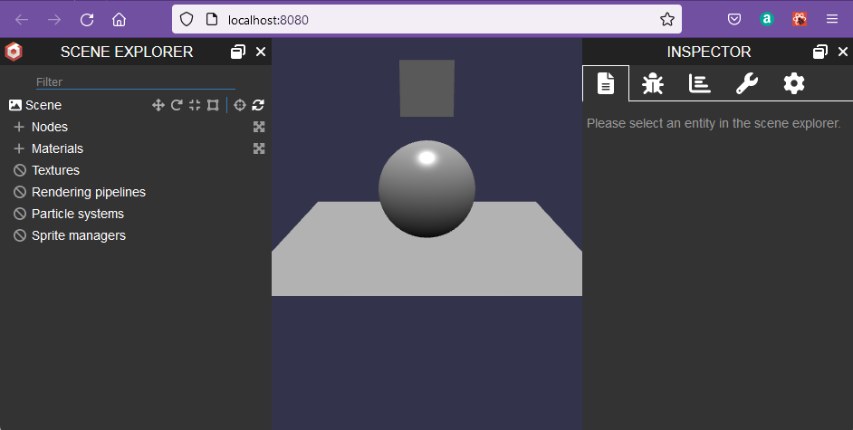

Any changes to the scene code will now be on hot refresh.

To close the webpack development server:

>CTRL + C

### synchronise github

Virtual studio code adds an icon to indicate that the file type is recognised.

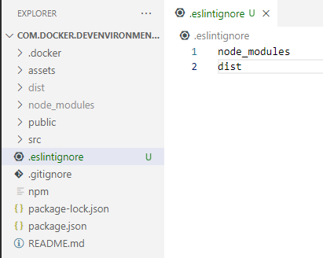

Commit these files and synchronise to github.

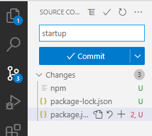

Give the commit a text message "startup" and click the commit button.

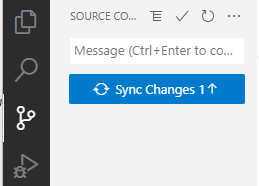

Synchronise the changes.

Your code is now safely backed up on github.

## Production Build

Once a babylon project is complete it should be built to create a fast loading web page which an be mounted on any web server without the need for a node environment.

This production build should be generated inside the `dist/` folder. 

If this is a production build the debug layer will not be required so the imports for the inspector and the line to show the deug screen can be commented out (or removed).

**createStartScene** without scene inspector.
```javascript
import { MeshBuilder } from "@babylonjs/core/Meshes/meshBuilder"
import { Vector3 } from "@babylonjs/core/Maths/math.vector"
import { Scene } from "@babylonjs/core/scene"
import { HemisphericLight } from "@babylonjs/core/Lights/hemisphericLight";
import { ArcRotateCamera } from "@babylonjs/core/Cameras/arcRotateCamera";
import { StandardMaterial } from "@babylonjs/core/Materials/standardMaterial";
// import "@babylonjs/core/Debug/debugLayer";
// import "@babylonjs/inspector";

function createBox(scene){
    let box = MeshBuilder.CreateBox("box", scene);
    box.position.y = 3;
    return box;
}
    
function createLight(scene){
    const light = new HemisphericLight("light", new Vector3(0, 1, 0),scene);
    light.intensity = 0.7;
    return light;
}
   
function createSphere(scene){
    let sphere = MeshBuilder.CreateSphere("sphere", { diameter: 2, segments: 32 }, scene);
    sphere.position.y = 1;
    return sphere;
}
   
function createGround(scene){
    let ground = MeshBuilder.CreateGround("ground", { width: 6, height: 6 }, scene);
    return ground;
}
  
function createArcRotateCamera(scene){
    let camAlpha = -Math.PI / 2,
    camBeta  =  Math.PI / 2.5,
    camDist  =  10,
    camTarget = new Vector3(0, 0, 0); 
    let camera = new ArcRotateCamera("camera1", camAlpha, camBeta, camDist, camTarget, scene);
    camera.attachControl(true);
    return camera;
}

export default function createStartScene(engine) {
    let that = {};
    let scene = that.scene = new Scene(engine);
    //scene.debugLayer.show();

    let box = that.starbox = createBox(scene);
    let light = that.light = createLight(scene);
    let sphere = that.sphere = createSphere(scene);
    let ground = that.ground = createGround(scene);
    let camera = that.camera = createArcRotateCamera(scene);

    return that;
}

```

With the application closed but the development environment running enter

> npm run build

```code
> com.docker.devenvironments.code@1.0.0 build
> npx webpack --config webpack.prod.js

asset js/babylonBundle.js 1020 KiB [emitted] [minimized] [big] (name: main)
asset index.html 555 bytes [emitted]
orphan modules 2.97 MiB [orphan] 246 modules
./src/index.js + 246 modules 2.97 MiB [built] [code generated]

WARNING in asset size limit: The following asset(s) exceed the recommended size limit (244 KiB).
This can impact web performance.
Assets: 
  js/babylonBundle.js (1020 KiB)

WARNING in entrypoint size limit: The following entrypoint(s) combined asset size exceeds the recommended limit (244 KiB). This can impact web performance.
Entrypoints:
  main (1020 KiB)
      js/babylonBundle.js


WARNING in webpack performance recommendations: 
You can limit the size of your bundles by using import() or require.ensure to lazy load some parts of your application.
For more info visit https://webpack.js.org/guides/code-splitting/

webpack 5.74.0 compiled with 3 warnings in 5424 ms
```

Look into the dist folder.

A new javascript bundle file babylonBundle.js has been created and this is injected into index.html.

**index.html**
```html
<!doctype html><html><head><meta http-equiv="Content-Type" content="text/html; charset=utf-8"/><title>Babylon.js sample code</title><style>html,
            body {
                overflow: hidden;
                width: 100%;
                height: 100%;
                margin: 0;
                padding: 0;
            }

            .renderCanvas {
                width: 100%;
                height: 100%;
                touch-action: none;
            }</style><script defer="defer" src="js/babylonBundle.js"></script></head><body></body></html>
```

To access the dist folder right click over the folder and download.


I have downloaded this as a file to the desktop. I can then upload this to any webserver, but to check its operation I have loaded it into visual studio code.  There is no node environment in use here.

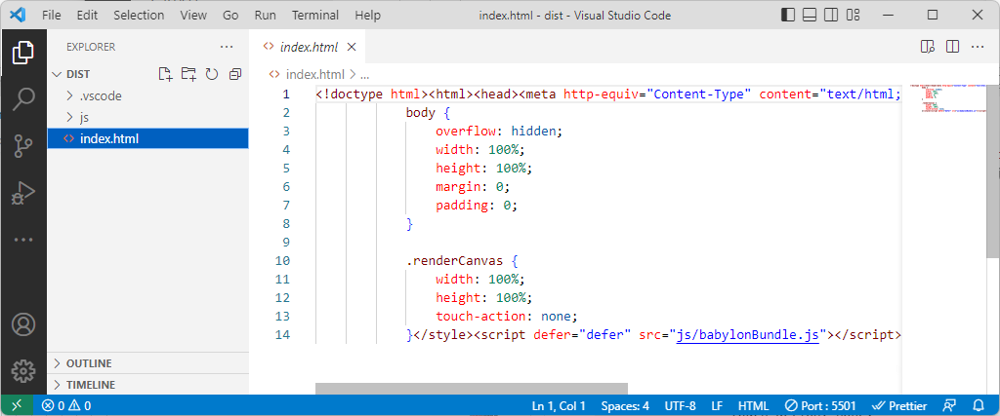

Now running this in live server shows that it is a fully working production model.

<iframe 
    height="600" 
    width="100%" 
    scrolling="no" 
    title="Production Build" 
    src="Block_3/section_3/dist/index.html" 
    frameborder="no" 
    loading="lazy" 
    allowtransparency="true" 
    allowfullscreen="true">
</iframe>

