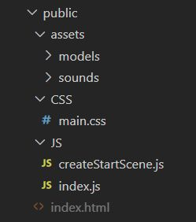

## Refactor the basic example

The next step is to refactor the basic code into a Javascript modular code structure.  This will keep the scene code in a separate file and pave the way for multiple scene files.  A functional approach will be taken to the creation of scene elements.

## Folder structure

To keep track of code when it is split betweeen several files it is best to adopt a standard folder structure.



At the moment assets are not being used in the BabylonJS display, but the folders are there ready for models and sounds.

Styles are added from an external stylesheet rather than being local to the html page.

Javascript is in the JS folder, which leaves one html file in the root of the public folder.

## File relationships

The index.html file will link to the stylesheet in order to style the canvas and any other details of the page.

The index.html will also connect by script tag to the babylonJS library files.  Usually these will be held in the cache of the local machine for repeated access.

A script tag will also link to index.js in the JS folder.  This will contain the minimum boiler plate code to render the display.  

The javascript files are organised as modules so index.js can aggregate a range of scenes from modules.  Initially there is just a single scene in use so only one module is needed to create this.

Note that any assets used will be accessed by relative addressing from the javascript file which requires them.


### HTML file

The Babylon code will be presented on a web page named **index.html**

This starts with `<script>` elements to include the Babylon.js library elements which will be used.  This is more efficient than loading the entire Babylon.js library.

The script links are made to cdn.babylon.js rather than preview.babylon.js so that stable versions of the library are used. The preview libraries are most up to date, but may from time to time contain bugs.

This is followed by a `<link>` to the cascading stylesheet to style the canvas and other aspects of the page.

The `<script>` element which includes the javascript for the display is left till after the `</html>` tag to ensure that all elements required exist in the htms document object model of the page before they are accessed by javascript.  Note that the javascript file 'index.js' has the type selected as `module`.  Any javascript file which includes either import or export statements will follow the javascript module syntax.

**index.html**
```html
<!DOCTYPE html>
<html>
    <head>
        <meta http-equiv="Content-Type" content="text/html; charset=utf-8" />

        <title>Babylon.js sample code</title>

        <!-- Babylon.js -->
        <script src="https://cdnjs.cloudflare.com/ajax/libs/dat-gui/0.6.2/dat.gui.min.js"></script>
        <script src="https://assets.babylonjs.com/generated/Assets.js"></script>
        <script src="https://cdn.babylonjs.com/ammo.js"></script>
        <script src="https://cdn.babylonjs.com/cannon.js"></script>
        <script src="https://cdn.babylonjs.com/Oimo.js"></script>
        <script src="https://cdn.babylonjs.com/earcut.min.js"></script>
        <script src="https://cdn.babylonjs.com/babylon.js"></script>
        <script src="https://cdn.babylonjs.com/materialsLibrary/babylonjs.materials.min.js"></script>
        <script src="https://cdn.babylonjs.com/proceduralTexturesLibrary/babylonjs.proceduralTextures.min.js"></script>
        <script src="https://cdn.babylonjs.com/postProcessesLibrary/babylonjs.postProcess.min.js"></script>
        <script src="https://cdn.babylonjs.com/loaders/babylonjs.loaders.js"></script>
        <script src="https://cdn.babylonjs.com/serializers/babylonjs.serializers.min.js"></script>
        <script src="https://cdn.babylonjs.com/gui/babylon.gui.min.js"></script>
        <script src="https://cdn.babylonjs.com/inspector/babylon.inspector.bundle.js"></script>

        <link rel="stylesheet" href="CSS/main.css"> 
        
    </head>
    <body></body>
</html>
<script src="JS/index.js" type="module"></script>

```

## main.css

Now overall style for the body and canvas are set in the detail of the cascading style sheet.  

 It is important to ensure that the ID of the canvas is consistent through alll the files which might refer to it.  The name 'renderCanvas' has been adopted for this.

**main.css**
```css
  body {
    overflow: hidden;
    width: 100%;
    height: 100%;
    margin: 0;
    padding: 0;
}

#renderCanvas {
    width: 100%;
    height: 100%;
}
```


## Javascript files

The two javascript module files are placed in a folder named JS.  The first, **index.js** will be the starting point for the code and within this, code from the other module, **createStartScene.js** will be imported for use.

The html file only needs a single link to the index.js script and does not directly access any other module files.

The Javascript modular structure gives complete separation of code into separate module files.  Any file which contains import of export statements is a module file.

### index.js

The importing of modules is always placed at the top of the file.

```javascript
import createStartScene from "./createStartScene.js";
```


The function createStartScene will be imported from the file createStartScene.js.

The imported function name may be given a name patterned on the source module file name, but this is not compulsory.

The file index.html had empty `<body><body>` tags so the canvas must be created in the body by the javascript file accessing the HTML DOM.

```javascript
const CanvasName = "renderCanvas";

let canvas = document.createElement("canvas");
canvas.id = CanvasName;

canvas.classList.add("background-canvas");
document.body.appendChild(canvas);
```

The canvas is first created and given an `id` attribute before being appended as a child of the empty HTML body.

The canvas is also given a class name so that it could be used in a more general style sheet selector.


```javascript
let eng = new BABYLON.Engine(canvas, true, null, true);
let startScene = createStartScene(eng);
eng.runRenderLoop(() => {
    startScene.scene.render();
});
```

Finally the minimum code required to create a Babylon engine and start a rendeloop based on the imported startScene is added to the the file.  

So a minimal index.js file can be listed in full:

**index.js**
```javascript
import createStartScene from "./createStartScene.js";

const CanvasName = "renderCanvas";

let canvas = document.createElement("canvas");
canvas.id = CanvasName;

canvas.classList.add("background-canvas");
document.body.appendChild(canvas);

let eng = new BABYLON.Engine(canvas, true, null, true);
let startScene = createStartScene(eng);
eng.runRenderLoop(() => {
    startScene.scene.render();
});
```

### createStartScene.js

Now within **createStartScene.js** the basic scene elements are all defined buy functions which will each return a single element: box, light, sphere. graound and camera.  

At this point this separation will lead to more code rather than less, however as the scene becomes more detailed the imposition of structure will make it easier to work with the code.

The functions which define scene elements will include a list of arguments to which the scene into which the elements are going to be incoporated should be included.

In this case the properties of the elements such as box.position are all given hard coded values, but further values could be passed in through  additional arguments.


```javascript
function createBox(scene){
    let box = BABYLON.MeshBuilder.CreateBox("box", scene);
    box.position.y = 3;
    return box;
}
    
function createLight(scene){
    const light = new BABYLON.HemisphericLight("light", new BABYLON.Vector3(0, 1, 0),scene);
    light.intensity = 0.7;
    return light;
}
   
function createSphere(scene){
    let sphere = BABYLON.MeshBuilder.CreateSphere("sphere", { diameter: 2, segments: 32 }, scene);
    sphere.position.y = 1;
    return sphere;
}
   
function createGround(scene){
    let ground = BABYLON.MeshBuilder.CreateGround("ground", { width: 6, height: 6 }, scene);
    return ground;
}

function createArcRotateCamera(scene){
    let camAlpha = -Math.PI / 2,
    camBeta  =  Math.PI / 2.5,
    camDist  =  10,
    camTarget = new BABYLON.Vector3(0, 0, 0); 
    let camera = new BABYLON.ArcRotateCamera("camera1", camAlpha, camBeta, camDist, camTarget, scene);
    camera.attachControl(true);
    return camera;
}
```
Now a a createStartScene function is defined which which when called will return and object `that` which will include the scene as a property `that.scene`.

There should only be one graphic engine running and will be defined in index.js and passed as an argument to createStartScene (and subsequently multiple scenes) to be used in constructing the empty scene.

```javascript
...index.js
let startScene = createStartScene(eng);
```

The createStartScene function will then add elements to build up the scene and return `that`.


```javascript
export default function createStartScene(engine) {
    let that = {};
    let scene = that.scene = new BABYLON.Scene(engine);
    scene.debugLayer.show();

    let box = that.starbox = createBox(scene);
    let light = that.light = createLight(scene);
    let sphere = that.sphere = createSphere(scene);
    let ground = that.ground = createGround(scene);
    let camera = that.camera = createArcRotateCamera(scene);
    return that;
}
```

Because what is returned is an object and not simply a scene, there is room for expanding the returned data.

The index.js file has to access the scene property of the object which has been returned.

```javascript
...index.js
startScene.scene.render();
```
The full listing of **createStartScene.js** becomes:

```javascript
function createBox(scene){
    let box = BABYLON.MeshBuilder.CreateBox("box", scene);
    box.position.y = 3;
    return box;
}
    
function createLight(scene){
    const light = new BABYLON.HemisphericLight("light", new BABYLON.Vector3(0, 1, 0),scene);
    light.intensity = 0.7;
    return light;
}
   
function createSphere(scene){
    let sphere = BABYLON.MeshBuilder.CreateSphere("sphere", { diameter: 2, segments: 32 }, scene);
    sphere.position.y = 1;
    return sphere;
}
   
function createGround(scene){
    let ground = BABYLON.MeshBuilder.CreateGround("ground", { width: 6, height: 6 }, scene);
    return ground;
}

function createArcRotateCamera(scene){
    let camAlpha = -Math.PI / 2,
    camBeta  =  Math.PI / 2.5,
    camDist  =  10,
    camTarget = new BABYLON.Vector3(0, 0, 0); 
    let camera = new BABYLON.ArcRotateCamera("camera1", camAlpha, camBeta, camDist, camTarget, scene);
    camera.attachControl(true);
    return camera;
}
  
export default function createStartScene(engine) {
    let that = {};
    let scene = that.scene = new BABYLON.Scene(engine);
    scene.debugLayer.show();

    let box = that.starbox = createBox(scene);
    let light = that.light = createLight(scene);
    let sphere = that.sphere = createSphere(scene);
    let ground = that.ground = createGround(scene);
    let camera = that.camera = createArcRotateCamera(scene);
    return that;
}
```


That provides a design pattern which can be carried through to other examples.

## Display

<iframe 
    height="600" 
    width="100%" 
    scrolling="no" 
    title="Refactored Basic Scene" 
    src="Block_3/section_1b/public/index.html" 
    frameborder="no" 
    loading="lazy" 
    allowtransparency="true" 
    allowfullscreen="true">
</iframe>