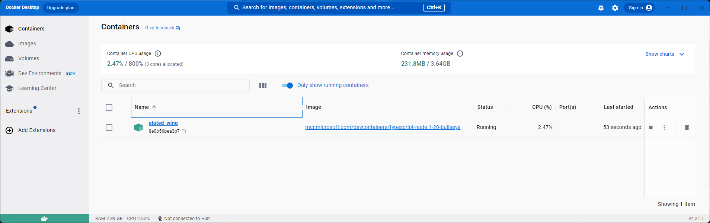

# Running BabylonJS in a Development environment

This is an adaptation of the tutorial [Using Vite with Babylon.js](https://doc.babylonjs.com/guidedLearning/usingVite) to a docker development system and and the typescript language.

## Setting up the environment

Before starting you will need docker desktop installed (currently V 4.15.0) and running.

Then you will need VScode with the devContainers extension installed.


This will allow any local folder to be run in a docker development container and is an easy way to run with a development environment.

Create a folder in the local file system.  I have called this devContainer.

Create a blank file in the folder called dev.md.

In VScode 

>CRTL + SHIFT + P

to show a list of commands and select open folder in container.


This will then open a browser dialog to choose the devContainer folder.

On the first time of opening a prompt appears asking what type of container is needed  I chose 'Node & Typescript'

Then you are asked what additional facilities you need from a large checklist.  I selected none.

The system then takes time to create the container image.  When this is complete docker desktop shows that the container is running.



The file structure which has been created in the container is 


This shows the dev.md file which will become this document together with the firse image for display.

The .devContainer folder contains devcontainer.json which shows that the nature of the container is based on node and typescript.

```json
// For format details, see https://aka.ms/devcontainer.json. For config options, see the
// README at: https://github.com/devcontainers/templates/tree/main/src/typescript-node
{
	"name": "Node.js & TypeScript",
	// Or use a Dockerfile or Docker Compose file. More info: https://containers.dev/guide/dockerfile
	"image": "mcr.microsoft.com/devcontainers/typescript-node:0-18"

	// Features to add to the dev container. More info: https://containers.dev/features.
	// "features": {},

	// Use 'forwardPorts' to make a list of ports inside the container available locally.
	// "forwardPorts": [],

	// Use 'postCreateCommand' to run commands after the container is created.
	// "postCreateCommand": "yarn install",

	// Configure tool-specific properties.
	// "customizations": {},

	// Uncomment to connect as root instead. More info: https://aka.ms/dev-containers-non-root.
	// "remoteUser": "root"
}

```
Opening a terminal the prompt should appear as

```code
node ➜ /workspaces/devContainer $ 
```

The node version can be checked by 

>node -v

```code
v18.15.0
```

The typescript version is checked by:

>tsc -v

```code
Version 5.0.3
```

Install vite with

>npm install vite

As this runs you are prompted to choose the framework you want to scaffold.  There are options to work with web frameworks such as react, but for BabylonJS the basic choice is vanila.


You are then prompted to select a variant and Typescript is selected.


Once the loading process has completed a package.json file is crated in the .devcontainer folder, this displays the dependancy for Vite.

```json
  "dependencies": {
    "vite": "^4.2.1"
  }
```

Now install babylon core.

>npm i -D @babylonjs/core

and also the inspector to make debugging easier.

>npm i -D @babylonjs/inspector

When these are completed the package.json file will have been modified to show the babylon elements as devDependencies because of the -D flag used on installation.

```json
{
  "dependencies": {
    "vite": "^4.2.1"
  },
  "devDependencies": {
    "@babylonjs/core": "^5.53.0",
    "@babylonjs/inspector": "^5.53.0"
  }
}

```

## Running a test typescript project

To initialise a typescript project based on the vanilla-ts framework vite with a project name testProj

>npm init vite

This creates a new folder with the name testProj and a starting structure:


Within the testProj folder is a new package.json file which includes the names of scripts which will allow the project to be run on a development server, built to a distribution folder and for this to be previewed for checking.

**package.json**
```json
{
  "name": "testproj",
  "private": true,
  "version": "0.0.0",
  "type": "module",
  "scripts": {
    "dev": "vite",
    "build": "tsc && vite build",
    "preview": "vite preview"
  },
  "devDependencies": {
    "typescript": "^4.9.3",
    "vite": "^4.2.0"
  }
}
```
To test this out the dependancies must be installed by the node package manager.

>cd testProj

>npm install

```code
added 15 packages, and audited 16 packages in 8s

5 packages are looking for funding
  run `npm fund` for details

found 0 vulnerabilities
```

>npm run dev

```code
VITE v4.2.1  ready in 419 ms

  ➜  Local:   http://localhost:5173/
  ➜  Network: use --host to expose
  ➜  press h to show help
  ```

  Look to the browser 

  >http://127.0.0.1:5173/

  The test project is now running.

  

  Clicking on the button will increment the counter.

  The application starts with an HTML file.

  **index.html**
  ```html
<!DOCTYPE html>
<html lang="en">
  <head>
    <meta charset="UTF-8" />
    <link rel="icon" type="image/svg+xml" href="/vite.svg" />
    <meta name="viewport" content="width=device-width, initial-scale=1.0" />
    <title>Vite + TS</title>
  </head>
  <body>
    <div id="app"></div>
    <script type="module" src="/src/main.ts"></script>
  </body>
</html>
  ```

This includes a div with id as 'app' where the javascript will generate output determined by running the typescript file main.ts.

**main.ts**
```ts
import './style.css'
import typescriptLogo from './typescript.svg'
import viteLogo from '/vite.svg'
import { setupCounter } from './counter'

document.querySelector<HTMLDivElement>('#app')!.innerHTML = `
  <div>
    <a href="https://vitejs.dev" target="_blank">
      
    </a>
    <a href="https://www.typescriptlang.org/" target="_blank">
      
    </a>
    <h1>Vite + TypeScript</h1>
    <div class="card">
      <button id="counter" type="button"></button>
    </div>
    <p class="read-the-docs">
      Click on the Vite and TypeScript logos to learn more
    </p>
  </div>
`

setupCounter(document.querySelector<HTMLButtonElement>('#counter')!)
```

This file first imports the images an stylesheet before importing the function setupCounter from the module file counter.ts.

The output is created by adding to the innerHTML of the #app div.

This includes a button with id 'counter'.

The button is read from the DOM usint the [querySelector](https://www.w3schools.com/jsref/met_document_queryselector.asp) method and passed as a parameter to the setupCounter function.

The counter.ts is a module which exports a single named function.

**counter.ts**
```ts
export function setupCounter(element: HTMLButtonElement) {
  let counter = 0
  const setCounter = (count: number) => {
    counter = count
    element.innerHTML = `count is ${counter}`
  }
  element.addEventListener('click', () => setCounter(counter + 1))
  setCounter(0)
}
```

The function setupCounterdefines a local variable counter with starting value zero and a private function 'setCounter' which will display the count value passed as a parameter to the HTMLButtonElement represented by the parameter 'element'.

An event listener is added to the button which will call setCounter with an incremented value on each click.

setCounter(0) is called to provide a starting value on the button before any clicks are recieved.

This is a typescript app being served by the vite development server.  BabylonJS has not been used yet.

To close the application in the terminal.

>CTRL + C

