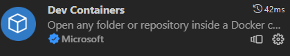

# Running Typescript in a Deno Development environment

This is an adaptation of the tutorial [Using Vite with Babylon.js](https://doc.babylonjs.com/guidedLearning/usingVite) to a docker development system and and the typescript language, but rather than using nodejs it will use [Deno](https://deno.land/) which is a replacement for nodejs written by the author of nodejs.  This will have typescript as standard in the box and claims speed and security advantages.  Firstly an environment will be set up and then vite will be used in this environment to run a simple typescript application.

## Setting up the environment

In this section I am running Linux just to confirm that Ubuntu cand be used directly on a linux machine as well as running on WSL on a windows machine.

Before starting you will need docker desktop installed and running.  


Then you will need VScode with the devContainers extension installed.



This will allow any local folder to be run in a docker development container and is an easy way to run with a development environment.

Using github desktop, create a new repository named babylonJSdev.  This will be your working space for babylon code development.

> File|New Reppository or CTRL + N


Publish this to github.


Open this in visual studio code and create a blank file in the folder called dev.md.  You can use this file subsequently to keep notes on your  code development as you go.


In VScode 

>CRTL + SHIFT + P

to show a list of commands and select open folder in container.


Click on Open Folder in Container. This will then open a browser dialog to choose the devContainer folder and open.


On the first time of opening a prompt appears asking what type of container is.    I Showing all available containers I choose 'Deno community'.


Then you are asked to choose a debian version, I have accepted the default version bullseye.


Then you are asked what additional features you need from a large checklist.  I selected none and pressed ok.


The system then takes time to create the container image.  


Click on show log to view progress, be patient.

When this is complete docker desktop shows that the container is running.


The file structure which has been created in the container is 


This shows the dev.md file which will be available as a place  to keep working notes.

At some point you may be interrupted by the Deno for VScode extension.


This does not assume that you are working on a deno project so you have to us use 

>CTRL + Shift + P 

Deno: Initialize Workspace Configuration command

From the dialogue, enable dino linting and allow unstable apis.

This creates a .vscode folder with settings.json


The .devContainer folder contains devcontainer.json which shows that the nature of the container is based on deno.

```json
{
	"name": "Deno",
 	"build": {
		"dockerfile": "Dockerfile"
	},

	// Configure tool-specific properties.
	"customizations": {
		// Configure properties specific to VS Code.
		"vscode": {
			// Set *default* container specific settings.json values on container create.
			"settings": { 
				// Enables the project as a Deno project
				"deno.enable": true,
				// Enables Deno linting for the project
				"deno.lint": true,
				// Sets Deno as the default formatter for the project
				"editor.defaultFormatter": "denoland.vscode-deno"
			},
			
			// Add the IDs of extensions you want installed when the container is created.
			"extensions": [
				"denoland.vscode-deno"
			]
		}
	},

	"remoteUser": "vscode"
}
```
There is also a dockerfile which is used in setting up the container.

```Dockerfile
# [Choice] Debian OS version: bullseye, buster
ARG VARIANT=bullseye
FROM --platform=linux/amd64 mcr.microsoft.com/devcontainers/base:0-${VARIANT}

ENV DENO_INSTALL=/deno
RUN mkdir -p /deno \
    && curl -fsSL https://deno.land/x/install/install.sh | sh \
    && chown -R vscode /deno

ENV PATH=${DENO_INSTALL}/bin:${PATH} \
    DENO_DIR=${DENO_INSTALL}/.cache/deno

# [Optional] Uncomment this section to install additional OS packages.
# RUN apt-get update && export DEBIAN_FRONTEND=noninteractive \
#    && apt-get -y install --no-install-recommends <your-package-list-here>

```

open a terminal from the VSC menu.  The prompt should appear as


To check that the javascript runtime is running:

> deno

```code
Deno 1.36.0
exit using ctrl+d, ctrl+c, or close()
REPL is running with all permissions allowed.
To specify permissions, run `deno repl` with allow flags.
```


> Deno.version.deno

```code
"1.36.0"
```
And Check tha t typescript is available out of the box.

> Deno.version.typescript

```code
"5.1.6"
```

To stop deno running enter twice

> CTRL + C

Confirm that you want to close.


## Install Vite

Now vite can be installed with

> deno run --allow-read --allow-write --allow-env npm:create-vite-extra@latest

This will give read write permissions in this environment.

Enter a project name in response to the prompt

> BabylonjsProject

Accept default for package name

> babylonjsproject

In this instance I am not using a web framework so I take the vanilla option, but need to ensure I choose the deno default option and **not** the ssr option!

> deno-vanilla

Ensure that the selected varient is 

> Typescript


```code
low-env npm:create-vite-extra@latest
✔ Project name: … BabylonjsProject
✔ Package name: … babylonjsproject
✔ Select a template: › deno-vanilla
✔ Select a variant: › TypeScript

Scaffolding project in /workspaces/babylonJSdeno/BabylonjsProject...

Done. Now run:

  cd BabylonjsProject
  deno task dev
```
 
Try this out.

> cd BabylonjsProject

> deno task dev

```code
  VITE v4.4.9  ready in 338 ms

  ➜  Local:   http://localhost:5173/
  ➜  Network: use --host to expose
  ➜  press h to show help
```


There is now an application running on port 5173, the vite development server.

This shows logos for deno, vite and typescript.

Clicking on the count button will cause it to increment, demonstrating success!


## Inspect and Build typescript project

A simple typescript project has been made by default and this can be inspected to see how it is organised.


Note that the structure has a deno.json file rather than the package.json file which characterised apps developed with node.js.  Compared with node.js the deno.json file is relatively simple.

**deno.json**
```json
{
  "tasks": {
    "dev": "deno run -A --node-modules-dir npm:vite",
    "build": "deno run -A --node-modules-dir npm:vite build",
    "preview": "deno run -A --node-modules-dir npm:vite preview",
    "serve": "deno run --allow-net --allow-read https://deno.land/std@0.157.0/http/file_server.ts dist/"
  }
}
```

The "dev" line instructs deno to run the vite module which it will fine in the node-modules directory, and that starts the development server.

The src folder also contains a typescript file:

**vite-env.d.ts
```javascript
/// <reference types="vite/client" />
```

This is a note to the typescript transpiler to identify a particular reference type.  Note the line starts with three ///.

To close the development server when you are ready:

> ctrl + c


  The application starts with an HTML file.

  **index.html**
  ```html
<!DOCTYPE html>
<html lang="en">
  <head>
    <meta charset="UTF-8" />
    <link rel="icon" type="image/svg+xml" href="/vite.svg" />
    <meta name="viewport" content="width=device-width, initial-scale=1.0" />
    <title>Vite + TS</title>
  </head>
  <body>
    <div id="app"></div>
    <script type="module" src="/src/main.ts"></script>
  </body>
</html>
  ```

This includes a div with id as 'app' where the javascript will generate output determined by running the typescript file main.ts.

**main.ts**
```javascript
import './style.css'
import typescriptLogo from './typescript.svg'
import { setupCounter } from './counter'

document.querySelector<HTMLDivElement>('#app')!.innerHTML = `
  <div>
    
    <a href="https://vitejs.dev" target="_blank">
      
    </a>
    <a href="https://www.typescriptlang.org/" target="_blank">
      
    </a>
    <h1>Vite + TypeScript</h1>
    <div class="card">
      <button id="counter" type="button"></button>
    </div>
    <p class="read-the-docs">
      Click on the Vite and TypeScript logos to learn more
    </p>
  </div>
`

setupCounter(document.querySelector<HTMLButtonElement>('#counter')!)

```

This file first imports a stylesheetand images before importing the function setupCounter from the module file counter.ts.

The output is created by adding to the innerHTML of the #app div.

This includes a button with id 'counter'.

The button is read from the DOM usint the [querySelector](https://www.w3schools.com/jsref/met_document_queryselector.asp) method and passed as a parameter to the setupCounter function.

The counter.ts is a module which exports a single named function.

**counter.ts**
```javascript
export function setupCounter(element: HTMLButtonElement) {
  let counter = 0
  const setCounter = (count: number) => {
    counter = count
    element.innerHTML = `count is ${counter}`
  }
  element.addEventListener('click', () => setCounter(counter + 1))
  setCounter(0)
}
```

The function setupCounter defines a local variable counter with starting value zero and a private function 'setCounter' which will display the count value passed as a parameter to the HTMLButtonElement represented by the parameter 'element'.

An event listener is added to the button which will call setCounter with an incremented value on each click.

setCounter(0) is called to provide a starting value on the button before any clicks are recieved.

This is a typescript app being served by the vite development server.  BabylonJS has not been used yet.

To close the application in the terminal.

>CTRL + C


>Commit


>Publish

Check the repository on gitHub note that all the project files are uploaded, but not the node files because you selected .gitnore node when you created the repository.


