# Running Typescript in a Development environment

This is an adaptation of the tutorial [Using Vite with Babylon.js](https://doc.babylonjs.com/guidedLearning/usingVite) to a docker development system and and the typescript language.  Firstly an environment will be set up and then vite will be used in this environment to run a simple typescript application.

## Setting up the environment

Before starting you will need docker desktop installed and running.  The Help|about tab shows version details.

```
Version: 1.80.1 (user setup)
Commit: 74f6148eb9ea00507ec113ec51c489d6ffb4b771
Date: 2023-07-12T17:22:07.651Z
Electron: 22.3.14
ElectronBuildId: 21893604
Chromium: 108.0.5359.215
Node.js: 16.17.1
V8: 10.8.168.25-electron.0
OS: Windows_NT x64 10.0.22621
```

Then you will need VScode with the devContainers extension installed.

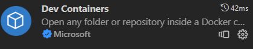

This will allow any local folder to be run in a docker development container and is an easy way to run with a development environment.

Using github desktop, create a new repository named babylonJSdev.  This will be your working space for babylon code development.

> File|New Reppository or CTRL + N

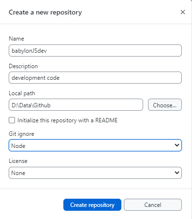

Open this in visual studio code and create a blank file in the folder called dev.md.  You can use this file subsequently to keep notes on your  code development as you go.

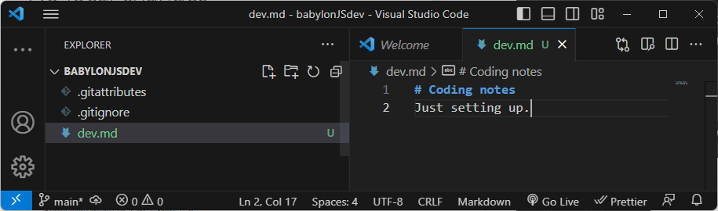

In VScode 

>CRTL + SHIFT + P

to show a list of commands and select open folder in container.

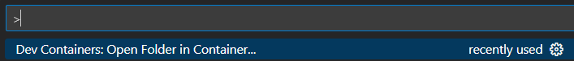

Click on Open Foldwer in Container. This will then open a browser dialog to choose the devContainer folder and open.

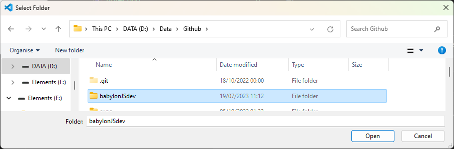


On the first time of opening a prompt appears asking what type of container is needed  I chose 'Node & Typescript'

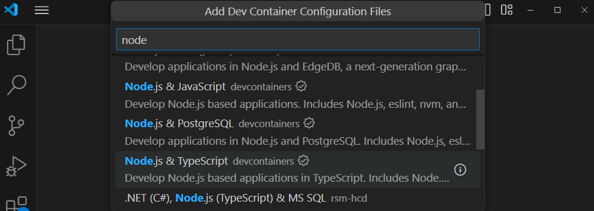

Then you are asked to choose a node version, I have accepted the default version 20-bullseye.

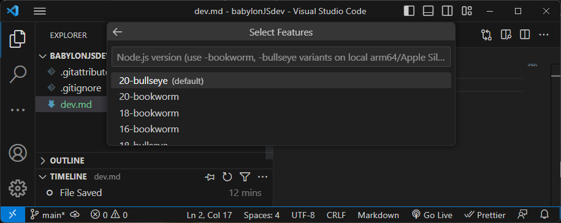


Then you are asked what additional features you need from a large checklist.  I selected none and pressed ok.

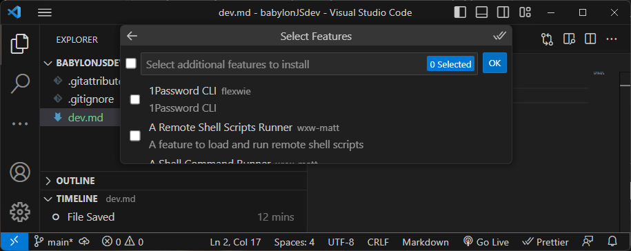

The system then takes time to create the container image.  

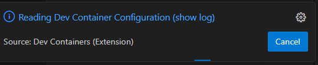

Click on show log to view progress, be patient.

When this is complete docker desktop shows that the container is running.

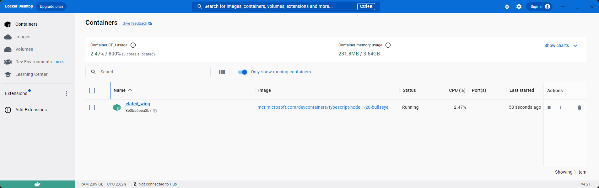

The file structure which has been created in the container is 

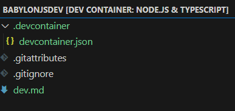

This shows the dev.md file which will be available as a place  tpo keep working notes.

The .devContainer folder contains devcontainer.json which shows that the nature of the container is based on node and typescript.

``` json
// For format details, see https://aka.ms/devcontainer.json. For config options, see the
// README at: https://github.com/devcontainers/templates/tree/main/src/typescript-node
{
	"name": "Node.js & TypeScript",
	// Or use a Dockerfile or Docker Compose file. More info: https://containers.dev/guide/dockerfile
	"image": "mcr.microsoft.com/devcontainers/typescript-node:1-20-bullseye"

	// Features to add to the dev container. More info: https://containers.dev/features.
	// "features": {},

	// Use 'forwardPorts' to make a list of ports inside the container available locally.
	// "forwardPorts": [],

	// Use 'postCreateCommand' to run commands after the container is created.
	// "postCreateCommand": "yarn install",

	// Configure tool-specific properties.
	// "customizations": {},

	// Uncomment to connect as root instead. More info: https://aka.ms/dev-containers-non-root.
	// "remoteUser": "root"
}
```
Open a terminal from the VSC menu.  The prompt should appear as

```code
node ➜ /workspaces/babylonJSdev (main) $ 
```

The node version can be checked by 

>node -v

```code
v20.8.0
```

The typescript version is checked by:

>tsc -v

```code
Version 5.2.2
```

Install vite with

>npm install vite

This led to a comment inviting an update to npm.

```
3 packages are looking for funding
  run `npm fund` for details

found 0 vulnerabilities
npm notice 
npm notice New major version of npm available! 9.8.1 -> 10.2.1
npm notice Changelog: https://github.com/npm/cli/releases/tag/v10.2.1
npm notice Run npm install -g npm@10.2.1 to update!
npm notice 
```

Folllow any advice to update.

> npm install -g npm@10.2.1

```
added 1 package in 4s

29 packages are looking for funding
  run `npm fund` for details
```

Once the loading process has completed a package.json file is crated in the babylonJSdev folder, this displays the dependancy for Vite.

```json
{
  "dependencies": {
    "vite": "^4.4.4"
  }
}
```

Now install babylon core.

>npm i -D @babylonjs/core

```
added 1 package, and audited 10 packages in 22s

3 packages are looking for funding
  run `npm fund` for details

found 0 vulnerabilities
```
and also the inspector to make debugging easier.

>npm i -D @babylonjs/inspector

```
added 16 packages, and audited 26 packages in 39s

3 packages are looking for funding
  run `npm fund` for details

found 0 vulnerabilities
```

Also add the babylon loaders required to handle meshes.

>npm i -D @babylonjs/loaders

```
up to date, audited 26 packages in 3s

3 packages are looking for funding
  run `npm fund` for details

found 0 vulnerabilities
```
When these are completed the package.json file will have been modified to show the babylon elements as devDependencies because of the -D flag used on installation.

```json
{
  "dependencies": {
    "vite": "^4.4.4"
  },
  "devDependencies": {
    "@babylonjs/core": "^6.12.5",
    "@babylonjs/inspector": "^6.12.5",
    "@babylonjs/loaders": "^6.12.5"
  }
}
```

## Running a test typescript project

To initialise a typescript project based on the vanilla-ts framework vite with a project name testProj

>npm init vite

This asks for permission to add packages:

```
Need to install the following packages:
  create-vite@4.4.0
Ok to proceed? (y) 
```

> Enter y

```
? Project name: › vite-project
```

> change to testProj

```
? Package name: › testproj
```

> Accept testproj

```
? Select a framework: › - Use arrow-keys. Return to submit.
❯   Vanilla
    Vue
    React
    Preact
    Lit
    Svelte
    Solid
    Qwik
    Others
```

> Select vanilla

```
? Select a variant: › - Use arrow-keys. Return to submit.
❯   TypeScript
    JavaScript
```

>Select  typescript

```
Scaffolding project in /workspaces/babylonJSdev/testProj...

Done. Now run:

  cd testProj
  npm install
  npm run dev
```

This creates a new folder with the name testProj and a starting structure:

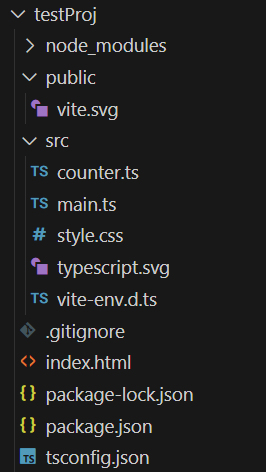

Within the testProj folder is a new package.json file which includes the names of scripts which will allow the project to be run on a development server, built to a distribution folder and for this to be previewed for checking.

**package.json**
```json
{
  "name": "testproj",
  "private": true,
  "version": "0.0.0",
  "type": "module",
  "scripts": {
    "dev": "vite",
    "build": "tsc && vite build",
    "preview": "vite preview"
  },
  "devDependencies": {
    "typescript": "^5.0.2",
    "vite": "^4.4.0"
  }
}
```
To test this out the dependancies must be installed by the node package manager.

>cd testProj

>npm install

```code
added 9 packages, and audited 10 packages in 10s

3 packages are looking for funding
  run `npm fund` for details

found 0 vulnerabilities
```

>npm run dev

```code
  VITE v4.4.4  ready in 306 ms

  ➜  Local:   http://localhost:5173/
  ➜  Network: use --host to expose
  ➜  press h to show help
  ```

  Look to the browser 

  >http://127.0.0.1:5173/

  The test project is now running.

  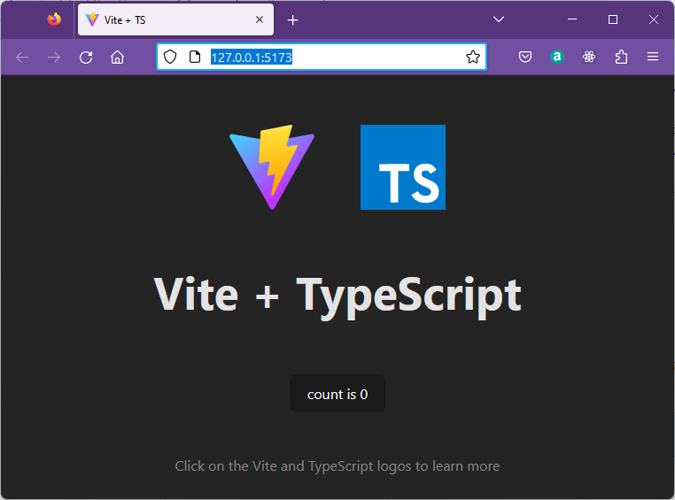

  Clicking on the button will increment the counter.

  The application starts with an HTML file.

  **index.html**
  ```html
<!DOCTYPE html>
<html lang="en">
  <head>
    <meta charset="UTF-8" />
    <link rel="icon" type="image/svg+xml" href="/vite.svg" />
    <meta name="viewport" content="width=device-width, initial-scale=1.0" />
    <title>Vite + TS</title>
  </head>
  <body>
    <div id="app"></div>
    <script type="module" src="/src/main.ts"></script>
  </body>
</html>
  ```

This includes a div with id as 'app' where the javascript will generate output determined by running the typescript file main.ts.

**main.ts**
```javascript
import './style.css'
import typescriptLogo from './typescript.svg'
import viteLogo from '/vite.svg'
import { setupCounter } from './counter.ts'

document.querySelector<HTMLDivElement>('#app')!.innerHTML = `
  <div>
    <a href="https://vitejs.dev" target="_blank">
      
    </a>
    <a href="https://www.typescriptlang.org/" target="_blank">
      
    </a>
    <h1>Vite + TypeScript</h1>
    <div class="card">
      <button id="counter" type="button"></button>
    </div>
    <p class="read-the-docs">
      Click on the Vite and TypeScript logos to learn more
    </p>
  </div>
`

setupCounter(document.querySelector<HTMLButtonElement>('#counter')!)
```

This file first imports a stylesheetand images before importing the function setupCounter from the module file counter.ts.

The output is created by adding to the innerHTML of the #app div.

This includes a button with id 'counter'.

The button is read from the DOM usint the [querySelector](https://www.w3schools.com/jsref/met_document_queryselector.asp) method and passed as a parameter to the setupCounter function.

The counter.ts is a module which exports a single named function.

**counter.ts**
```javascript
export function setupCounter(element: HTMLButtonElement) {
  let counter = 0
  const setCounter = (count: number) => {
    counter = count
    element.innerHTML = `count is ${counter}`
  }
  element.addEventListener('click', () => setCounter(counter + 1))
  setCounter(0)
}
```

The function setupCounter defines a local variable counter with starting value zero and a private function 'setCounter' which will display the count value passed as a parameter to the HTMLButtonElement represented by the parameter 'element'.

An event listener is added to the button which will call setCounter with an incremented value on each click.

setCounter(0) is called to provide a starting value on the button before any clicks are recieved.

This is a typescript app being served by the vite development server.  BabylonJS has not been used yet.

To close the application in the terminal.

>CTRL + C

From gitthub desktop add comments and commit the changes to main.

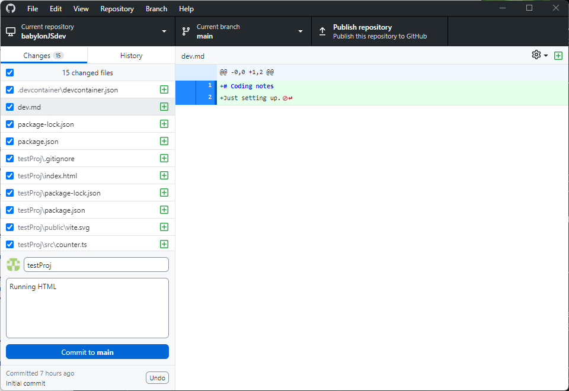

>Commit

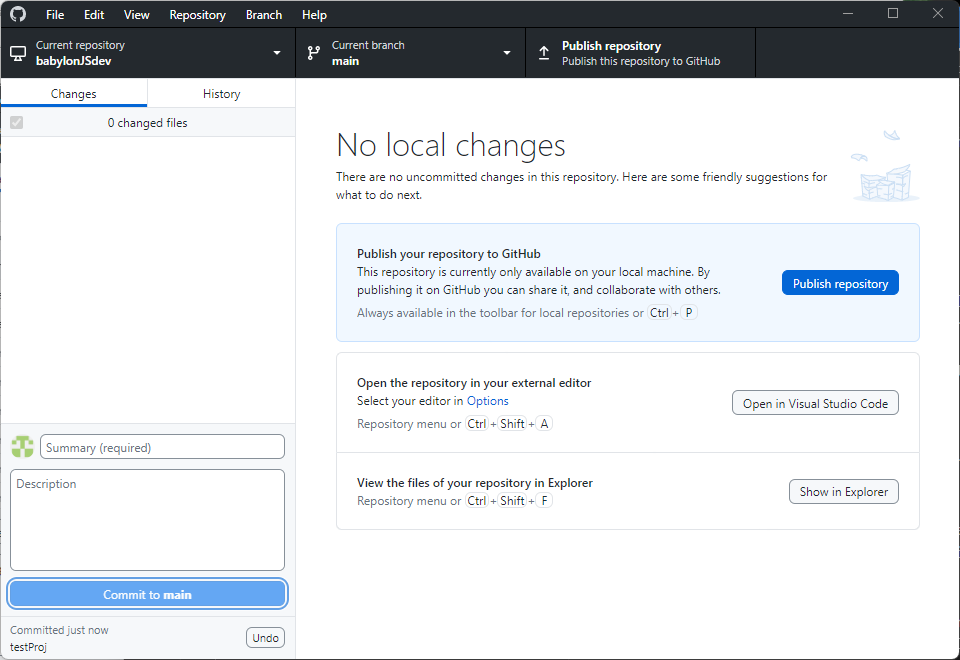

>Publish

Check the repository on gitHub note that all the project files are uploaded, but not the node files because you selected .gitnore node when you created the repository.

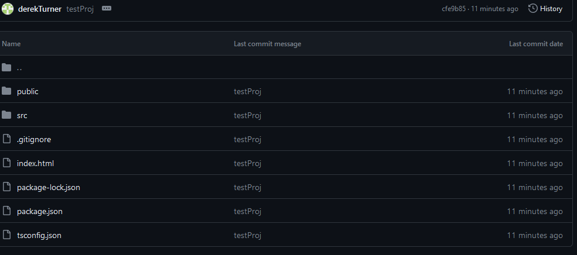
