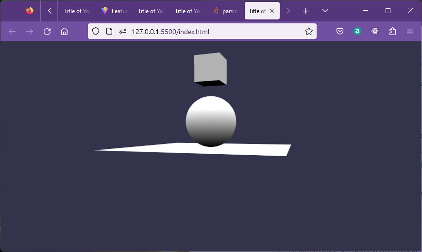

## Running babylon on Vite

You can make a copy of the previous test project folder to another folder if you want to keep it for later reference.  Never save the node modules, they are easily restored when needed.

Delete everything inside the publioc and src folders.

Replace the contents of testProj/tsconfig.json with:

```json
{
  "compilerOptions": {
    "target": "es6", // choose our ECMA/JavaScript version (all modern browsers support ES6 so it's your best bet)
    "lib": [ // choose our default ECMA/libraries to import
      "dom", // mandatory for all browser-based apps
      "es6" // mandatory for targeting ES6
    ],
    "useDefineForClassFields": true, // enable latest ECMA runtime behavior with older ECMA/JavaScript versions (delete this line if target: "ESNext" or "ES2022"+)
    "module": "ESNext", // use the latest ECMA/JavaScript syntax for our import statements and such
    "moduleResolution": "node", // ensures we are using CommonJS for our npm packages
    "noResolve": false, // disable TypeScript from automatically detecting/adding files based on import statements and etc (it's less helpful than you think)
    "isolatedModules": true, // allows our code to be processed by other transpilers, such as preventing non-module TS files (you could delete this since we're only using base TypeScript)
    "removeComments": true, // remove comments from our outputted code to save on space (look into terser if you want to protect the outputted JS even more)
    "esModuleInterop": true, // treats non-ES6 modules separately from ES6 modules (helpful if module: "ESNext")
    "noImplicitAny": false, // usually prevents code from using "any" type fallbacks to prevent untraceable JS errors, but we'll need this disabled for our example code
    "noUnusedLocals": false, // usually raises an error for any unused local variables, but we'll need this disabled for our example code
    "noUnusedParameters": true, // raises an error for unused parameters
    "noImplicitReturns": true, // raises an error for functions that return nothing
    "skipLibCheck": true // skip type-checking of .d.ts files (it speeds up transpiling)
  },
  "include": ["src"] // specify location(s) of .ts files
```}
```

Comments are not normally used in json, but may be used with typescript.
The TSConfig referenc can be fond [here](https://www.typescriptlang.org/tsconfig).

Replace the index.html file with the simple file:

```html
<!DOCTYPE html>
<html>
    <head>
        <meta charset="UTF-8">
        <title>Title of Your Project</title>
    </head>
    <body> </body>
</html>
<script type="module" src="./src/index.ts"></script>

```
Now create index.ts and createStartScene.ts inside testProj/src to display a simple scene.

```ts
import { Engine, Scene } from "@babylonjs/core";
import createStartScene from "./createStartScene";
import './main.css';

const CanvasName = "renderCanvas";

let canvas = document.createElement("canvas");
canvas.id = CanvasName;

canvas.classList.add("background-canvas");
document.body.appendChild(canvas);

let eng = new Engine(canvas, true, null, true);
let startScene = createStartScene(eng);
eng.runRenderLoop(() => {
    startScene.scene.render();
});                  
```
Also add the startScene.ts module for the scene details.

```ts
import "@babylonjs/core/Debug/debugLayer";
import "@babylonjs/inspector";
import { Scene, ArcRotateCamera, Vector3, HemisphericLight, 
         MeshBuilder, 
         Mesh,
         Light,
         Camera} from "@babylonjs/core";

function createBox(scene){
    let box = MeshBuilder.CreateBox("box", scene);
    box.position.y = 3;
    return box;
}
    
function createLight(scene){
    const light = new HemisphericLight("light", new Vector3(0, 1, 0),scene);
    light.intensity = 0.7;
    return light;
}
   
function createSphere(scene){
    let sphere = MeshBuilder.CreateSphere("sphere", { diameter: 2, segments: 32 }, scene);
    sphere.position.y = 1;
    return sphere;
}
   
function createGround(scene){
    let ground = MeshBuilder.CreateGround("ground", { width: 6, height: 6 }, scene);
    return ground;
}

function createArcRotateCamera(scene){
    let camAlpha = -Math.PI / 2,
    camBeta  =  Math.PI / 2.5,
    camDist  =  10,
    camTarget = new Vector3(0, 0, 0); 
    let camera = new ArcRotateCamera("camera1", camAlpha, camBeta, camDist, camTarget, scene);
    camera.attachControl(true);
    return camera;
}

export default function createStartScene(engine) {
    interface SceneData {
        scene:Scene,
        box?: Mesh,
        light?: Light
        sphere?: Mesh,
        ground?: Mesh,
        camera?:Camera
    };

    let that:SceneData = {scene:new Scene(engine)};
    that.scene.debugLayer.show();

    that.box = createBox(that.scene);
    that.light = createLight(that.scene);
    that.sphere = createSphere(that.scene);
    that.ground = createGround(that.scene);
    that.camera = createArcRotateCamera(that.scene);
    return that;
}
```

Check that the terminal prompt is still in the devContainer

```code
node ➜ /workspaces/devContainer/testProj $
```

Then run in the developer mode.

>npm run dev

View in browser:


To close the application in the terminal.

>CTRL + C

Note that the scene still works if the individual objects are not passed back with the scene.  So for instance editing createStartScene.ts to remove lines will still work.

```ts
    //that.box = createBox(that.scene);
    //that.light = createLight(that.scene);
    //that.sphere = createSphere(that.scene);
    //that.ground = createGround(that.scene);
    //that.camera = createArcRotateCamera(that.scene);

    createBox(that.scene);
    createLight(that.scene);
    createSphere(that.scene);
    createGround(that.scene);
    createArcRotateCamera(that.scene);
    return that;
```

Passing back the objects with the scene is a pattern intended to make the objects individually accessible later.  Its usefulness will depend on context.

## Building and deployment

Close the running application.

>CTRL + C

Remove the inspector fromn the finished code in createStartscene.ts.

```ts
// import "@babylonjs/core/Debug/debugLayer";
// import "@babylonjs/inspector";
```
and 

```ts
    // that.scene.debugLayer.show();
```

Issue the build command.

>npm run build

```code
> testproj@0.0.0 build
> tsc && vite build

vite v4.2.1 building for production...
✓ 1163 modules transformed.
dist/index.html                     0.30 kB
dist/assets/index-d6d7b775.css      0.10 kB │ gzip:   0.10 kB
dist/assets/index-cf92da09.js   3,504.03 kB │ gzip: 812.52 kB

(!) Some chunks are larger than 500 kBs after minification. Consider:
- Using dynamic import() to code-split the application
- Use build.rollupOptions.output.manualChunks to improve chunking: https://rollupjs.org/configuration-options/#output-manualchunks
- Adjust chunk size limit for this warning via build.chunkSizeWarningLimit.
✓ built in 19.23s
```

There are some configuration files which could be optimised but the build has worked and can be seen in the dist folder.  Before you can uise this you will need to refresh VScodes view of the folder structure.


The files in the dist folder:


can be run by 

>npm run preview

This opens in a different port, 42173 to view on the browser.


The files in the dist folder can now we copied and placed on a web server or into a plain local folder where they can be served from a testing server.

You don't really need a separate testing server as you have one as live server within VScode.

So opening a separate window.


Then run on live server on port 5500.



Note that this is now running without a node environment as previewed below.

<iframe 
    height="400" 
    width="60" 
    scrolling="no" 
    title="Hello Page" 
    src="Block_3/section_1e/dist/index.html" 
    frameborder="no" 
    loading="lazy" 
    allowtransparency="true" 
    allowfullscreen="false">
</iframe>


