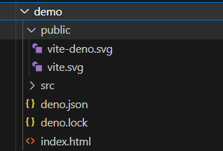
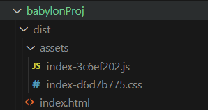

## Running babylon on Vite with Deno

Could get this working, but not with reliable operation for multi projects try again next session.

To allow babylon to run the core babylon libraries should be loaded.  This can be achieved by creating a package.json file in the BabylonjsProject folder which lists the babylon dependancies.  

**package.json**
``` json
{
    "name": "@deno/babylonjsproject",
    "description": "Babylon JS development",
    "type": "module",
    "scripts": {
      "null": "deno run --allow-env --allow-sys null.ts"
    },
    "dependencies": {
        "@babylonjs/core": "^6.12.5",
        "@babylonjs/inspector": "^6.12.5",
        "@babylonjs/loaders": "^6.12.5"
    }
  }
```

The scripts line is just left as a null default here, there is never any intention that the null script will be run.

This is giving acess to the node modules for Babylon version 6.

To activate these dependancies, 

> cd BabylonjsProject

> deno task dev

Watch as the dependancies are loaded and then the regular counter demonstration app starts to run.

Close this off.

> CTRL + C


Now package.json sits alongside deno.json and the @babylonjs node modules sit along side vite.

## Restructuring the project

If the plan was to create a single babylon project it could sit in the BabylonjsProject folder.  However my intention it to create a number of small projects showing different aspects of babylon code, so some reorganisation of folder structure will be helpful.

Create a new project named demo inside BabylonjsProject and move into this the public and src folders, deno.json and index.html

Edit deno.json to remove the reference to --node_modules.  This will prevent deno from creating a duplicate copy of the node modules.  

**deno.json**
```javascript
{
  "tasks": {
    "dev": "deno run -A npm:vite",
    "build": "deno run -A npm:vite build",
    "preview": "deno run -A  npm:vite preview",
    "serve": "deno run --allow-net --allow-read https://deno.land/std@0.157.0/http/file_server.ts dist/"
  }
}
```

> cd demo

> deno task dev

The familiar counter example runs in the browser.

> ctrl + c

The demo folder now has a deno.lock  file.



Open the integrated terminal in the demo folder and check that the typescript still runs from this folder.

> deno task dev

## Adding projects

Now any number of folders can be made to house separate small projects.

Add a new folder named "example1" in the BabylonjsProject folder and copy into this the public and src folders, deno.json and index.html from the demo folder.

Change directories into example1.  

*(It is convenient to close the old terminal and open and open a new one in visual studio code by richt clicking over the selected folder and choosing open in integrated terminal. This avoids the need for cd.. and cd foldername)*

> cd example1

> deno task dev

The familiar counter example runs in the browser.

> ctrl + c

The example 1 folder can now be edited to create a babylonjs scene.


Add the following file named tsconfig.json to example1

**tsconfig.json**
```json
{
  "compilerOptions": {
    "target": "es6", // choose our ECMA/JavaScript version (all modern browsers support ES6 so it's your best bet)
    "lib": [ // choose our default ECMA/libraries to import
      "dom", // mandatory for all browser-based apps
      "es6" // mandatory for targeting ES6
    ],
    "useDefineForClassFields": true, // enable latest ECMA runtime behavior with older ECMA/JavaScript versions (delete this line if target: "ESNext" or "ES2022"+)
    "module": "ESNext", // use the latest ECMA/JavaScript syntax for our import statements and such
    "moduleResolution": "node", // ensures we are using CommonJS for our npm packages
    "noResolve": false, // disable TypeScript from automatically detecting/adding files based on import statements and etc (it's less helpful than you think)
    "isolatedModules": true, // allows our code to be processed by other transpilers, such as preventing non-module TS files (you could delete this since we're only using base TypeScript)
    "removeComments": true, // remove comments from our outputted code to save on space (look into terser if you want to protect the outputted JS even more)
    "esModuleInterop": true, // treats non-ES6 modules separately from ES6 modules (helpful if module: "ESNext")
    "noImplicitAny": false, // usually prevents code from using "any" type fallbacks to prevent untraceable JS errors, but we'll need this disabled for our example code
    "noUnusedLocals": false, // usually raises an error for any unused local variables, but we'll need this disabled for our example code
    "noUnusedParameters": true, // raises an error for unused parameters
    "noImplicitReturns": true, // raises an error for functions that return nothing
    "skipLibCheck": true // skip type-checking of .d.ts files (it speeds up transpiling)
  },
  "include": ["src"] // specify location(s) of .ts files
}
```


Comments are not normally used in json files, but may be used with typescript.
The TSConfig referenc can be fond [here](https://www.typescriptlang.org/tsconfig).


Edit index.html file in example 1 to read:

**index.html**
```html
<!DOCTYPE html>
<html>
    <head>
        <meta charset="UTF-8">
        <title>Example 1</title>
    </head>
    <body> </body>
</html>
<script type="module" src="./src/index.ts"></script>
```

Delete the counter.ts, main.ts, style.css and typescript.svg from the example1 folder leaving vite-env.d.ts in place ready for new code.

Delete the contents of the public folder completely.

Now add index.ts and createStartScene.ts inside babylonProjexample1/src to display a simple scene.

**babylonProj/src/index.ts**
```javascript
import { Engine } from "@babylonjs/core";
import createStartScene from "./createStartScene";
import './main.css';

const CanvasName = "renderCanvas";

const canvas = document.createElement("canvas");
canvas.id = CanvasName;

canvas.classList.add("background-canvas");
document.body.appendChild(canvas);

const eng = new Engine(canvas, true, null, true);
const startScene = createStartScene(eng);
eng.runRenderLoop(() => {
    startScene.scene.render();
});                       
```
Also add the createStartScene.ts module for the scene details.

**babylonProj/src/createStartScene.ts**
```javascript
import "@babylonjs/core/Debug/debugLayer";
import "@babylonjs/inspector";
import {
  ArcRotateCamera,
  Camera,
  Engine,
  HemisphericLight,
  Light,
  Mesh,
  MeshBuilder,
  Scene,
  Vector3,
} from "@babylonjs/core";

function createBox(scene: Scene) {
  const box = MeshBuilder.CreateBox("box", scene);
  box.position.y = 3;
  return box;
}

function createLight(scene: Scene) {
  const light = new HemisphericLight("light", new Vector3(0, 1, 0), scene);
  light.intensity = 0.7;
  return light;
}

function createSphere(scene: Scene) {
  const sphere = MeshBuilder.CreateSphere("sphere", {
    diameter: 2,
    segments: 32,
  }, scene);
  sphere.position.y = 1;
  return sphere;
}

function createGround(scene: Scene) {
  const ground = MeshBuilder.CreateGround(
    "ground",
    { width: 6, height: 6 },
    scene,
  );
  return ground;
}

function createArcRotateCamera(scene: Scene) {
  const camAlpha = -Math.PI / 2,
    camBeta = Math.PI / 2.5,
    camDist = 10,
    camTarget = new Vector3(0, 0, 0);
  const camera = new ArcRotateCamera(
    "camera1",
    camAlpha,
    camBeta,
    camDist,
    camTarget,
    scene,
  );
  camera.attachControl(true);
  return camera;
}

export default function createStartScene(engine: Engine) {
  interface SceneData {
    scene: Scene;
    box?: Mesh;
    light?: Light;
    sphere?: Mesh;
    ground?: Mesh;
    camera?: Camera;
  }

  const that: SceneData = { scene: new Scene(engine) };
  that.scene.debugLayer.show();

  that.box = createBox(that.scene);
  that.light = createLight(that.scene);
  that.sphere = createSphere(that.scene);
  that.ground = createGround(that.scene);
  that.camera = createArcRotateCamera(that.scene);
  return that;
}
```

Now add the stylesheet file main.css inside example1/src .

**babylonProj/src/main.css**
```css
body {
    overflow: hidden;
    width: 100%;
    height: 100%;
    margin: 0;
    padding: 0;
}

#renderCanvas {
    width: 100%;
    height: 100%;
}
```


At this point the file structure should be:


The TS files will contain warnings of errors.  These are indications which Typescript adds to highlight errors!  The main issue is that typescript cant resolve the references to @babylon and to the dom.  This relates to the tsconfig file settings.  Accept these warnings because deno is not confused by them.

Now to run this project, change the directory that the terminal is addressing:

If the terminal is not already open on example1, click on the folder example1 and "open in integrated terminal".


```code
node ➜ /workspaces/babylonJSdev/example1 (main) $
```

> deno task dev

```code
VITE v4.4.9  ready in 1315 ms

  ➜  Local:   http://localhost:5173/
  ➜  Network: use --host to expose
  ➜  press h to show help
```

The scene now runs in the browser, it takes a while to load first time.


This is success, however typescript is not picking up the links to modules and therefore displays lots of errors.

This operation of babylon resolving a package.json is a valid action,  there are alternative approaches in deno to use deno.json file to add aliasses to imports or to use an import map, but these are not resolving the errors displayed.

### Comments on operation

Note that the scene still works if the individual objects are not passed back with the scene.  So for instance editing createStartScene.ts to remove lines will still work.

```ts
    //that.box = createBox(that.scene);
    //that.light = createLight(that.scene);
    //that.sphere = createSphere(that.scene);
    //that.ground = createGround(that.scene);
    //that.camera = createArcRotateCamera(that.scene);

    createBox(that.scene);
    createLight(that.scene);
    createSphere(that.scene);
    createGround(that.scene);
    createArcRotateCamera(that.scene);
    return that;
```

Passing back the objects with the scene is a pattern intended to make the objects individually accessible later.  Its usefulness will depend on context.

Note also that because the babylon framework has been imported it is no longer necessary to use the BABYLON keyword in lines such as

```javascript
 let box = MeshBuilder.CreateBox("box", scene);
```

Typescript demands stricter syntax than javaScript, that is one way in which it reduces errors.

You must ensure that all the elements added to the variable that are included in the interface.  If you decide to add a new shape that must be in the interface as well.  However the use of ? means optional so if you decide to remove the box the interface will not complain that it is missing.

```javascript
export default function createStartScene(engine) {
    interface SceneData {
        scene:Scene,
        box?: Mesh,
        light?: Light
        sphere?: Mesh,
        ground?: Mesh,
        camera?:Camera
    };

    let that:SceneData = {scene:new Scene(engine)};
    that.scene.debugLayer.show();

    that.box = createBox(that.scene);
    that.light = createLight(that.scene);
    that.sphere = createSphere(that.scene);
    that.ground = createGround(that.scene);
    that.camera = createArcRotateCamera(that.scene);
    return that;
}
```

## Building and deployment

Close the running application.

>CTRL + C

Remove the inspector fromn the finished code in createStartscene.ts.

```ts
// import "@babylonjs/core/Debug/debugLayer";
// import "@babylonjs/inspector";
```
and 

```ts
    // that.scene.debugLayer.show();
```

Issue the build command.

>npm run build

```code
> testproj@0.0.0 build
> tsc && vite build

✓ 1179 modules transformed.
dist/index.html                     0.30 kB │ gzip:   0.22 kB
dist/assets/index-d6d7b775.css      0.10 kB │ gzip:   0.10 kB
dist/assets/index-3c6ef202.js   3,610.89 kB │ gzip: 836.26 kB

(!) Some chunks are larger than 500 kBs after minification. Consider:
- Using dynamic import() to code-split the application
- Use build.rollupOptions.output.manualChunks to improve chunking: https://rollupjs.org/configuration-options/#output-manualchunks
- Adjust chunk size limit for this warning via build.chunkSizeWarningLimit.
✓ built in 41.88s
```

There are some configuration files which could be optimised but the build has worked and can be seen in the dist folder.  Before you can uise this you will need to refresh VScodes view of the folder structure.


The files in the dist folder:



can be run by 

>npm run preview

This opens in a different port, 42173 to view on the browser.


The files in the dist folder can now we copied and placed on a web server or into a plain local folder where they can be served from a testing server.

You don't really need a separate testing server as you have one as live server within VScode.

So opening a separate window.


Then run on live server on port 5500.

[tested on server](tested.png)

Note that this is now running without a node environment as previewed below.

<iframe 
    height="400" 
    width="60" 
    scrolling="no" 
    title="Hello Page" 
    src="Block_3/section_1e/dist_1e/index.html" 
    frameborder="no" 
    loading="lazy" 
    allowtransparency="true" 
    allowfullscreen="false">
</iframe>


## Github issue

When uploading back to github I noted an issuse that I had insufficient privelidges to add an object to the repository database.  A [Stack overflow reference ](https://stackoverflow.com/questions/6448242/git-push-error-insufficient-permission-for-adding-an-object-to-repository-datab) helped me to resolve this.

From the computer terminal application I cd to the GitHub/babylonJSdeno folder then check to find my name and group.

```code
# for yourname
whoami
# for yourgroup
id -g -n <yourname>
```

Once I know who I am on the machine I can see the file ownership in the .git/objects folder

```code
cd .git/objects
ls -al
```

This shows a list of files, most of which have my name and group ownership, but a few which do not.  This is repaired by

```code
sudo chown -R yourname:yourgroup *
```

A repeat

```code
ls -al
```

confirms the changes and allows upload via GitHub desktop or visual studio code in the normal way.


