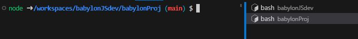

## Running BabylonJS on a different machine


Saving work to gitHub means that it is relatively easy to open and run the code on a different machine.

Set up your second machine so that it has Docker, git, VSC with Dev Containers plugin, github desktop.

Start up docker desktop and check that it is up to date.

Open github desktop and open

> File|Clone Repository

 or

> CTRL + Shift + O


Select the repository and clone into your local github folder.

Open in visual studio.

Open the babylonjs folder and note that the empty public folder has not been carried over and that the dist folder has not been carried over.  

> CTRL + Shift + P

> Dev Container: open folder in container

Select the babylonJdev folder to open.

When the container is running, it can be seen on docker desktop and visuals studio code will indicate DevContainer: Node & Typescript at the bottom left hand corner.

Open a new terminal from the menu or 

> CTRL + Shift + '

```bash
node ➜ /workspaces/babylonJSdev (main) $ 
```

Install node modules based on package.json inside the babylonJSdev folder:

> npm install

```bash
added 25 packages, and audited 26 packages in 27s

3 packages are looking for funding
  run `npm fund` for details

found 0 vulnerabilities
npm notice 
npm notice New minor version of npm available! 9.6.7 -> 9.8.1
npm notice Changelog: https://github.com/npm/cli/releases/tag/v9.8.1
npm notice Run npm install -g npm@9.8.1 to update!
npm notice 
```

Follow any update advice:

>npm install -g npm@9.8.1

```bash
added 1 package in 2s

28 packages are looking for funding
  run `npm fund` for details
```

Right click on the babylonProj folder and open in integrated terminal.

Two bash shells are now running



```bash
node ➜ /workspaces/babylonJSdev/babylonProj (main) $ 
```
Install modules based on package.json in the babylonProj folder.

> npm install

```bash
added 9 packages, and audited 10 packages in 2s

3 packages are looking for funding
  run `npm fund` for details

found 0 vulnerabilities
```

Now check the programme running on the development server.

> npm run dev

```bash
  VITE v4.4.4  ready in 531 ms

  ➜  Local:   http://localhost:5173/
  ➜  Network: use --host to expose
  ➜  press h to show help
  ```


This is running on the vite development server.

> CTRL + C

Try a distribution build.

> npm run build

```bash
> testproj@0.0.0 build
> tsc && vite build

vite v4.4.4 building for production...
✓ 1179 modules transformed.
dist/index.html                     0.30 kB │ gzip:   0.22 kB
dist/assets/index-d6d7b775.css      0.10 kB │ gzip:   0.10 kB
dist/assets/index-3c6ef202.js   3,610.89 kB │ gzip: 836.26 kB

(!) Some chunks are larger than 500 kBs after minification. Consider:
- Using dynamic import() to code-split the application
- Use build.rollupOptions.output.manualChunks to improve chunking: https://rollupjs.org/configuration-options/#output-manualchunks
- Adjust chunk size limit for this warning via build.chunkSizeWarningLimit.
✓ built in 55.98s
```

Refresh VSC view and open index.html in the dist folder.


Right click this to run in live server.

Note that there are no changes highlighted in VSC so what you have done here does not influence what is held on github.

> CTRL + Shift + P

> Development Containers: Reopen folder locally.  Now the vite server is no longer running.

Right click over dist/index.html and open in live server.

This yields errors because the script src and link href refer to the address starting from the root of the server:

```html
<script type="module" crossorigin src="/assets/index-3c6ef202.js"></script>
<link rel="stylesheet" href="/assets/index-d6d7b775.css">
      ```

This would be fine if you opened the dist folder in vsc to make it the root, or if you copied the dist folder contents to a different server.  But for now you can change the addresses to be relative to the current directory and then the application will work on port 5500.

```html
<script type="module" crossorigin src="./assets/index-3c6ef202.js"></script>
<link rel="stylesheet" href="./assets/index-d6d7b775.css">
```      


The code now works fine.
<div class="resizable">
<iframe 
    height="600" 
    width="100%" 
    scrolling="no" 
    title="Refactored Basic Scene" 
    src="Block_3/section_1f/dist_1f/index.html" 
    style="border:10;border-style: solid;
    border-color: red;" 
    loading="lazy" 
    allowtransparency="true" 
    allowfullscreen="true">
</iframe>
</div>
