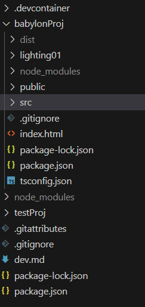
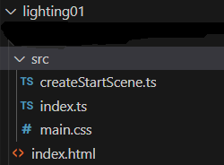
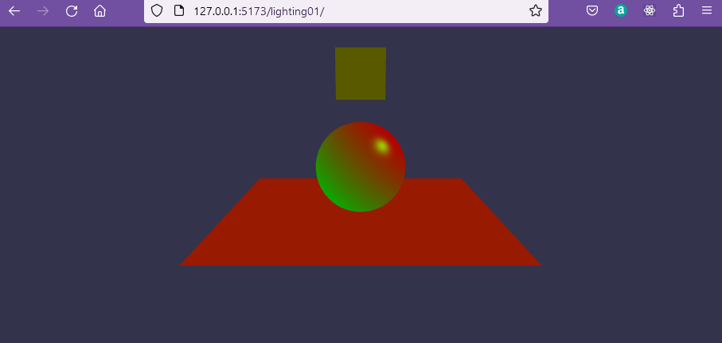
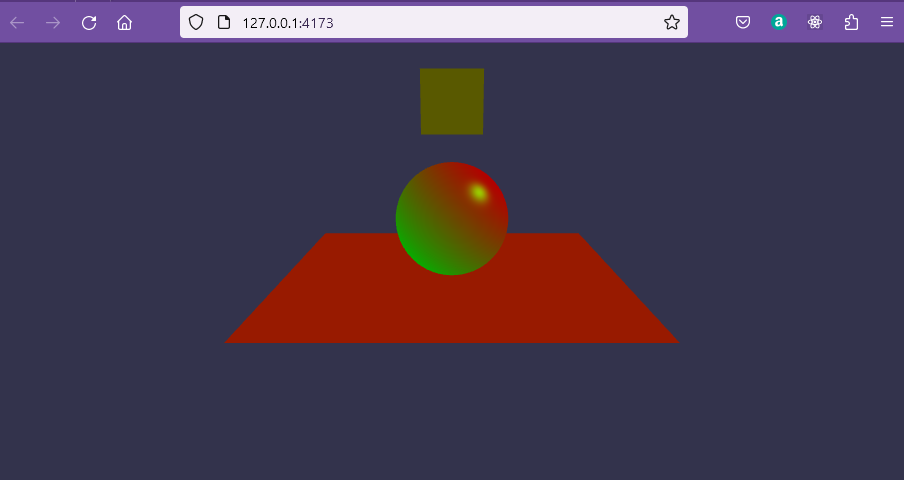
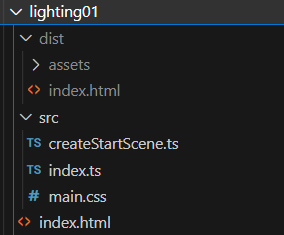

## Managing vite

Working with folder such as babylonProj is good for project development, however, before setting out on a full project it is useful to create many small example programs which are themselves minature projects. That takes a bit of organisation.

Vite has hot module reloading which means that when you edit a file it should change in the browser view immediately. However, as far as I can tell, this feature is only included if you use a template such as react in the setup and we used vanilla - so no hot reload!

You are reccomended to try

> npm update

from time to time in the root folder to maintain current versions of babylon and vite. There is advice on [using vite with babylon.js](https://doc.babylonjs.com/guidedLearning/usingVite#maintenance-and-updates) which may evolve so look back now and again. There is also a [vite guide](https://vitejs.dev/guide/) which you hopefully should not need!

To view your site on the development server you should enter `npm run dev`.

If you edit code you can reload by `CTRL + C` and `npm run dev`:

If you build a site using ` npm run build` you may notice javascript transpiled copies of typescript files appearing in the src folder. If you edit the typescript code and then `npm run dev` the server will serve the old javascript files and not your edited typescript files. If you `CTRL + C` and then **delete** any javascript files, the development server will serve from the Typescript files and you will see your new changes. In effect, you should not build until you are pretty well finished with the code development.

### Adding small example folders

As an example of adding a small example folder I am going to create a new folder named lighting01 within the babylonProj folder.



Into this folder (whilst running in the container) the code from the babylonProg/src folder and index.html are copied in to provide a starting point.



The only file edited here is createStartScene.ts just adding Color3 to the list of imports

```javaScript
import {
  Scene,
  ArcRotateCamera,
  Vector3,
  HemisphericLight,
  MeshBuilder,
  Mesh,
  Light,
  Color3,
  Camera,
  Engine,
} from "@babylonjs/core";
```

and then mpdifying the properties of the hemispheric light.

```javascript
function createLight(scene: Scene) {
  const light = new HemisphericLight("light", new Vector3(1, 1, 0), scene);
  light.intensity = 0.7;
  light.diffuse = new Color3(1, 0, 0);
  light.specular = new Color3(0, 1, 0);
  light.groundColor = new Color3(0, 1, 0);
  return light;
}
```

The `Vector3(1, 1, 0)` gives a direction to the light pointing down from the right.

The `diffuse` colour represents the colour (r,g,b) wich the light casts on objects such as the sphere.

The `specular` colour is the colour reflected from shiny surfaces, so appears as a small point on the sphere.

The `groundColour` is a feature only of the Hemispheric light and represents a contrast colour from the opposite direction from the light, as if from the ground.

Now start to add functions to create meshes to add the scene.

```javascript
function createBox(scene: Scene) {
  let box = MeshBuilder.CreateBox("box", { size: 1 }, scene);
  box.position.y = 3;
  return box;
}
```
This function will return a box in a fixed position.  You could add parameters to the function if you wanted to make it more versatile.

Add a sphere function.

```javascript
function createSphere(scene: Scene) {
  let sphere = MeshBuilder.CreateSphere(
    "sphere",
    { diameter: 2, segments: 32 },
    scene
  );
  sphere.position.y = 1;
  return sphere;
}
```


The full listing is:

**lighting01/createStartScene.ts**
```javascript
// import "@babylonjs/core/Debug/debugLayer";
// import "@babylonjs/inspector";
import { Scene, ArcRotateCamera, Vector3, HemisphericLight, 
         MeshBuilder, 
         Mesh,
         Light, Color3,
         Camera, 
         Engine} from "@babylonjs/core";

function createBox(scene: Scene){
    let box = MeshBuilder.CreateBox("box",{size: 1}, scene);
    box.position.y = 3;
    return box;
}
    
function createLight(scene: Scene){
    const light = new HemisphericLight("light", new Vector3(1, 1, 0),scene);
    light.intensity = 0.7;
    light.diffuse = new Color3(1, 0, 0);
	light.specular = new Color3(0, 1, 0);
	light.groundColor = new Color3(0, 1, 0);
    return light;
}
   
function createSphere(scene: Scene){
    let sphere = MeshBuilder.CreateSphere("sphere", { diameter: 2, segments: 32 }, scene);
    sphere.position.y = 1;
    return sphere;
}
   
function createGround(scene: Scene){
    let ground = MeshBuilder.CreateGround("ground", { width: 6, height: 6 }, scene);
    return ground;
}

function createArcRotateCamera(scene: Scene){
    let camAlpha = -Math.PI / 2,
    camBeta  =  Math.PI / 2.5,
    camDist  =  10,
    camTarget = new Vector3(0, 0, 0); 
    let camera = new ArcRotateCamera("camera1", camAlpha, camBeta, camDist, camTarget, scene);
    camera.attachControl(true);
    return camera;
}

export default function createStartScene(engine: Engine) {
    interface SceneData {
        scene:Scene,
        box?: Mesh,
        light?: Light
        sphere?: Mesh,
        ground?: Mesh,
        camera?:Camera
    };

    let that:SceneData = {scene:new Scene(engine)};
    // that.scene.debugLayer.show();

    that.box = createBox(that.scene);
    that.light = createLight(that.scene);
    that.sphere = createSphere(that.scene);
    that.ground = createGround(that.scene);
    that.camera = createArcRotateCamera(that.scene);
    return that;
}
```

Now to see this, open a terminal on babylonProj folder and issue:

> npm run dev

Browse to `http://127.0.0.1:5173/lighting01/`



### Building example

As you are investigating how babylonJS works it is unlikely that you will want to build until you have a more developed example than this, but just it is followed through here just for example.

Modify babylonProj/package.json adding new scripts directed at your lighting01 folder.

```JSON
{
  "name": "testproj",
  "private": true,
  "version": "0.0.0",
  "type": "module",
  "scripts": {
    "dev": "vite",
    "build": "tsc && vite build",
    "preview": "vite preview",
    "lighting01build": "tsc && vite build lighting01",
    "lighting01preview": "vite preview lighting01"
  },
  "devDependencies": {
    "typescript": "^5.0.2",
    "vite": "^4.4.0"
  }
}
```

Then to build the lighing01 example:

Check that the development server is stopped and the terminal is in the **babylonProj** folder:

> CTRL + C

Build lighting01:

> npm run lighting01build

```bash
> testproj@0.0.0 lighting01build
> tsc && vite build lighting01

vite v4.4.4 building for production...
✓ 1179 modules transformed.
dist/index.html                     0.30 kB │ gzip:   0.22 kB
dist/assets/index-d6d7b775.css      0.10 kB │ gzip:   0.10 kB
dist/assets/index-518960f8.js   3,610.96 kB │ gzip: 836.29 kB

(!) Some chunks are larger than 500 kBs after minification. Consider:
- Using dynamic import() to code-split the application
- Use build.rollupOptions.output.manualChunks to improve chunking: https://rollupjs.org/configuration-options/#output-manualchunks
- Adjust chunk size limit for this warning via build.chunkSizeWarningLimit.
✓ built in 38.19s
```
To preview this build:

> npm run lighting01preview

```bash
> testproj@0.0.0 lighting01preview
> vite preview lighting01

  ➜  Local:   http://localhost:4173/
  ➜  Network: use --host to expose
  ➜  press h to show help
```

Note that the preview server uses a different port number from the development server.



The files are now in the dist folder



These can be copied using file explorer and deployed on any html server.

<iframe 
    height="600" 
    width="100%" 
    scrolling="no" 
    title="Coloured Hemispheric Light" 
    src="Block_3/section_1g/dist_1g/index.html" 
    style="border:10;border-style: solid;
    border-color: red;"
    loading="lazy" 
    allowtransparency="true" 
    allowfullscreen="true">
</iframe>

### The next project

When you are over the small example phase and ready to start a serious project I reccommend starting a new project folder named after the project. Perhaps even starting from scratch.

Vite acts as a server so you can make other folders within the babylonProj folder and work from there.


