### Cloud development environments

In a similar way to which docker provides a development environment on the local machine, a cloud development environment provides this on a managed platform.  This should mean that you can develop software within an environment with reduced setup requirements.

The cloud environments provided by a range of providers may have different features, some have free tiers others provide free credit and these often need credit card details to setup.

Be aware that the cloud environment may not have the same graphics processing facility as a local machine, you should not expect it to run graphic editors.

One such environment is [codeSandbox](https://codesandbox.io/).

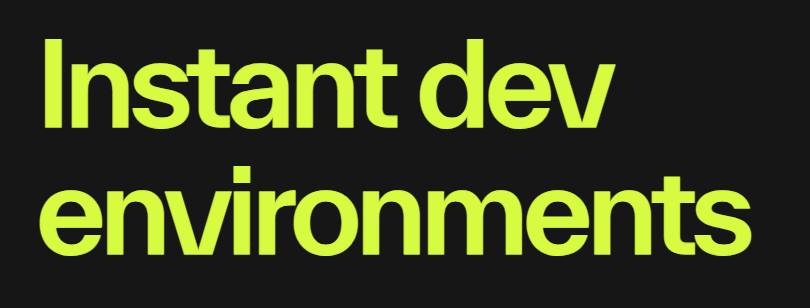

This site is free for learning and experimenting providing unlimited public sandboxes with the capacity for 2 GiB Ram, 2 virtual CPUs and 6 GB disk.

The site has a browser based editor "boxy" and is able to integrate with github and visual studio code.

### Setup cde

To get started you should sign in with either GitHub, google or Apple.  So here I am signing in with GitHub.  I have already signed in to my github account before trying to sign in to codesandbox.

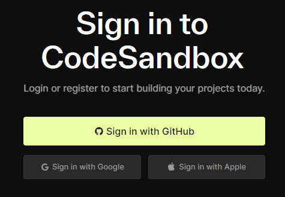

Authorization is requested.

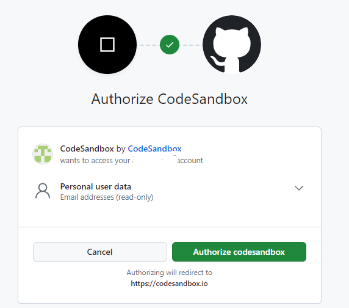

I already have sandboxes at this site but I will start a new one from scratch.

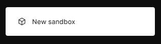

There are a lot of templates and we want to stick with vite so choose vite-ts.  Don't worry how close a template is to what you want because you can install or updated manually later.

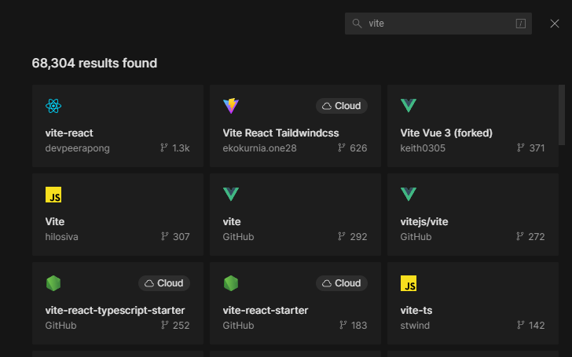

Select vite-ts

The editor opens and the sandbox has a random name, change this to babylonjs.

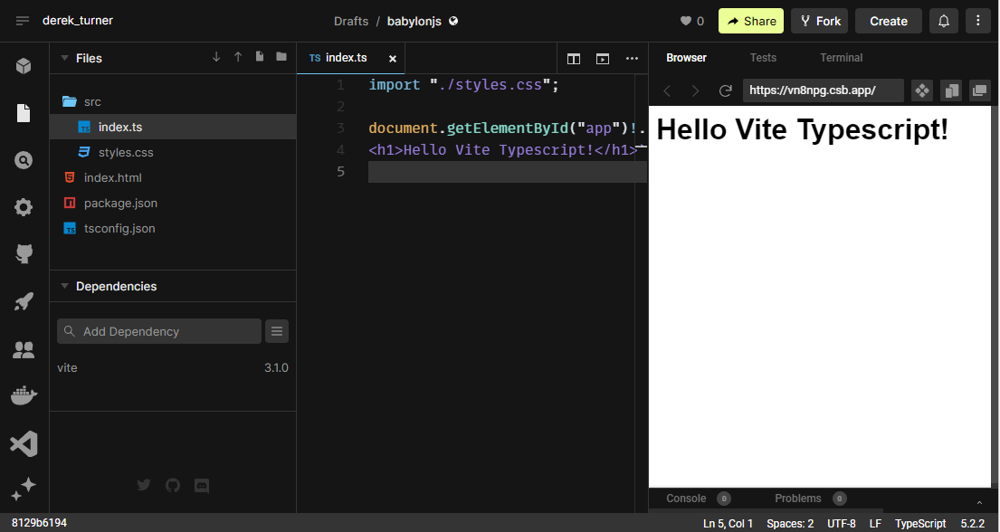

Click the terminal tab and convert the sandbox into a cloud sandbox.

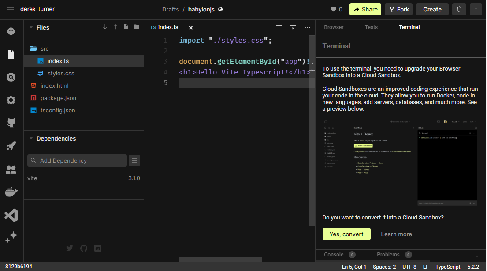

> yes convert

Now you have a virtual machine sandbox with a package json which shows the dependencies loaded by the template.

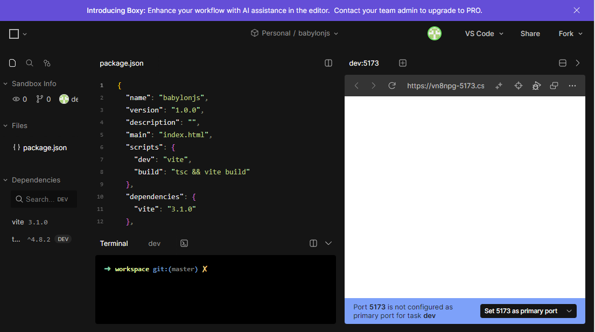

Thes may need updating.  In the Terminal enter

>npm update

This audits packages and suggests

>  npm install -g npm@10.1.0

Don't run this as it leads to a compatibility message.

Load the dependanceis for babylon

> npm i -D @babylonjs/core

> npm i -D @babylonjs/inspector

> npm i -D @babylonjs/loaders

The dependancies are now updated

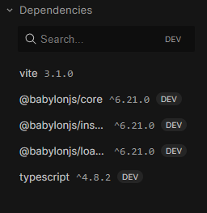

Scroll down the package.json and update the version number of the version numbers of vite and typescript to 4.4.4 and 5.0.2 respectively.  Save the changes (ctrl + s).

``` json
{
  "name": "babylonjs",
  "version": "1.0.0",
  "description": "",
  "main": "index.html",
  "scripts": {
    "dev": "vite",
    "build": "tsc && vite build"
  },
  "dependencies": {
    "vite": "^4.4.4"
  },
  "devDependencies": {
    "@babylonjs/core": "^6.21.0",
    "@babylonjs/inspector": "^6.21.0",
    "@babylonjs/loaders": "^6.21.0",
    "typescript": "^5.0.2"
  },
  "resolutions": {
    "@babel/preset-env": "7.13.8"
  },
  "keywords": []
}
```

To update the node modules to match this.

> npm install

Dependancies are now up to date.

The dev and build scripts are listed in packages.json, add in a preview script

``` json
 "scripts": {
    "dev": "vite",
    "build": "tsc && vite build",
    "preview":"vite preview"
  },
```

There is a tab next to the terminal named dev which shows up the old vite version.  Close this with 

> CTRL + C

and delete from view.

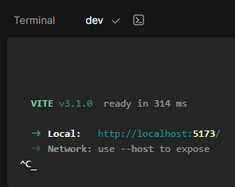

### babylon code

Now start to bring the babylon code into the sandbox editor.

Edit index.html

**index.html**

```html
<!DOCTYPE html>
<html>
    <head>
        <meta charset="UTF-8">
        <title>BabylonJS</title>
    </head>
    <body> </body>
</html>
<script type="module" src="./src/index.ts"></script>
```

Edit index.ts 

**index.ts**
``` javascript
import { Engine } from "@babylonjs/core";
import createStartScene from "./createStartScene";
import './main.css';

const CanvasName = "renderCanvas";

let canvas = document.createElement("canvas");
canvas.id = CanvasName;

canvas.classList.add("background-canvas");
document.body.appendChild(canvas);

let eng = new Engine(canvas, true, {}, true);
let startScene = createStartScene(eng);
eng.runRenderLoop(() => {
    startScene.scene.render();
});       
```

Rename style.css to main.css and edit:

**main.css**
```css
body {
    overflow: hidden;
    width: 100%;
    height: 100%;
    margin: 0;
    padding: 0;
}

#renderCanvas {
    width: 100%;
    height: 100%;
}

```

Add the file createStartScene.ts in the src folder

**createStartScene.ts**

```javascript
import "@babylonjs/core/Debug/debugLayer";
import "@babylonjs/inspector";
import {
    Scene,
    ArcRotateCamera,
    Vector3,
    HemisphericLight,
    MeshBuilder,
    Mesh,
    Light,
    Camera,
    Engine,
  } from "@babylonjs/core";
  
  
  function createBox(scene: Scene) {
    let box = MeshBuilder.CreateBox("box",{size: 1}, scene);
    box.position.y = 3;
    return box;
  }

  
  function createLight(scene: Scene) {
    const light = new HemisphericLight("light", new Vector3(0, 1, 0), scene);
    light.intensity = 0.7;
    return light;
  }
  
  function createSphere(scene: Scene) {
    let sphere = MeshBuilder.CreateSphere(
      "sphere",
      { diameter: 2, segments: 32 },
      scene,
    );
    sphere.position.y = 1;
    return sphere;
  }
  
  function createGround(scene: Scene) {
    let ground = MeshBuilder.CreateGround(
      "ground",
      { width: 6, height: 6 },
      scene,
    );
    return ground;
  }
  
  function createArcRotateCamera(scene: Scene) {
    let camAlpha = -Math.PI / 2,
      camBeta = Math.PI / 2.5,
      camDist = 10,
      camTarget = new Vector3(0, 0, 0);
    let camera = new ArcRotateCamera(
      "camera1",
      camAlpha,
      camBeta,
      camDist,
      camTarget,
      scene,
    );
    camera.attachControl(true);
    return camera;
  }
  
  export default function createStartScene(engine: Engine) {
    interface SceneData {
      scene: Scene;
      box?: Mesh;
      light?: Light;
      sphere?: Mesh;
      ground?: Mesh;
      camera?: Camera;
    }
  
    let that: SceneData = { scene: new Scene(engine) };
    that.scene.debugLayer.show();
  
    that.box = createBox(that.scene);
    that.light = createLight(that.scene);
    that.sphere = createSphere(that.scene);
    that.ground = createGround(that.scene);
    that.camera = createArcRotateCamera(that.scene);
    return that;
  }
```

The file structure is now:

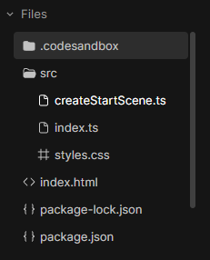

In the terminal run the vite development server:

> nmm run dev

In this view there is not a lot of room for the scene explorer and inspector which make the image really small.

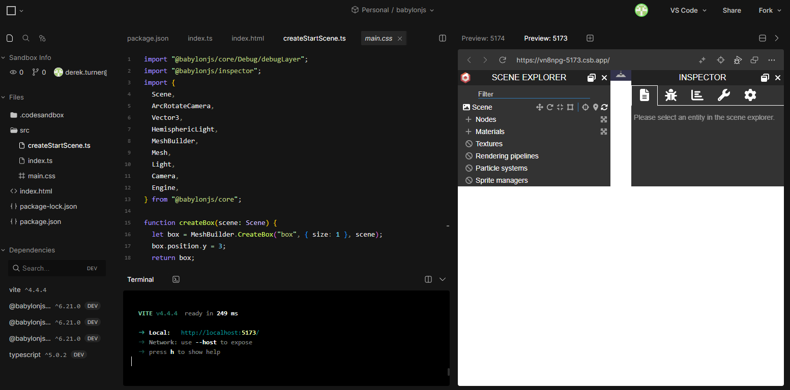

Click on the x icons to close scene explorer and inspector. The full image now shows in the browser preview.  There is a debug icon to the right above the image which will open a browser console.

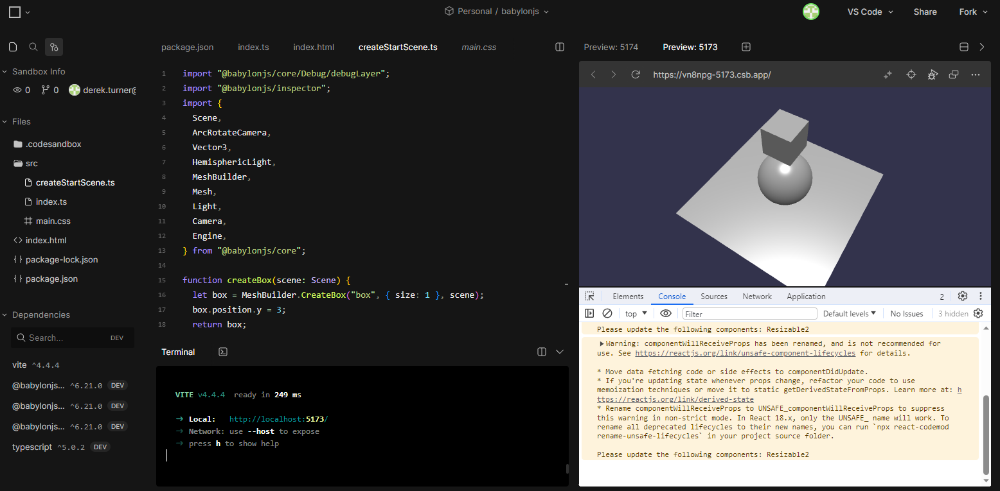

The warnings here are for the developers to worry about the babylon code is working.

Comment out the lines which generate the scene explorer and the inspector.

**createStartScene.ts**
```javascript
//import "@babylonjs/core/Debug/debugLayer";
//import "@babylonjs/inspector";
import {
    Scene,
    ArcRotateCamera,
    Vector3,
    HemisphericLight,
    MeshBuilder,
    Mesh,
    Light,
    Camera,
    Engine,
  } from "@babylonjs/core";
  
  
  function createBox(scene: Scene) {
    let box = MeshBuilder.CreateBox("box",{size: 1}, scene);
    box.position.y = 3;
    return box;
  }

  
  function createLight(scene: Scene) {
    const light = new HemisphericLight("light", new Vector3(0, 1, 0), scene);
    light.intensity = 0.7;
    return light;
  }
  
  function createSphere(scene: Scene) {
    let sphere = MeshBuilder.CreateSphere(
      "sphere",
      { diameter: 2, segments: 32 },
      scene,
    );
    sphere.position.y = 1;
    return sphere;
  }
  
  function createGround(scene: Scene) {
    let ground = MeshBuilder.CreateGround(
      "ground",
      { width: 6, height: 6 },
      scene,
    );
    return ground;
  }
  
  function createArcRotateCamera(scene: Scene) {
    let camAlpha = -Math.PI / 2,
      camBeta = Math.PI / 2.5,
      camDist = 10,
      camTarget = new Vector3(0, 0, 0);
    let camera = new ArcRotateCamera(
      "camera1",
      camAlpha,
      camBeta,
      camDist,
      camTarget,
      scene,
    );
    camera.attachControl(true);
    return camera;
  }
  
  export default function createStartScene(engine: Engine) {
    interface SceneData {
      scene: Scene;
      box?: Mesh;
      light?: Light;
      sphere?: Mesh;
      ground?: Mesh;
      camera?: Camera;
    }
  
    let that: SceneData = { scene: new Scene(engine) };
    //that.scene.debugLayer.show();
  
    that.box = createBox(that.scene);
    that.light = createLight(that.scene);
    that.sphere = createSphere(that.scene);
    that.ground = createGround(that.scene);
    that.camera = createArcRotateCamera(that.scene);
    return that;
  }
```

The page auto-reloads.

Now close the running dev server

> CTRL + C

Try a build

> npm run build

The dist folder contains the created code for distribution.

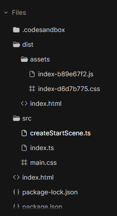

To check that the build is successful it can be previewed on vite.

> npm run preview

Note that the preview operates on port 4173 to distinguish it from the dev code.

Right click on the dist folder to download the folder as dist.zip.  Unzip this.

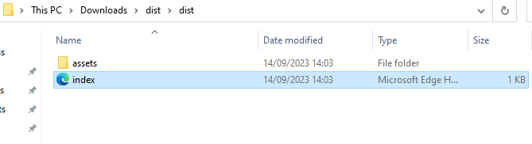

Open the dist folder in a visual studio window and check that it works when run on live server.

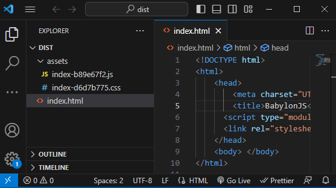

See that the code now is running on the browser port 5501.

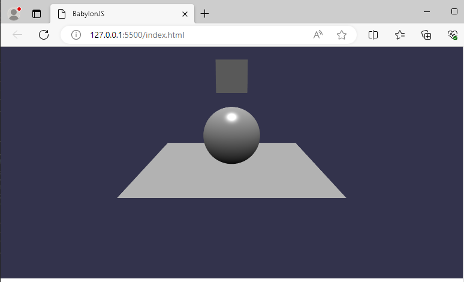

And finally it is running here!

<iframe 
    height="600" 
    width="100%" 
    scrolling="no" 
    title="BabylonJS developed on codeSandbox" 
    src="Block_3/section_1h/dist_1h/index.html" 
    style="border:10;border-style: solid;
    border-color: red;" 
    loading="lazy" 
    allowtransparency="true" 
    allowfullscreen="true">
</iframe>

