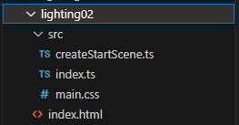
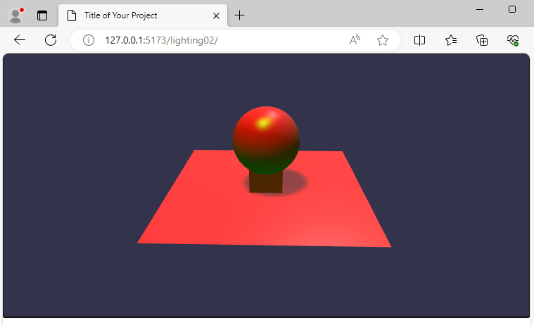

## Lighting

In the babylonProj folder copy files to create a structure in folder lighting02 which can then be edited.



In the previous section a basic scene with lighting was described.  There are a range of [lighting options available](https://doc.babylonjs.com/features/featuresDeepDive/lights/lights_introduction#tmp) which include:

* HemisphericLight - Ambient environment
* PointLight - Emits in all directions from a point
* DirectionalLight - Emits in a direction set by a vector
* SpotLight - Emits in a direction with a conical beam

These are defined in babylonProj/lighting02/src/createStartScene.ts

The sections for each light are:

```javascript
function createHemisphericLight(scene: Scene ){
    const light:HemisphericLight = new HemisphericLight("light", new Vector3(1, 10, 0),scene);
    light.intensity = 0.3;
    light.diffuse = new Color3(1, 0, 0);
	light.specular = new Color3(0, 1, 0);
	light.groundColor = new Color3(0, 1, 0);
    return light;
}
```

The [hemispheric light](https://doc.babylonjs.com/typedoc/classes/BABYLON.HemisphericLight) has been seen previously.  It does have a direction which is usually `(0,1,0)`, but can be varied as is shown here.

Key features are the colours.  

Diffuse sets the basic colour of objects lit by the light.

Specular sets the colour reflected from shiny objects.

GroundColor is the light in the other direction which can be viewed as a reflection from a ground surface.

```javascript
function createPointLight(scene: Scene ){
    const light = new PointLight("light", new Vector3(-1, 1, 0),scene);
    light.position = new Vector3(5, 20, 10);
    light.intensity = 0.3;
    light.diffuse = new Color3(0.5, 1, 1);
	light.specular = new Color3(0.8, 1, 1);
    return light;
}
```

For the [point light](https://doc.babylonjs.com/typedoc/classes/BABYLON.PointLight), the location of the light is defined by a vector, but there is no directivity.  The position can also be manipulated by the light.poition.  A point light is capable of casting a shadow.

```javascript
    function createDirectionalLight(scene: Scene ){
    const light = new DirectionalLight("light", new Vector3(0.2, -1, 0.2),scene);
    light.position = new Vector3(20, 40, 20);
    light.intensity = 0.7;
    light.diffuse = new Color3(1, 0, 0);
	light.specular = new Color3(0, 1, 0);
    return light;
}
```

The [directional light](https://doc.babylonjs.com/typedoc/classes/BABYLON.DirectionalLight) casts in the direction of the vector3 and its position is manipulated by light.position. A directional light is capable of casting a shadow.

```javascript
function createSpotLight(scene: Scene ){
    const light = new SpotLight("light", new Vector3(1, 5, -3), 
        new Vector3(0, -1, 0), Math.PI / 3, 20, scene);
    light.intensity = 0.5;
    light.diffuse = new Color3(1, 0, 0);
	light.specular = new Color3(0, 1, 0);
    return light;
}
```

The [spotlight](https://doc.babylonjs.com/typedoc/classes/BABYLON.SpotLight) sets the position with a vector and the direction with a second vector. The angle sets the angle of the cone in radians.  The exponent number determines the rate of fall off of light intensity.


```javascript
function createShadows(light: DirectionalLight, sphere: Mesh ,box: Mesh){
    const shadower = new ShadowGenerator(1024, light);
    const sm : any = shadower.getShadowMap();
    sm.renderList.push(sphere, box);

    shadower.setDarkness(0.2);
    shadower.useBlurExponentialShadowMap = true;
    shadower.blurScale = 4;
    shadower.blurBoxOffset = 1;
    shadower.useKernelBlur = true;
    shadower.blurKernel = 64;
    shadower.bias = 0;
    return shadower;
}
```

In order to create shadows, a [shadow generator](https://doc.babylonjs.com/typedoc/classes/BABYLON.ShadowGenerator) must be created.  This is used to create a shadow map.  

The render list determines which elements in the scene will ge allocated to shadowing.  It can save CPU to not shadow absolutely everything.

The nature of the shadow in terms of detail and blur can be controloled by parameters.

```javascript
function createGround(scene: Scene){
    let ground = MeshBuilder.CreateGround("ground", { width: 6, height: 6 }, scene);
    var groundMaterial = new StandardMaterial("groundMaterial", scene);
    groundMaterial.backFaceCulling = false;
    ground.material = groundMaterial;
    ground.receiveShadows = true;
    return ground;
}
```

In order to cast shadows on the ground it must be set to recieveShadows.

The backFaceCulling feature allows the camera to look below the ground and see a face.  By default the ground is transparent when viewed from below.

Following the pattern set previously the elements in the scene will all be listed in the SceneData interface and implemented in the object which I have named ``that`` which is returned from the function.

The full listing is then

**babylonProj/lighting02/src/createStartScene.ts**
```javascript
// import "@babylonjs/core/Debug/debugLayer";
// import "@babylonjs/inspector";
import { Scene, ArcRotateCamera, Vector3,
         MeshBuilder, Mesh,
         StandardMaterial,
         HemisphericLight, PointLight, SpotLight, DirectionalLight, Color3,
         Camera,
         ShadowGenerator,
         Engine} from "@babylonjs/core";

function createBox(scene: Scene ){
    let box = MeshBuilder.CreateBox("box",{size: 1}, scene);
    box.position.y = 3;
    box.position.y = 0.51;
    return box;
}
    
function createPointLight(scene: Scene ){
    const light = new PointLight("light", new Vector3(-1, 1, 0),scene);
    light.position = new Vector3(5, 20, 10);
    light.intensity = 0.3;
    light.diffuse = new Color3(0.5, 1, 1);
	light.specular = new Color3(0.8, 1, 1);
    return light;
}

function createDirectionalLight(scene: Scene ){
    const light = new DirectionalLight("light", new Vector3(0.2, -1, 0.2),scene);
    light.position = new Vector3(20, 40, 20);
    light.intensity = 0.7;
    light.diffuse = new Color3(1, 0, 0);
	light.specular = new Color3(0, 1, 0);
    return light;
}

function createSpotLight(scene: Scene ){
    const light = new SpotLight("light", new Vector3(1, 5, -3), 
        new Vector3(0, -1, 0), Math.PI / 3, 20, scene);
    light.intensity = 0.5;
    light.diffuse = new Color3(1, 0, 0);
	light.specular = new Color3(0, 1, 0);
    return light;
}
   
function createHemisphericLight(scene: Scene ){
    const light:HemisphericLight = new HemisphericLight("light", new Vector3(1, 10, 0),scene);
    light.intensity = 0.3;
    light.diffuse = new Color3(1, 0, 0);
	light.specular = new Color3(0, 1, 0);
	light.groundColor = new Color3(0, 1, 0);
    return light;
}

function createShadows(light: DirectionalLight, sphere: Mesh ,box: Mesh){
    const shadower = new ShadowGenerator(1024, light);
    const sm : any = shadower.getShadowMap();
    sm.renderList.push(sphere, box);

    shadower.setDarkness(0.2);
    shadower.useBlurExponentialShadowMap = true;
    shadower.blurScale = 4;
    shadower.blurBoxOffset = 1;
    shadower.useKernelBlur = true;
    shadower.blurKernel = 64;
    shadower.bias = 0;
    return shadower;
}

function createSphere(scene: Scene){
    let sphere = MeshBuilder.CreateSphere("sphere", { diameter: 2, segments: 32 }, scene);
    sphere.position.y = 1.5;
    return sphere;
}
   
function createGround(scene: Scene){
    let ground = MeshBuilder.CreateGround("ground", { width: 6, height: 6 }, scene);
    var groundMaterial = new StandardMaterial("groundMaterial", scene);
    groundMaterial.backFaceCulling = false;
    ground.material = groundMaterial;
    ground.receiveShadows = true;
    return ground;
}

function createArcRotateCamera(scene: Scene){
    let camAlpha = -Math.PI / 2,
    camBeta  =  Math.PI / 2.5,
    camDist  =  10,
    camTarget = new Vector3(0, 0, 0); 
    let camera = new ArcRotateCamera("camera1", camAlpha, camBeta, camDist, camTarget, scene);
    camera.attachControl(true);
    return camera;
}

export default function createStartScene(engine:Engine) {
    interface SceneData {
        scene:Scene,
        box?: Mesh,
        lightBulb?: PointLight,
        lightDirectional?: DirectionalLight,
        lightSpot?: SpotLight,
        lightHemispheric?: HemisphericLight,
        sphere?: Mesh,
        ground?: Mesh,
        camera?:Camera,
        shadowGenerator?: ShadowGenerator
    };

    let that:SceneData = {scene:new Scene(engine)};
    // that.scene.debugLayer.show();

    that.box = createBox(that.scene);
    that.lightBulb = createPointLight(that.scene);
    that.lightDirectional = createDirectionalLight(that.scene);
    that.lightSpot = createSpotLight(that.scene);
    that.lightHemispheric = createHemisphericLight(that.scene);
    that.sphere = createSphere(that.scene);
    that.ground = createGround(that.scene);
    that.camera = createArcRotateCamera(that.scene);
    that.shadowGenerator = createShadows(that.lightDirectional,that.sphere,that.box)
    return that;
}
```

> npm run dev

The resulting scene will then appear in the browser.



And finally it is running here!

<iframe 
    height="480" 
    width="600" 
    scrolling="no" 
    title="Lighting and Shadow" 
    src="Block_3/section_2a/dist_2a/index.html" 
    style="border:10;border-style: solid;
    border-color: red;" 
    loading="lazy" 
    allowtransparency="true" 
    allowfullscreen="true">
</iframe>