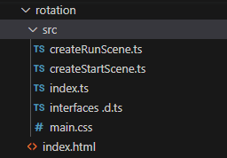

## Refactoring

In this section we will add motion and rotation to meshes and a light.

As the code is becoming longer it becomes worthwhile to refactor it into smaller pieces.  The object here is to separate out the file in which the scene is described with a file where actions on the scene elements are stated.

The glue which holds these two files together is the interface which has to be accurately maintained to describe the list of elements which are in a particular scene.

To make this work the files will need to be addressed in turn as the scene is set up.

Make a copy of lighting02 folder and call this 'rotation' at the end of the process the file stucture you should have will be:



Starting from rotation/index.ts

```javascript
import { Engine } from "@babylonjs/core";
import createStartScene from "./createStartScene";
import createRunScene from "./createRunScene";
import "./main.css";

const CanvasName = "renderCanvas";

let canvas = document.createElement("canvas");
canvas.id = CanvasName;

canvas.classList.add("background-canvas");
document.body.appendChild(canvas);

let eng = new Engine(canvas, true, {}, true);
let startScene = createStartScene(eng);
createRunScene(startScene);

eng.runRenderLoop(() => {
  startScene.scene.render();
});
```

This will import from the scene description in ./createStartScene and the scene actions in ./createRunScene.

Once the engine has been created the createStartScene(eng) can be called and the scene data is all stored in the variable startScene.

This data is passed as an argument to the createRunScene() function.

Finally the scene is rendered in a loop.

While we have only one scene this pattern will work fine.

The contents of createStartScene.ts reflect the elements added to the scene.

The first section imports the required resources and defines the functions to make the elements.  Not much change here.

**rotation/src/createStartScene.ts**
```javascript
import { SceneData } from "./interfaces ";

import {
  Scene,
  ArcRotateCamera,
  Vector3,
  MeshBuilder,
  Mesh,
  StandardMaterial,
  HemisphericLight,
  PointLight,
  SpotLight,
  DirectionalLight,
  Color3,
  ShadowGenerator,
  Engine,
} from "@babylonjs/core";

function createBox(scene) {
  let box = MeshBuilder.CreateBox("box", scene);
  box.position.y = 3;
  box.position.y = 0.51;
  return box;
}

function createPointLight(scene: Scene) {
  const light = new PointLight("light", new Vector3(-1, 1, 0), scene);
  light.position = new Vector3(5, 20, 10);
  light.intensity = 0.3;
  light.diffuse = new Color3(0.5, 1, 1);
  light.specular = new Color3(0.8, 1, 1);
  return light;
}

function createDirectionalLight(scene: Scene) {
  const light = new DirectionalLight("light", new Vector3(0.2, -1, 0.2), scene);
  light.position = new Vector3(20, 40, 20);
  light.intensity = 0.7;
  light.diffuse = new Color3(1, 0, 0);
  light.specular = new Color3(0, 1, 0);
  return light;
}

function createSpotLight(scene: Scene) {
  const light = new SpotLight(
    "light",
    new Vector3(1, 5, -3),
    new Vector3(0, -1, 0),
    Math.PI / 3,
    20,
    scene
  );
  light.intensity = 0.7;
  light.diffuse = new Color3(1, 0, 0);
  light.specular = new Color3(0, 1, 0);
  return light;
}

function createHemisphericLight(scene: Scene) {
  const light: HemisphericLight = new HemisphericLight(
    "light",
    new Vector3(1, 10, 0),
    scene
  );
  light.intensity = 0.3;
  light.diffuse = new Color3(1, 0, 0);
  light.specular = new Color3(0, 1, 0);
  light.groundColor = new Color3(0, 1, 0);
  return light;
}

function createShadows(light: DirectionalLight, sphere: Mesh, box: Mesh) {
  const shadower = new ShadowGenerator(1024, light);
  const shadowmap: any = shadower.getShadowMap();
  shadowmap.renderList.push(sphere, box);

  shadower.setDarkness(0.2);
  shadower.useBlurExponentialShadowMap = true;
  shadower.blurScale = 4;
  shadower.blurBoxOffset = 1;
  shadower.useKernelBlur = true;
  shadower.blurKernel = 64;
  shadower.bias = 0;
  return shadower;
}

function createSphere(scene: Scene) {
  let sphere = MeshBuilder.CreateSphere(
    "sphere",
    { diameter: 2, segments: 32 },
    scene
  );
  sphere.position.y = 1.5;
  return sphere;
}

function createGround(scene: Scene) {
  let ground = MeshBuilder.CreateGround(
    "ground",
    { width: 6, height: 6 },
    scene
  );
  var groundMaterial = new StandardMaterial("groundMaterial", scene);
  groundMaterial.backFaceCulling = false;
  ground.material = groundMaterial;
  ground.receiveShadows = true;
  return ground;
}

function createArcRotateCamera(scene: Scene) {
  let camAlpha = -Math.PI / 2,
    camBeta = Math.PI / 2.5,
    camDist = 10,
    camTarget = new Vector3(0, 0, 0);
  let camera = new ArcRotateCamera(
    "camera1",
    camAlpha,
    camBeta,
    camDist,
    camTarget,
    scene
  );
  camera.attachControl(true);
  return camera;
}

```

The createStartScene function has been reorganised.  Firstly a list of variables are created which contain the scene elements created by function calls.

```javascript
export default function createStartScene(engine: Engine) {
  let scene = new Scene(engine);
  let box = createBox(scene);
  let lightBulb = createPointLight(scene);
  let lightDirectional = createDirectionalLight(scene);
  let lightSpot = createSpotLight(scene);
  let lightHemispheric = createHemisphericLight(scene);
  let sphere = createSphere(scene);
  let ground = createGround(scene);
  let camera = createArcRotateCamera(scene);
  let shadowGenerator = createShadows(lightDirectional, sphere, box);

```
Next the variables are loaded into a variable `that` which implements the SceneData interface which is imported from ./interfaces as the first line of this code file.

This is now a clear list of what the scene contains.

```javascript

  let that: SceneData = {
    scene,
    box,
    lightBulb,
    lightDirectional,
    lightSpot,
    lightHemispheric,
    sphere,
    ground,
    camera,
    shadowGenerator,
  };
  return that;
}
```

The full listing of rotation/src/createStartScene.ts is 

**rotation/src/createStartScene.ts**
```javascript
import { SceneData } from "./interfaces ";

import {
  Scene,
  ArcRotateCamera,
  Vector3,
  MeshBuilder,
  Mesh,
  StandardMaterial,
  HemisphericLight,
  PointLight,
  SpotLight,
  DirectionalLight,
  Color3,
  ShadowGenerator,
  Engine,
} from "@babylonjs/core";

function createBox(scene) {
  let box = MeshBuilder.CreateBox("box", scene);
  box.position.y = 3;
  box.position.y = 0.51;
  return box;
}

function createPointLight(scene: Scene) {
  const light = new PointLight("light", new Vector3(-1, 1, 0), scene);
  light.position = new Vector3(5, 20, 10);
  light.intensity = 0.3;
  light.diffuse = new Color3(0.5, 1, 1);
  light.specular = new Color3(0.8, 1, 1);
  return light;
}

function createDirectionalLight(scene: Scene) {
  const light = new DirectionalLight("light", new Vector3(0.2, -1, 0.2), scene);
  light.position = new Vector3(20, 40, 20);
  light.intensity = 0.7;
  light.diffuse = new Color3(1, 0, 0);
  light.specular = new Color3(0, 1, 0);
  return light;
}

function createSpotLight(scene: Scene) {
  const light = new SpotLight(
    "light",
    new Vector3(1, 5, -3),
    new Vector3(0, -1, 0),
    Math.PI / 3,
    20,
    scene
  );
  light.intensity = 0.7;
  light.diffuse = new Color3(1, 0, 0);
  light.specular = new Color3(0, 1, 0);
  return light;
}

function createHemisphericLight(scene: Scene) {
  const light: HemisphericLight = new HemisphericLight(
    "light",
    new Vector3(1, 10, 0),
    scene
  );
  light.intensity = 0.3;
  light.diffuse = new Color3(1, 0, 0);
  light.specular = new Color3(0, 1, 0);
  light.groundColor = new Color3(0, 1, 0);
  return light;
}

function createShadows(light: DirectionalLight, sphere: Mesh, box: Mesh) {
  const shadower = new ShadowGenerator(1024, light);
  const shadowmap: any = shadower.getShadowMap();
  shadowmap.renderList.push(sphere, box);

  shadower.setDarkness(0.2);
  shadower.useBlurExponentialShadowMap = true;
  shadower.blurScale = 4;
  shadower.blurBoxOffset = 1;
  shadower.useKernelBlur = true;
  shadower.blurKernel = 64;
  shadower.bias = 0;
  return shadower;
}

function createSphere(scene: Scene) {
  let sphere = MeshBuilder.CreateSphere(
    "sphere",
    { diameter: 2, segments: 32 },
    scene
  );
  sphere.position.y = 1.5;
  return sphere;
}

function createGround(scene: Scene) {
  let ground = MeshBuilder.CreateGround(
    "ground",
    { width: 6, height: 6 },
    scene
  );
  var groundMaterial = new StandardMaterial("groundMaterial", scene);
  groundMaterial.backFaceCulling = false;
  ground.material = groundMaterial;
  ground.receiveShadows = true;
  return ground;
}

function createArcRotateCamera(scene: Scene) {
  let camAlpha = -Math.PI / 2,
    camBeta = Math.PI / 2.5,
    camDist = 10,
    camTarget = new Vector3(0, 0, 0);
  let camera = new ArcRotateCamera(
    "camera1",
    camAlpha,
    camBeta,
    camDist,
    camTarget,
    scene
  );
  camera.attachControl(true);
  return camera;
}

export default function createStartScene(engine: Engine) {
  let scene = new Scene(engine);
  let box = createBox(scene);
  let lightBulb = createPointLight(scene);
  let lightDirectional = createDirectionalLight(scene);
  let lightSpot = createSpotLight(scene);
  let lightHemispheric = createHemisphericLight(scene);
  let sphere = createSphere(scene);
  let ground = createGround(scene);
  let camera = createArcRotateCamera(scene);
  let shadowGenerator = createShadows(lightDirectional, sphere, box);

  let that: SceneData = {
    scene,
    box,
    lightBulb,
    lightDirectional,
    lightSpot,
    lightHemispheric,
    sphere,
    ground,
    camera,
    shadowGenerator,
  };
  return that;
}
```

Now the file rotation/src/interfaces.d.ts has to reflect exactly the pattern of the SceneData.

**rotation/src/interfaces.d.ts**
```javascript
import {
  Scene,
  Mesh,
  HemisphericLight,
  PointLight,
  SpotLight,
  DirectionalLight,
  Camera,
  ShadowGenerator,
} from "@babylonjs/core";

export interface SceneData {
  scene: Scene;
  box: Mesh;
  lightBulb: PointLight;
  lightDirectional?: DirectionalLight;
  lightSpot: SpotLight;
  lightHemispheric: HemisphericLight;
  sphere: Mesh;
  ground: Mesh;
  camera: Camera;
  shadowGenerator: ShadowGenerator;
}
``` 
There is not much here that can't be created quickly with cut and paste.  However, you must maintain this file and a keep it up to date with any changes you make with the SceneData in the createStartScene.ts file.

## rotation

The code which controlls the motion of the elements is now held in the file rotation.src/createRunScene.ts

**rotation.src/createRunScene.ts**
```javascript
import { Vector3, Quaternion } from "@babylonjs/core";

import { SceneData } from "./interfaces ";
```
The imports of Vector3 and Quaternion are useful for implementing rotation.

The import of SceneData means that the code can access the full range of elements in the scene.

```javascript

// rotate box
let boxAngle: number = 0.3;
let boxSpeed: number = 0.01;

// move light in ellipse and cycle luma
let lightAngle: number = 0;
let lightSpeed: number = 0.005;
const lightXpos: number = 1;
const lightZpos: number = 5;

// vertical oscilation of meshes
let verticalSpeed: number = 0.006;
let verticalAngle: number = 0;
let verticalRangeY: number = 0.3;
let boxPositionY: number = 4;
let spherePositionY: number = 1.5;

```
A group of local variables and constants are set which will act as variable paramenters during the motion of elements.

```javascript

export default function createRunScene(runScene: SceneData) {
  runScene.scene.onAfterRenderObservable.add(() => {
    // rotate box
    const axis: Vector3 = new Vector3(0, 0, 1).normalize();
    const quat: Quaternion = Quaternion.RotationAxis(
      axis,
      boxAngle * 2 * Math.PI
    );
    runScene.box.rotationQuaternion = quat;
    boxAngle += boxSpeed;
    boxAngle %= 1;

```

Within the createRunScene function an anonymous function is added to the onAfterRenderObservable property of the scene.  The contents of this function will be called at every frame.

There are other properties of the scene which could be used to achieve and equivalent effect.

To rotate the box a rotation axis must be defined.  In this case rotating on the z axis. 

An angle of rotation is defined in radians.  One cycle is 2PI radians so boxangle needs to vary from 0 - 1 to move round the cycle.

A [quaternion](https://doc.babylonjs.com/typedoc/classes/BABYLON.Quaternion) is a combination of a direction and and angle of rotation.  Babylon has a number of ways of defining the quaternion and there are a range of useful methods which are more than is required for this simple example.

```javascript    

    // move light in ellipse  and cycle luma
    runScene.lightSpot.position = new Vector3(
      lightXpos + 8 * Math.sin(lightAngle * 2 * Math.PI),
      20,
      lightZpos + 10 * Math.cos(lightAngle * 2 * Math.PI)
    );
    runScene.lightSpot.intensity = 0.7 * Math.sin(lightAngle * 2 * Math.PI);
    lightAngle += lightSpeed;
    lightAngle %= 1;
```

Th spotlight position is set by a vector which varies in the x and z directions.  The use of sine and cosine waves describes circle, this becomes an ellipse when the amplitude of the sine and cosine elements are different.

A sine wave is useful to control the intensity as this fades smoothly, but notice that the light will be off for half the cycle.  If you want to make this on at all times add 1 to the sine and divide the result by 2.

```javascript
    // vertical oscilation of meshes
    runScene.box.position.y =
      boxPositionY + verticalRangeY * Math.sin(verticalAngle * 2 * Math.PI);
    runScene.sphere.position.y =
      spherePositionY - verticalRangeY * Math.sin(verticalAngle * 2 * Math.PI);
    verticalAngle += verticalSpeed;
    verticalAngle %= 1;
  });
}

```

The vertical oscillation of the meshes fits with a sine wave and this moves the meshes above and below their central location.

The complete listing of rotation.src/createRunScene.ts is

**rotation.src/createRunScene.ts**
```javascript
import { Vector3, Quaternion } from "@babylonjs/core";

import { SceneData } from "./interfaces ";

// rotate box
let boxAngle: number = 0.3;
let boxSpeed: number = 0.01;

// move light in ellipse and cycle luma
let lightAngle: number = 0;
let lightSpeed: number = 0.005;
const lightXpos: number = 1;
const lightZpos: number = 5;

// vertical oscilation of meshes
let verticalSpeed: number = 0.006;
let verticalAngle: number = 0;
let verticalRangeY: number = 0.3;
let boxPositionY: number = 4;
let spherePositionY: number = 1.5;

export default function createRunScene(runScene: SceneData) {
  runScene.scene.onAfterRenderObservable.add(() => {
    // rotate box
    const axis: Vector3 = new Vector3(0, 0, 1).normalize();
    const quat: Quaternion = Quaternion.RotationAxis(
      axis,
      boxAngle * 2 * Math.PI
    );
    runScene.box.rotationQuaternion = quat;
    boxAngle += boxSpeed;
    boxAngle %= 1;

    // move light in ellipse  and cycle luma
    runScene.lightSpot.position = new Vector3(
      lightXpos + 8 * Math.sin(lightAngle * 2 * Math.PI),
      20,
      lightZpos + 10 * Math.cos(lightAngle * 2 * Math.PI)
    );
    runScene.lightSpot.intensity = 0.7 * Math.sin(lightAngle * 2 * Math.PI);
    lightAngle += lightSpeed;
    lightAngle %= 1;

    // vertical oscilation of meshes
    runScene.box.position.y =
      boxPositionY + verticalRangeY * Math.sin(verticalAngle * 2 * Math.PI);
    runScene.sphere.position.y =
      spherePositionY - verticalRangeY * Math.sin(verticalAngle * 2 * Math.PI);
    verticalAngle += verticalSpeed;
    verticalAngle %= 1;
  });
}

```

Move the camera around to get the best view of the moving scene.

And finally it is running here!

<iframe 
    height="600" 
    width="100%" 
    scrolling="no" 
    title="Rotation" 
    src="Block_3/section_2b/dist_2b/index.html" 
    style="border:10;border-style: solid;
    border-color: red;" 
    loading="lazy" 
    allowtransparency="true" 
    allowfullscreen="true">
</iframe>

