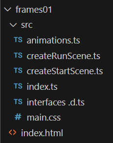

# Frame based animations

The properties of meshes such as boxes and spheres can be modified on a frame by frame basis to produce an animation effect.

The general process to create an amimation is:

1. Determine a frame rate in frames per second at which the animation should run.  In many instances this will be global so that all animations on a page are running at the same rate.  However, this is not a requirement.

2. Create an named animation object which applies to a particular property, setting the type and mode of the animation.

3. Create an array of keyframes and apply these to the animation object.

4. Push the animation object to the animations collection of mesh or object which responds to the animated property


## File structure

This scene is formed in a folder named frame01 and consists of files and modules:

   |    File |  Useage  |
   |:-----|:-------|
  |createStartScene.js |Defining the shapes placed in the scene|
  |createRunScene.js  | Controlling the manipulation of the scene  |
  | index.ts| Initialize and render the scene|
  | interface.d.ts|Describe the scene elements to share between files |
  |animations.ts |module containing frame based animation functions |

  The folder structure is:

  
 

In this example a box will be animated with a framerate of 30 frames per second.

The box is described in createStartScene.ts as:

```javascript
function createBox(scene: Scene) {
  let box = MeshBuilder.CreateBox("box",{}, scene);
  let boxMaterial = new StandardMaterial("texture1", scene);
  box.material = boxMaterial;
  box.position.y = 3;
  box.position.y = 0.51;
  return box;
}
```

This differs from the previous examples of box by the addition of a standard material so that the box can accept colors, to be used later.

Otherwise the sceme is similar to previous lighting examples.

The full listing is:

**createStartScene.ts**
```javascript
import { SceneData } from "./interfaces ";

import {
  Scene,
  ArcRotateCamera,
  Vector3,
  MeshBuilder,
  Mesh,
  StandardMaterial,
  HemisphericLight,
  PointLight,
  SpotLight,
  DirectionalLight,
  Color3,
  ShadowGenerator,
  Engine,
} from "@babylonjs/core";

function createBox(scene: Scene) {
  let box = MeshBuilder.CreateBox("box",{}, scene);
  let boxMaterial = new StandardMaterial("texture1", scene);
  box.material = boxMaterial;
  box.position.y = 3;
  box.position.y = 0.51;
  return box;
}

function createPointLight(scene: Scene) {
  const light = new PointLight("light", new Vector3(-1, 1, 0), scene);
  light.position = new Vector3(5, 20, 10);
  light.intensity = 0.3;
  light.diffuse = new Color3(0.5, 1, 1);
  light.specular = new Color3(0.8, 1, 1);
  return light;
}

function createDirectionalLight(scene: Scene) {
  const light = new DirectionalLight("light", new Vector3(0.2, -1, 0.2), scene);
  light.position = new Vector3(20, 40, 20);
  light.intensity = 0.7;
  light.diffuse = new Color3(1, 0, 0);
  light.specular = new Color3(0, 1, 0);
  return light;
}

function createSpotLight(scene: Scene) {
  const light = new SpotLight(
    "light",
    new Vector3(1, 5, -3),
    new Vector3(0, -1, 0),
    Math.PI / 3,
    20,
    scene
  );
  light.intensity = 0.7;
  light.diffuse = new Color3(1, 0, 0);
  light.specular = new Color3(0, 1, 0);
  return light;
}

function createHemisphericLight(scene: Scene) {
  const light: HemisphericLight = new HemisphericLight(
    "light",
    new Vector3(1, 10, 0),
    scene
  );
  light.intensity = 0.3;
  light.diffuse = new Color3(1, 0, 0);
  light.specular = new Color3(0, 1, 0);
  light.groundColor = new Color3(0, 1, 0);
  return light;
}

function createShadows(light: DirectionalLight, sphere: Mesh, box: Mesh) {
  const shadower = new ShadowGenerator(1024, light);
  const shadowmap: any = shadower.getShadowMap();
  shadowmap.renderList.push(sphere, box);

  shadower.setDarkness(0.2);
  shadower.useBlurExponentialShadowMap = true;
  shadower.blurScale = 4;
  shadower.blurBoxOffset = 1;
  shadower.useKernelBlur = true;
  shadower.blurKernel = 64;
  shadower.bias = 0;
  return shadower;
}

function createSphere(scene: Scene) {
  let sphere = MeshBuilder.CreateSphere(
    "sphere",
    { diameter: 2, segments: 32 },
    scene
  );
  sphere.position.y = 1.5;
  return sphere;
}

function createGround(scene: Scene) {
  let ground = MeshBuilder.CreateGround(
    "ground",
    { width: 6, height: 6 },
    scene
  );
  var groundMaterial = new StandardMaterial("groundMaterial", scene);
  groundMaterial.backFaceCulling = false;
  ground.material = groundMaterial;
  ground.receiveShadows = true;
  return ground;
}

function createArcRotateCamera(scene: Scene) {
  let camAlpha = -Math.PI / 2,
    camBeta = Math.PI / 2.5,
    camDist = 10,
    camTarget = new Vector3(0, 0, 0);
  let camera = new ArcRotateCamera(
    "camera1",
    camAlpha,
    camBeta,
    camDist,
    camTarget,
    scene
  );
  camera.attachControl(true);
  return camera;
}

export default function createStartScene(engine: Engine) {
  let scene = new Scene(engine);
  let box = createBox(scene);
  let lightBulb = createPointLight(scene);
  let lightDirectional = createDirectionalLight(scene);
  let lightSpot = createSpotLight(scene);
  let lightHemispheric = createHemisphericLight(scene);
  let sphere = createSphere(scene);
  let ground = createGround(scene);
  let camera = createArcRotateCamera(scene);
  let shadowGenerator = createShadows(lightDirectional, sphere, box);

  let that: SceneData = {
    scene,
    box,
    lightBulb,
    lightDirectional,
    lightSpot,
    lightHemispheric,
    sphere,
    ground,
    camera,
    shadowGenerator,
  };
  return that;
}

```

Each element in the scene is created by calling a function and these elements are then added to the data structure SceneData.

The SceneData interface is defined in interfaces.d.ts so that other module files can access the elements of the scene.

The full listing is:

**interfaces.d.ts**
```javascript
import {
  Scene,
  Mesh,
  HemisphericLight,
  PointLight,
  SpotLight,
  DirectionalLight,
  Camera,
  ShadowGenerator,
} from "@babylonjs/core";

export interface SceneData {
  scene: Scene;
  box: Mesh;
  lightBulb: PointLight;
  lightDirectional?: DirectionalLight;
  lightSpot: SpotLight;
  lightHemispheric: HemisphericLight;
  sphere: Mesh;
  ground: Mesh;
  camera: Camera;
  shadowGenerator: ShadowGenerator;
}
```


The interface and Scene data content must match exactly.

The animations.ts file will be used to keep the animations separate from the scene code.  Breaking the code into appropriate small modules helps with readability and makes it easier to reuse code.

Code in animations.ts will take care of the first three steps of the process:

1. Determine a frame rate in frames per second at which the animation should run.  In many instances this will be global so that all animations on a page are running at the same rate.  However, this is not a requirement.

2. Create an named animation object which applies to a particular property, setting the type and mode of the animation.

3. Create an array of keyframes and apply these to the animation object.

The scene details are manipulated in createRunScene.ts

In this case the file will be relatively short, just taking care of the last step:

4. Push the animation object to the animations collection of mesh or object which responds to the animated property

The animations are applied to the box here and can be switched on and off simply by commenting out lines.

You might try editing the files to add selected animations to the sphere.

## Animating position.x

The animation is defined as an exported function in animations.ts

At the top of the file the required babylon resources are imported and interfaces are defined so that apropriate types can be added to the keyframe arrays which will be defined.

**animations.ts**
```javascript
import { Animation, Color3, Vector3 } from "@babylonjs/core";

interface PositionArray {
    frame: number;
    value: number;
}

interface ScaleArray {
    frame: number;
    value: Vector3;
}

interface colorArray {
    frame: number;
    value: Color3;
}

export const frameRate = 30;
```

This first animation is named xSlide and can be applied to control the position.x property of any any element which has this position property, such as a standard mesh.

The frameRate is also defined here and exported for use throughout the application.


The type and mode of the animation available are selected from:

    Types
    Animation.ANIMATIONTYPE_FLOAT
    Animation.ANIMATIONTYPE_VECTOR2
    Animation.ANIMATIONTYPE_VECTOR3
    Animation.ANIMATIONTYPE_QUATERNION
    Animation.ANIMATIONTYPE_COLOR3

    Modes
    Animation.ANIMATIONLOOPMODE_RELATIVE
    Animation.ANIMATIONLOOPMODE_CYCLE
    Animation.ANIMATIONLOOPMODE_CONSTANT

To move an object around in the x direction a function named xSlide is defined.

**animations.ts**
```javascript
export function createxSlide(frameRate: number){
    const xSlide = new Animation(
        "xSlide",
        "position.x",
        frameRate,
        Animation.ANIMATIONTYPE_FLOAT,
        Animation.ANIMATIONLOOPMODE_CYCLE
    );

 
```


An array of keyframes is created and the frame number and value for each key frame is pushed into this array.     

The values of the keyframes (particularly the last one) need to be selected with care to prevent a jerky glitch on each repeat of the animation.

Here the framerate is 30 so for a 2 second animation duration 59 frames need to be described and then the 60th frame wraps round to the first frame.


In this example the value starts at 2 at the first frame and by frame 30 it has changed to -2.  The relative motion was -4, so to return to the origin the return motion is +4.

However only 29 further frames are described so the value will not quite have the full return motion, but 29/30 times the full motion of 4.

This is expressed in the equation below and demonstrates that cyclical motion needs careful planning!

```javascript
   const keyFramesX: PositionArray[] = [];
    keyFramesX.push({ frame: 0, value: 2 });
    keyFramesX.push({ frame: frameRate, value: -2 });
    keyFramesX.push({ frame: (2 * frameRate)-1, value: (-2 + (4 * ( frameRate /2) / ((frameRate/2) -1))) });
```


The key frames array is then associated with the animation that it relates to using the setKeys() function.  

```javascript
    xSlide.setKeys(keyFramesX);
```

Finally the animation is returned by the creating function


```javascript
    return xSlide
}
```

The full function is then:

```javascript
export function createxSlide(frameRate: number){
    const xSlide = new Animation(
        "xSlide",
        "position.x",
        frameRate,
        Animation.ANIMATIONTYPE_FLOAT,
        Animation.ANIMATIONLOOPMODE_CYCLE
    );

    const keyFramesX: PositionArray[] = [];
    keyFramesX.push({ frame: 0, value: 2 });
    keyFramesX.push({ frame: frameRate, value: -2 });
    keyFramesX.push({ frame: (2 * frameRate)-1, value: (-2 + (4 * ( frameRate /2) / ((frameRate/2) -1))) });

    xSlide.setKeys(keyFramesX);
    return xSlide
}
```


Now in createRunScene.ts the required resources are imported and the  animation xslide is pushed to the box mesh.

Finally the animation on the bos is started with beginAnimation().

```javascript
import { SceneData } from "./interfaces ";

import { createxSlide, createySlide, createxRotate, createyRotate, createV3scaling,  createColorShift, frameRate } from "./animations";


export default function createRunScene(runScene: SceneData) {
  runScene.sphere.position.y = -2;    

  runScene.box.animations.push(createxSlide(frameRate));
  runScene.scene.beginAnimation(runScene.box, 0, 2 * frameRate, true);
}                                   
```

Note that the position of the sphere is also altered, this is simply to clear a path for the box animations to be viewed withous collision.


The resulting animation in the x direction is shown here.

<iframe 
    height="600" 
    width="100%" 
    scrolling="no" 
    title="frame animaations" 
    src="Block_3/section_3/dist01/index.html" 
    frameborder="no" 
    loading="lazy" 
    allowtransparency="true" 
    allowfullscreen="true">
</iframe>


## Animating position.y

Creating an animation on the y position is a matter of adding a function createySlide to animate position.y following the same pattern as that for the previous animation of position.x

```javascript
export function createySlide(frameRate: number){
    const ySlide = new Animation(
        "ySlide",
        "position.y",
        frameRate,
        Animation.ANIMATIONTYPE_FLOAT,
        Animation.ANIMATIONLOOPMODE_CYCLE
    );

    const keyFramesY: PositionArray[] = [];
    keyFramesY.push({ frame: 0, value: 2 });
    keyFramesY.push({ frame: frameRate / 2, value: 1 });
    keyFramesY.push({ frame: frameRate, value: 2 });
    keyFramesY.push({ frame: frameRate* 3 / 2, value: 4 });
    keyFramesY.push({ frame: 2 * frameRate, value: 2 });

    ySlide.setKeys(keyFramesY);

    return ySlide
}
```

The extra animation is added to the box in the createRunScene.ts file.

```javascript
export default function createRunScene(runScene: SceneData) {
  runScene.sphere.position.y = -2;  

  runScene.box.animations.push(createySlide(frameRate));
  runScene.scene.beginAnimation(runScene.box, 0, 2 * frameRate, true);
}  
```

The y animation is shown here.

<iframe 
    height="600" 
    width="100%" 
    scrolling="no" 
    title="frame animaations" 
    src="Block_3/section_3/dist02/index.html" 
    frameborder="no" 
    loading="lazy" 
    allowtransparency="true" 
    allowfullscreen="true">
</iframe>

## Animating rotation

A function is provided to create rotation around the x axis.  Note that the rotation values are expressed as radians.

```javascript
export function createxRotate(frameRate: number){
    const xRotation = new Animation(
        "xRotation",
        "rotation.x",
        frameRate,
        Animation.ANIMATIONTYPE_FLOAT,
        Animation.ANIMATIONLOOPMODE_CYCLE
    );

    const keyFramesRX: PositionArray[]= [];
    keyFramesRX.push({ frame: 0, value: 0 });
    keyFramesRX.push({ frame: frameRate, value: Math.PI });
    keyFramesRX.push({ frame: 2 * frameRate, value: Math.PI * 2 });

    xRotation.setKeys(keyFramesRX);

    return xRotation
}
```

A similarly patterned function provides rotation about the y axis. 

```javascript
export function createyRotate(frameRate: number){
    const yRotation = new Animation(
        "yRotation",
        "rotation.y",
        frameRate,
        Animation.ANIMATIONTYPE_FLOAT,
        Animation.ANIMATIONLOOPMODE_CYCLE
    );

    const keyFramesRY: PositionArray[]= [];
    keyFramesRY.push({ frame: 0, value: 0 });
    keyFramesRY.push({ frame: frameRate, value: Math.PI });
    keyFramesRY.push({ frame: 2 * frameRate, value: Math.PI * 2 });

    yRotation.setKeys(keyFramesRY);

    return yRotation
}
```


 Both of these are added to the createRunScene()
 function.

```javascript
export default function createRunScene(runScene: SceneData) {
  runScene.sphere.position.y = -2;    

  runScene.box.animations.push(createxRotate(frameRate));
  runScene.box.animations.push(createyRotate(frameRate));
  runScene.scene.beginAnimation(runScene.box, 0, 2 * frameRate, true);
}     
```
The combined motion and rotation can be seen here.

<iframe 
    height="600" 
    width="100%" 
    scrolling="no" 
    title="frame animaations" 
    src="Block_3/section_3/dist03/index.html" 
    frameborder="no" 
    loading="lazy" 
    allowtransparency="true" 
    allowfullscreen="true">
</iframe>

## Animating scale

So far the animations used have  had an animation type of float.  It iss also posssiblee to create a vector3  animation type to control x,y and z aspects of parameters such as scaling.

The keyframes are now expressed as vector3 quantities.

```javascript
export function createV3scaling(frameRate: number) {
    const v3scaling = new Animation(
        "v3Scaling",
        "scaling",
        frameRate,
        Animation.ANIMATIONTYPE_VECTOR3,
        Animation.ANIMATIONLOOPMODE_CYCLE
    );

    const keyFramesv3s: ScaleArray[] = [];
    keyFramesv3s.push({ frame: 0, value: new Vector3(1, 2, 3) }),
    keyFramesv3s.push({ frame: 0.66 * frameRate, value: new Vector3(2, 3, 1) });
    keyFramesv3s.push({ frame: 1.32 * frameRate, value: new Vector3(3, 1, 2) });
    keyFramesv3s.push({ frame: 2 * frameRate, value: new Vector3(1, 2, 3) });

    v3scaling.setKeys(keyFramesv3s);

    return v3scaling;
}
```

This is then added to the createRunScene function.

```javascript
export default function createRunScene(runScene: SceneData) {
  runScene.sphere.position.y = -2;    

  runScene.box.animations.push(createV3scaling(frameRate));
  runScene.scene.beginAnimation(runScene.box, 0, 2 * frameRate, true);
}  
```

The animated scaling is shown here.

<iframe 
    height="600" 
    width="100%" 
    scrolling="no" 
    title="frame animaations" 
    src="Block_3/section_3/dist04/index.html" 
    frameborder="no" 
    loading="lazy" 
    allowtransparency="true" 
    allowfullscreen="true">
</iframe>

## Animating Color

Color is not a property of a mesh, but of a material.  So to see color a material must be added to the box.  In this case standard material is used.

```javascript
function createBox(scene: Scene) {
  let box = MeshBuilder.CreateBox("box",{}, scene);
  let boxMaterial = new StandardMaterial("texture1", scene);
  box.material = boxMaterial;
  box.position.y = 3;
  box.position.y = 0.51;
  return box;
}
```

Material does not have a color property but a range of color properties: diffuseColor, specularColor, emissiveColor and ambientColor.  These colors  have red, green and blue  components which can be described by a vector3 value.

In this example the color animation is applied to the diffuse color of the material.

```javascript
export function createColorShift(frameRate: number) {
    const colorShift = new Animation(
        "color3",
        "material.diffuseColor",
        frameRate,
        Animation.ANIMATIONTYPE_COLOR3,
        Animation.ANIMATIONLOOPMODE_CYCLE
    );

    const keyFramesC3: colorArray [] = [];
    keyFramesC3.push({ frame: 0, value: new Color3(1, 0.5, 0.2) }),
    keyFramesC3.push({ frame: 0.66 * frameRate, value: new Color3(0.5, 0.2, 1) });
    keyFramesC3.push({ frame: 1.32 * frameRate, value: new Color3(0.2, 1, 0.5) });
    keyFramesC3.push({ frame: 2 * frameRate, value: new Color3(1, 0.5, 0.2) });

   colorShift.setKeys(keyFramesC3);

    return colorShift;
}
```

This can be added to createRunScene.ts.

<iframe 
    height="600" 
    width="100%" 
    scrolling="no" 
    title="frame animaations" 
    src="Block_3/section_3/dist05/index.html" 
    frameborder="no" 
    loading="lazy" 
    allowtransparency="true" 
    allowfullscreen="true">
</iframe>

## Combined animations

All the listed animations can be applied to the box or any other mesh in the scene at the same time to produce a combined effect.


The full listing of the scene with all animations described is:

**animations.ts**
```javascript
import { Animation, Color3, Vector3 } from "@babylonjs/core";

interface PositionArray {
    frame: number;
    value: number;
}

interface ScaleArray {
    frame: number;
    value: Vector3;
}

interface colorArray {
    frame: number;
    value: Color3;
}

export const frameRate = 30;

export function createxSlide(frameRate: number){
    const xSlide = new Animation(
        "xSlide",
        "position.x",
        frameRate,
        Animation.ANIMATIONTYPE_FLOAT,
        Animation.ANIMATIONLOOPMODE_CYCLE
    );

    const keyFramesX: PositionArray[] = [];
    keyFramesX.push({ frame: 0, value: 2 });
    keyFramesX.push({ frame: frameRate, value: -2 });
    keyFramesX.push({ frame: (2 * frameRate)-1, value: (-2 + (4 * ( frameRate /2) / ((frameRate/2) -1))) });

    xSlide.setKeys(keyFramesX);
    return xSlide
}

export function createySlide(frameRate: number){
    const ySlide = new Animation(
        "ySlide",
        "position.y",
        frameRate,
        Animation.ANIMATIONTYPE_FLOAT,
        Animation.ANIMATIONLOOPMODE_CYCLE
    );

    const keyFramesY: PositionArray[] = [];
    keyFramesY.push({ frame: 0, value: 2 });
    keyFramesY.push({ frame: frameRate / 2, value: 1 });
    keyFramesY.push({ frame: frameRate, value: 2 });
    keyFramesY.push({ frame: frameRate* 3 / 2, value: 4 });
    keyFramesY.push({ frame: 2 * frameRate, value: 2 });

    ySlide.setKeys(keyFramesY);

    return ySlide
}

export function createxRotate(frameRate: number){
    const xRotation = new Animation(
        "xRotation",
        "rotation.x",
        frameRate,
        Animation.ANIMATIONTYPE_FLOAT,
        Animation.ANIMATIONLOOPMODE_CYCLE
    );

    const keyFramesRX: PositionArray[]= [];
    keyFramesRX.push({ frame: 0, value: 0 });
    keyFramesRX.push({ frame: frameRate, value: Math.PI });
    keyFramesRX.push({ frame: 2 * frameRate, value: Math.PI * 2 });

    xRotation.setKeys(keyFramesRX);

    return xRotation
}

export function createyRotate(frameRate: number){
    const yRotation = new Animation(
        "yRotation",
        "rotation.y",
        frameRate,
        Animation.ANIMATIONTYPE_FLOAT,
        Animation.ANIMATIONLOOPMODE_CYCLE
    );

    const keyFramesRY: PositionArray[]= [];
    keyFramesRY.push({ frame: 0, value: 0 });
    keyFramesRY.push({ frame: frameRate, value: Math.PI });
    keyFramesRY.push({ frame: 2 * frameRate, value: Math.PI * 2 });

    yRotation.setKeys(keyFramesRY);

    return yRotation
}

export function createV3scaling(frameRate: number) {
    const v3scaling = new Animation(
        "v3Scaling",
        "scaling",
        frameRate,
        Animation.ANIMATIONTYPE_VECTOR3,
        Animation.ANIMATIONLOOPMODE_CYCLE
    );

    const keyFramesv3s: ScaleArray[] = [];
    keyFramesv3s.push({ frame: 0, value: new Vector3(1, 2, 3) }),
    keyFramesv3s.push({ frame: 0.66 * frameRate, value: new Vector3(2, 3, 1) });
    keyFramesv3s.push({ frame: 1.32 * frameRate, value: new Vector3(3, 1, 2) });
    keyFramesv3s.push({ frame: 2 * frameRate, value: new Vector3(1, 2, 3) });

    v3scaling.setKeys(keyFramesv3s);

    return v3scaling;
}


export function createColorShift(frameRate: number) {
    const colorShift = new Animation(
        "color3",
        "material.diffuseColor",
        frameRate,
        Animation.ANIMATIONTYPE_COLOR3,
        Animation.ANIMATIONLOOPMODE_CYCLE
    );

    const keyFramesC3: colorArray [] = [];
    keyFramesC3.push({ frame: 0, value: new Color3(1, 0.5, 0.2) }),
    keyFramesC3.push({ frame: 0.66 * frameRate, value: new Color3(0.5, 0.2, 1) });
    keyFramesC3.push({ frame: 1.32 * frameRate, value: new Color3(0.2, 1, 0.5) });
    keyFramesC3.push({ frame: 2 * frameRate, value: new Color3(1, 0.5, 0.2) });

   colorShift.setKeys(keyFramesC3);

    return colorShift;
}
```

These are added to the box and started in createRunScene.ts with the full listing:

**createRunScene.ts**
```javascript
import { SceneData } from "./interfaces ";

import { createxSlide, createySlide, createxRotate, createyRotate, createV3scaling,  createColorShift, frameRate } from "./animations";


export default function createRunScene(runScene: SceneData) {
  runScene.sphere.position.y = -2;    

  runScene.box.animations.push(createxSlide(frameRate));
  runScene.box.animations.push(createySlide(frameRate));
  runScene.box.animations.push(createxRotate(frameRate));
  runScene.box.animations.push(createyRotate(frameRate));
  runScene.box.animations.push(createV3scaling(frameRate));
  runScene.box.animations.push(createColorShift(frameRate));
  runScene.scene.beginAnimation(runScene.box, 0, 2 * frameRate, true);
}                                   
```

The result of the combined animations is shown here:

<iframe 
    height="600" 
    width="100%" 
    scrolling="no" 
    title="frame animaations" 
    src="Block_3/section_3/dist06/index.html" 
    frameborder="no" 
    loading="lazy" 
    allowtransparency="true" 
    allowfullscreen="true">
</iframe>