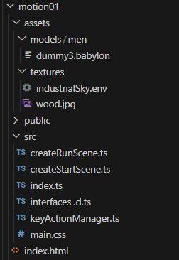

# Moving a mesh by keyboard action

In this section a mesh will be loaded into a simple scene and caused to move across a plane in response to the "AWSD" keys.

As part of the simple environment a .skybox will be addede to the scene.

Audio will be added which can be switched on and off by keypress.

The next step of development will be to cause a mesh to spin i response to a mouse click, and to stop again when the mouse hold is prolonged.

Then the baked in animations of the model will be accessed to simulate walking with motion.

## Structure

In order to organise the code into small manageable modules, the code will be structured with files: dreateRunScene.ts, createStartScene.ts, interfaces.d.ts and keyActionManager.ts.

The aim is to separate the code for scene layout from that for scene action and to hold reusable code in separate small module files.

The overall folder structure will be:



In the usual way index.html points to index.ts which calls the createStartScene and CreateRun Scene files and renders the scene.

## The basic scene

The elements to be displayed in the scene are set out in **createStartScene**
First the sceneData interface is imported and the required resources are imported to match the requirements of the elements required.

```javascript
import { SceneData } from "./interfaces ";

import {
  Scene,
  ArcRotateCamera,
  Vector3,
  MeshBuilder,
  StandardMaterial,
  HemisphericLight,
  Color3,
  Engine,
  Texture,
  SceneLoader,
  AbstractMesh,
  ISceneLoaderAsyncResult,
  Sound
} from "@babylonjs/core";
```
Backgrouond music is added from an audio file stored in the assets folder.  This is set with autoplay initally true.  However browsers prevent pop up windows from launching audio so babylon provides a system which will start the audio only after the application window has been clicked.  This uses the audio engine custom unlocked button.  When a window event corresponding to a click happens the audio will be enabled.  This window event only needs to happen onece, after the first click the browser is happy to play audio.

```javascript
function backgroundMusic(scene: Scene): Sound{
  let music = new Sound("music", "./assets/audio/arcade-kid.mp3", scene,  null ,
   {
      loop: true,
      autoplay: true
  });

  Engine.audioEngine!.useCustomUnlockedButton = true;

  // Unlock audio on first user interaction.
  window.addEventListener('click', () => {
    if(!Engine.audioEngine!.unlocked){
        Engine.audioEngine!.unlock();
    }
}, { once: true });
  return music;
}
```

The ground is using a wood texture which would initially make planks look too large.  By applying uscale and vscale to the groundTexture the plank size can be made more realistic.

This texture is then stored as the diffuse Texture of the ground material.

Back face culling being false means that the underside of the ground plane will not be transparent.

After creating ground, the ground material is applied as the ground.material.

```javascript
function createGround(scene: Scene) {
  const groundMaterial = new StandardMaterial("groundMaterial");
  const groundTexture = new Texture("./assets/textures/wood.jpg");
  groundTexture.uScale  = 4.0; //Repeat 4 times on the Vertical Axes
  groundTexture.vScale  = 4.0; //Repeat 4 times on the Horizontal Axes
  groundMaterial.diffuseTexture = groundTexture;
 // groundMaterial.diffuseTexture = new Texture("./assets/textures/wood.jpg");
  groundMaterial.diffuseTexture.hasAlpha = true;

  groundMaterial.backFaceCulling = false;
  let ground = MeshBuilder.CreateGround(
    "ground",
    { width: 15, height: 15, subdivisions: 4 },
    scene
  );

  ground.material = groundMaterial;
  return ground;
}
```

A hemispheric light is fairly standard to create basic scene illumination.

```javascript
function createHemisphericLight(scene: Scene) {
  const light = new HemisphericLight(
    "light",
    new Vector3(2, 1, 0), // move x pos to direct shadows
    scene
  );
  light.intensity = 0.7;
  light.diffuse = new Color3(1, 1, 1);
  light.specular = new Color3(1, 0.8, 0.8);
  light.groundColor = new Color3(0, 0.2, 0.7);
  return light;
}
```

An arc rotate camera is created and its motion restricted so that the scene cannot be viewed from below ground.

```javascript
function createArcRotateCamera(scene: Scene) {
  let camAlpha = -Math.PI / 2,
    camBeta = Math.PI / 2.5,
    camDist = 15,
    camTarget = new Vector3(0, 0, 0);
  let camera = new ArcRotateCamera(
    "camera1",
    camAlpha,
    camBeta,
    camDist,
    camTarget,
    scene
  );
  camera.lowerRadiusLimit = 9;
  camera.upperRadiusLimit = 25;
  camera.lowerAlphaLimit = 0;
  camera.upperAlphaLimit = Math.PI * 2;
  camera.lowerBetaLimit = 0;
  camera.upperBetaLimit = Math.PI / 2.02;

  camera.attachControl(true);
  return camera;
}
```
A mesh is imported from a file in .babylon format.  Other mesh formats can be used, but the .babylon format is reliable.  Some other formats need work arounds to use them effectively.

The process of loading a model is asynchonous.   The programme has moved on before the loading is complete.

The item returned is not a mesh, but a Promise of type ISceneLoaderAsyncResult.  A promice can be resolved by accessing its ``then`` property, so item cannot be treated as a simple variable.  Because you can't predict when it has completed you have to check the ``then`` property at all points in the programme, including in other module files.

For a .babylon mesh the key property of the mesh is meshes[0], manipulating this enables the mesh to be initially positioned and subsequently moved.

```javascript
function importMeshA(scene: Scene, x: number, y: number) {
  let item: Promise<void | ISceneLoaderAsyncResult> =
    SceneLoader.ImportMeshAsync(
      "",
      "./assets/models/men/",
      "dummy3.babylon",
      scene
    );

  item.then((result) => {
    let character: AbstractMesh = result!.meshes[0];
    character.position.x = x;
    character.position.y = y + 0.1;
    character.scaling = new Vector3(1, 1, 1);
    character.rotation = new Vector3(0, 1.5, 0);
  });
  return item;
}
```

That is a simple scene, I have not even included a skybox here, but I will control the appearance of the sky subsequently.

Call the functions which create the scene and add them to the that object.

```javascript
export default function createStartScene(engine: Engine) {
  let scene = new Scene(engine);
  let audio = backgroundMusic(scene);
  let lightHemispheric = createHemisphericLight(scene);
  let camera = createArcRotateCamera(scene);
  let player = importMeshA(scene, 0, 0);
  let ground = createGround(scene);

  let that: SceneData = {
    scene,
    audio,
    lightHemispheric,
    camera,
    player,
    ground,
  };
  return that;
}

```
Now the details of **interface.d.ts** must exactly match the details of SceneData.

```javascript
import {
  Scene,
  Sound,
  Mesh,
  HemisphericLight,
  Camera,
  ISceneLoaderAsyncResult,
} from "@babylonjs/core";

export interface SceneData {
  scene: Scene;
  audio: Sound;
  lightHemispheric: HemisphericLight;
  camera: Camera;
  player: Promise<void | ISceneLoaderAsyncResult>;
  ground: Mesh;
}
```
This interface will allow the features of the scene to be accessed within other code modules.

The **index.ts** file follows an established pattern calling createStartScene to set up the scene elements and createRunScene to apply actions to these scene elements.

```javascript
import { Engine} from "@babylonjs/core";
import createStartScene from "./createStartScene";
import createRunScene from "./createRunScene";
import "./main.css";


const CanvasName = "renderCanvas";

let canvas = document.createElement("canvas");
canvas.id = CanvasName;

canvas.classList.add("background-canvas");
document.body.appendChild(canvas);

let eng = new Engine(canvas, true, {}, true);
let startScene = createStartScene(eng);
createRunScene(startScene);

eng.runRenderLoop(() => {
  startScene.scene.render();
});
```

The actions are added to the scene in the **createRunScene.ts** module.  Asd usual the imported resources are added at the top of the code.  As more action is added to the scene the code could become large and difficult to read so I favour moving reusable code out to separate module files and in this case a separate keyActionManage file has been created which will be inspected later.  For now you keed to know that keyActionManager file maintains an array of the currently pressed keys in a keyDownMap. The getKeyDown function will tell wheter a key is currently pressed returning 1 if it is.  For sections of code where it would not be useful to respond to the key being down multiple times while it is being held, a keyDownHold function can cause getKeyDown to return 2 which will represent a held state.

```javascript
import { AbstractMesh, CubeTexture, _ENVTextureLoader } from "@babylonjs/core";
import { SceneData } from "./interfaces ";
import {
  keyActionManager,
  keyDownMap,
  keyDownHeld,
  getKeyDown,
} from "./keyActionManager";
```
I did not define a sky box so I am going to use a different method to add a default skybox to the scene.  This will require envTextureLoader and scenHelpers.

```javascript
import "@babylonjs/core/Materials/Textures/Loaders/envTextureLoader";
import "@babylonjs/core/Helpers/sceneHelpers";
```
The createRunScene function will be called from the index.ts file.  This creates an action manager which is associated with the scene.  This then calls a function imported from an external module called keyActionManeager which will keep track of keypresses.  The external module can read the scene so the newly created scene.actionmanager will be available to it.

```javascript
export default function createRunScene(runScene: SceneData) {
  runScene.scene.actionManager = new ActionManager(runScene.scene);
  keyActionManager(runScene.scene);
```

A nice type of scene image is an HDRI format.  These are available at [ambient.cg](https://ambientcg.com/list?type=HDRI) and also at [Poly](https://polyhaven.com/hdris).  A key property of thes is that they provide illumination into the scene as well as an outer 360 image.

BabylonJS does not normally use the HDRI directly but a [community tool](https://www.babylonjs.com/tools/ibl/#) will convert these to a .env format.  Just drag the HDRI file into the tools window and wait patiently till a .env file is delivered to your downloads folder.  You can rename this to suit but retain the .env filename.

You will see that the .env file represents a cube texture to be loaded into the scene and a default skybox can then be created from this.  The result is better than the skybox made from six square images.


```javascript

  const environmentTexture = new CubeTexture(
    "assets/textures/industrialSky.env",
    runScene.scene
  );
  const skybox = runScene.scene.createDefaultSkybox(
    environmentTexture,
    true,
    10000,
    0.1
  );
```
The audio which was added to the scene becomes active when the scene window is clicked.  This can be initially stopped.  Then by adding code to the onBeforeRenderObservable the state of the keypresses can be tested at the frame rate.

I want to press the "m" key to toggle the music between playing and being stopped.  I want to avoid the music being turned on and off at the frame rate while ever the "m" key is pressed.  

On the first frame when a key is pressed the value returned from getKeyDown will be 1 and the code will respond with the required action.

The keyDownHeld function will caus the getKeyDown to return a value of 2 until the key is released and this will prevent repeated audio switching while the key is held down.

Upon key release the getKeyDown() function will return 0.

```javascript
  runScene.audio.stop();
  runScene.scene.onBeforeRenderObservable.add(() => {
    // check and respond to keypad presses

    if (getKeyDown() == 1 && (keyDownMap["m"] || keyDownMap["M"])) {
      keyDownHeld();
      if (runScene.audio.isPlaying) {
        runScene.audio.stop();
      } else {
        runScene.audio.play();
      }
    }
```
To address the position and rotation of the mesh under keyboard control the promise which is represented by the player variable must be resolved using and anonymous function responding to the status of .then.  If you are not comfortable with this, check up notes on javascript pormises.

The character should continue to move while ever a key is held down and so it is only necessary to look at the keyDownMap array and getKeyDown() does not need to be tested.

The character will respond to "wasm" and arrow keys.

```javascript
    runScene.player.then((result) => {
      let character: AbstractMesh = result!.meshes[0];
      if (keyDownMap["w"] || keyDownMap["ArrowUp"]) {
        character.position.x -= 0.1;
        character.rotation.y = (3 * Math.PI) / 2;
      }
      if (keyDownMap["a"] || keyDownMap["ArrowLeft"]) {
        character.position.z -= 0.1;
        character.rotation.y = (2 * Math.PI) / 2;
      }
      if (keyDownMap["s"] || keyDownMap["ArrowDown"]) {
        character.position.x += 0.1;
        character.rotation.y = (1 * Math.PI) / 2;
      }
      if (keyDownMap["d"] || keyDownMap["ArrowRight"]) {
        character.position.z += 0.1;
        character.rotation.y = (0 * Math.PI) / 2;
      }
    });
  });

```

That concludes the onBeforeRenderObservable section.  There is also an AfterRenderObservable which could be used to drive code at the frame rate.  An empty stub of code is left so that this could be used if required.

```javascript

  runScene.scene.onAfterRenderObservable.add(() => {});
}
```

That brings us to the details of the **keyActionManager.ts** mopdule which is monitoring keypresses.

The first few lines import the required resources.
```javascript
import { ExecuteCodeAction } from "@babylonjs/core/Actions";
import { ActionManager } from "@babylonjs/core/Actions/actionManager";
import { Scene } from "@babylonjs/core/scene";
```
The module will export the main function which is the keyActionManager and also n array of keyypresses and functions to get and set the value of keyDown.

```javascript
export let keyDownMap: Boolean[] = [];
let keyDown:number = 0;
export function keyDownHeld(){ keyDown = 2}; 
export function getKeyDown():number {return keyDown};

export function keyActionManager(scene: Scene) {
```
The scene actionManager has already been created in createRunScene,ts.  That means it is available to be read by any number of javascript modules.
is created by using the ActionManager constructor.

The actionmanager can then register Actions.  This first registers code action which will be triggered whilever a key is depressed.

```javascript
  scene.actionManager.registerAction(
    new ExecuteCodeAction(
      {
        trigger: ActionManager.OnKeyDownTrigger,
      },
      function (evt) {
        if (keyDown == 0){keyDown ++}
        keyDownMap[evt.sourceEvent.key] = true;
      }
    )
  );
```
If the current state of keyDown is 0 (not pressed) the trigger is noted by setting keyDown to a value of 1.  

The keyDownMap will now have a value of true indexed by the name of every key which is depressed.  So this can respond to a case where two or more keys are pressed simoultaneously.

Another execution code action is registered with an on key up trigger.  This will clear the array entry for the key which has been released and will set the keyDown value badk to 0.

That works for us but there is still an issue that the music could be toggled if the "m" kiy is held and another key is released.  Try that out and ask how you could refine the code to remove this effect.

```javascript  
  scene.actionManager.registerAction(
    new ExecuteCodeAction(
      {
        trigger: ActionManager.OnKeyUpTrigger,
      },
      function (evt) {
        keyDown = 0;
        keyDownMap[evt.sourceEvent.key] = false;
      }
    )
  );
  return scene.actionManager;
}
```

Note that the camera is usually controlled by the arrow keys, so to prevent this the camera controls must be released by commenting out the code.

```javascript
    //camera.attachControl(true);
```

The result is that the character can be moved by the usual keys.  Try pressing "w" and "a" for diagonal motion.  Try moving the camera around to see the effect of the illumination.

<iframe 
    height="460" 
    width="100%" 
    scrolling="no" 
    title="Mesh wasd" 
    src="Block_3/section_6/distribution/index.html" 
    frameborder="no" 
    loading="lazy" 
    allowtransparency="true" 
    allowfullscreen="true">
</iframe>


