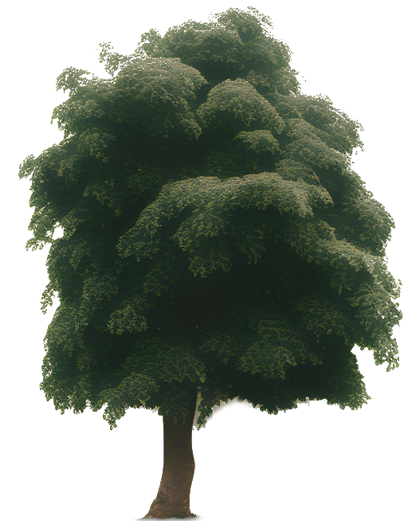

# Element 2

Select Element 1 from the Elements dropdown menu.

This demonstrates terrain with a height map and sky box.  Some meshes are included reflecting the village tutorial.  Additional trees are placed as sprites.

<iframe 
    height="1100" 
    width="100%" 
    scrolling="no" 
    title="frame animaations" 
    src="Block_4/demo/public/index.html" 
    frameborder="no" 
    loading="lazy" 
    allowtransparency="true" 
    allowfullscreen="true">
</iframe>

The scene sits on the web page elements2.html witin a div with id = canvasElement.

**elements2.html**
```html
<!DOCTYPE html>
<html lang="en">
<head>
  <title>Example Scene 2</title>
  <meta charset="utf-8">
  <meta name="viewport" content="width=device-width, initial-scale=1">
  <link href="https://cdn.jsdelivr.net/npm/bootstrap@5.2.1/dist/css/bootstrap.min.css" rel="stylesheet">
  <script src="https://cdn.jsdelivr.net/npm/bootstrap@5.2.1/dist/js/bootstrap.bundle.min.js"></script>
  <script src="https://cdn.babylonjs.com/babylon.js"></script>
  <script src="JS/element2.js"></script>
</head>
<body>

  <div class="container-fluid p-5 bg-primary text-white text-center">
    <h1>JavaScript Games: Programming Fundamentals</h1>
    <p>Example highlighting the layout of Elements!</p> 
  </div>
  
  <nav class="navbar navbar-expand-sm bg-dark navbar-dark">
      <div class="container-fluid">
        <a class="navbar-brand" href="#">Element 1</a>
        <button class="navbar-toggler" type="button" data-bs-toggle="collapse" data-bs-target="#collapsibleNavbar">
          <span class="navbar-toggler-icon"></span>
        </button>
        <div class="collapse navbar-collapse" id="collapsibleNavbar">
          <ul class="navbar-nav">
            <li class="nav-item">
              <a class="nav-link" href="index.html">Home</a>
            </li>
            <li class="nav-item">
              <a class="nav-link" href="team.html">Team</a>
            </li>  
            <li class="nav-item dropdown">
              <a class="nav-link dropdown-toggle" href="#" role="button" data-bs-toggle="dropdown">Elements</a>
              <ul class="dropdown-menu">
                <li><a class="dropdown-item" href="element1.html">Element 1</a></li>
                <li><a class="dropdown-item" href="element2.html">Element 2</a></li>
                <li><a class="dropdown-item" href="element3.html">Element 3</a></li>
                <li><a class="dropdown-item" href="element4.html">Element 4</a></li>
                <li><a class="dropdown-item" href="element5.html">Element 5</a></li>
              </ul>
            </li>
          </ul>
        </div>
      </div>
    </nav>

  <div id="canvasElement">
    <canvas id="renderCanvas" style="width:1000px; height:600px; display: block; margin-left: auto; margin-right: auto; margin-top: 50px;"></canvas>
    <script>
      const canvas = document.getElementById("renderCanvas");
      const engine = new BABYLON.Engine(canvas, true);
      const scene = createScene();
      engine.runRenderLoop(function() {
        scene.render();
      });
      window.addEventListener("resize", function() {
        engine.resize();
      });
    </script>
  </div>

</body>
</html>
```

The scene uses assets downloaded from the BabylonJS documentation and the [assets library](https://github.com/BabylonJS/Assets).  The trees are sprites generated by generative AI.



The ground material is prepared to represent grass and has backFaceCulling set to false so that the ground is not transparent when viewd from below.

```javascript
function createGround(scene) {
  const groundMaterial = new BABYLON.StandardMaterial("groundMaterial");
  groundMaterial.diffuseTexture = new BABYLON.Texture(
    "assets/environments/valleygrass.png"
  );
  groundMaterial.diffuseTexture.hasAlpha = true;
  //groundMaterial.diffuseColor = new BABYLON.Color3(0, 1, 0);
  groundMaterial.backFaceCulling = false;
  let ground = BABYLON.MeshBuilder.CreateGround(
    "ground",
    { width: 15, height: 15 },
    scene
  );

  ground.material = groundMaterial;
  return ground;
}
```
Surrounding ground is create3d using a height map where the lighter material appears higher.  The affect of the height map is ajusted within the ```{options}```

```javascript
function createTerrain(scene) {
  const largeGroundMat = new BABYLON.StandardMaterial("largeGroundMat");
  largeGroundMat.diffuseTexture = new BABYLON.Texture(
    "assets/environments/valleygrass.png"
  );

  const largeGround = BABYLON.MeshBuilder.CreateGroundFromHeightMap(
    "largeGround",
    "assets/environments/villageheightmap.png",
    {
      width: 150,
      height: 150,
      subdivisions: 20,
      minHeight: 0,
      maxHeight: 10,
      scene,
    }
  );
  largeGround.material = largeGroundMat;
  largeGround.position.y = -0.01;
}
```
The scene utilises a skybox based on a series of faces which make up a cube texture.

```javascript
function createSky(scene) {
  const skybox = BABYLON.MeshBuilder.CreateBox("skyBox", { size: 150 }, scene);
  const skyboxMaterial = new BABYLON.StandardMaterial("skyBox", scene);
  skyboxMaterial.backFaceCulling = false;
  skyboxMaterial.reflectionTexture = new BABYLON.CubeTexture(
    "assets/textures/skybox/skybox",
    scene
  );
  skyboxMaterial.reflectionTexture.coordinatesMode =
    BABYLON.Texture.SKYBOX_MODE;
  skyboxMaterial.diffuseColor = new BABYLON.Color3(0, 0, 0);
  skyboxMaterial.specularColor = new BABYLON.Color3(0, 0, 0);
  skybox.material = skyboxMaterial;
}
```
A house is based on a two boxes which are decorated with matrials for the walls and roof.
The boxes are merged to create a single house and the mergeMeshes parameters are set to allow the use of multiple materials.
The faceUV arrays are set to map points on the image which will represent the corners of faces of the boxes.
By passing a style parameter 1 or 2 the house can be created as a small house or a larger semi-detached pair of houses.

```javascript
function createHouse(scene, style) {
  //style 1 small style 2 semi detatched
  const boxMat = new BABYLON.StandardMaterial("boxMat");
  const faceUV = []; // faces for small house
  if (style == 1) {
    boxMat.diffuseTexture = new BABYLON.Texture(
      "assets/textures/cubehouse.png"
    );
    faceUV[0] = new BABYLON.Vector4(0.5, 0.0, 0.75, 1.0); //rear face
    faceUV[1] = new BABYLON.Vector4(0.0, 0.0, 0.25, 1.0); //front face
    faceUV[2] = new BABYLON.Vector4(0.25, 0, 0.5, 1.0); //right side
    faceUV[3] = new BABYLON.Vector4(0.75, 0, 1.0, 1.0); //left side
    // faceUV[4] would be for bottom but not used
    // faceUV[5] would be for top but not used
  } else {
    boxMat.diffuseTexture = new BABYLON.Texture(
      "assets/textures/semihouse.png"
    );
    faceUV[0] = new BABYLON.Vector4(0.6, 0.0, 1.0, 1.0); //rear face
    faceUV[1] = new BABYLON.Vector4(0.0, 0.0, 0.4, 1.0); //front face
    faceUV[2] = new BABYLON.Vector4(0.4, 0, 0.6, 1.0); //right side
    faceUV[3] = new BABYLON.Vector4(0.4, 0, 0.6, 1.0); //left side
    // faceUV[4] would be for bottom but not used
    // faceUV[5] would be for top but not used
  }

  const box = BABYLON.MeshBuilder.CreateBox(
    "box",
    { width: style, height: 1, faceUV: faceUV, wrap: true },
    scene
  );
  box.position = new BABYLON.Vector3(0, 0.5, 0);
  box.scaling = new BABYLON.Vector3(1, 1, 1);

  box.material = boxMat;

  const roof = BABYLON.MeshBuilder.CreateCylinder("roof", {
    diameter: 1.3,
    height: 1.2,
    tessellation: 3,
  });
  roof.scaling.x = 0.75;
  roof.scaling.y = style * 0.85;
  roof.rotation.z = Math.PI / 2;
  roof.position.y = 1.22;
  const roofMat = new BABYLON.StandardMaterial("roofMat");
  roofMat.diffuseTexture = new BABYLON.Texture(
    "assets/textures/roof.jpg",
    scene
  );
  roof.material = roofMat;

  const house = BABYLON.Mesh.MergeMeshes(
    [box, roof],
    true,
    false,
    null,
    false,
    true
  );
  // last true allows combined mesh to use multiple materials

  return house;
}
```
A function is provided to create houses once two models have been created.  This places two models fiorst and then goes on to place further copies as instances.  The orientation of the houses does not match the original tutorial so the graphic featuring the street at ground level is not used.

```javascript
function createHouses(scene, style) {
  //Start by locating one each of the two house types then add others

  if (style == 1) {
    // show 1 small house
    createHouse(scene, 1);
  }
  if (style == 2) {
    // show 1 large house
    createHouse(scene, 2);
  }
  if (style == 3) {
    // show estate
    const houses = [];
    const places = []; //each entry is an array [house type, rotation, x, z]
    places.push([1, 0, 0, 1]); // small house
    places.push([2, 0, 2, 1]); // semi  house
    places.push([1, 0, 0, -1]);
    places.push([2, 0, -2, -1]);
    places.push([2, Math.PI / 2, -2.5, 1]);
    places.push([2, -Math.PI / 2, +2.5, -1]);
    places.push([1, Math.PI / 2, -2.5, 3]);
    places.push([1, -Math.PI / 2, +2.5, -3]);

    houses[0] = createHouse(scene, 1);
    houses[1] = createHouse(scene, 2);

    houses[0].rotation.y = places[0][1];
    houses[0].position.x = places[0][2];
    houses[0].position.z = places[0][3];

    houses[1].rotation.y = places[1][1];
    houses[1].position.x = places[1][2];
    houses[1].position.z = places[1][3];

    for (let i = 2; i < places.length; i++) {
      if (places[i][0] === 1) {
        houses[i] = houses[0].createInstance("house" + i);
      } else {
        houses[i] = houses[1].createInstance("house" + i);
      }
      houses[i].rotation.y = places[i][1];
      houses[i].position.x = places[i][2];
      houses[i].position.z = places[i][3];
    }
  }
}
```

Trees are added from 2D images as sprites which always face the camera.  These are arranged randomy in two groves.

```javascript
function createTrees(scene){
  const spriteManagerTrees = new BABYLON.SpriteManager("treesManager", "assets/sprites/tree.png", 2000, {width: 512, height: 1024}, scene);

  //We create trees at random positions
  for (let i = 0; i < 500; i++) {
      const tree = new BABYLON.Sprite("tree", spriteManagerTrees);
      tree.position.x = Math.random() * (-30);
      tree.position.z = Math.random() * 20 + 8;
      tree.position.y = 0.2;
  }

  for (let i = 0; i < 500; i++) {
      const tree = new BABYLON.Sprite("tree", spriteManagerTrees);
      tree.position.x = Math.random() * (25) + 7;
      tree.position.z = Math.random() * -35  + 8;
      tree.position.y = 0.2;
  }

}
```

A hemispheric light is used with a bit of added colour for diffuse, specular and ground surfaces.

```javascript
function createLight(scene) {
  const light = new BABYLON.HemisphericLight(
    "light",
    new BABYLON.Vector3(2, 1, 0), // move x pos to direct shadows
    scene
  );
  light.intensity = 0.7;
  light.diffuse = new BABYLON.Color3(1, 1, 1);
  light.specular = new BABYLON.Color3(1, 0.8, 0.8);
  light.groundColor = new BABYLON.Color3(0, 0.2, 0.7);
  return light;
}
```

An arcRotateCamera is added, but its position and rotation is limitted so that the motion of the camera cannot spoil the appearance of the scene.

```javascript
function createArcRotateCamera(scene) {
  let camAlpha = -Math.PI / 2,
    camBeta = Math.PI / 2.5,
    camDist = 25,
    camTarget = new BABYLON.Vector3(0, 0, 0);
  let camera = new BABYLON.ArcRotateCamera(
    "camera1",
    camAlpha,
    camBeta,
    camDist,
    camTarget,
    scene
  );
  camera.lowerRadiusLimit = 9;
  camera.upperRadiusLimit = 25;
  camera.lowerAlphaLimit = 0;
  camera.upperAlphaLimit = Math.PI * 2;
  camera.lowerBetaLimit = 0;
  camera.upperBetaLimit = Math.PI / 2.02;

  camera.attachControl(true);
  return camera;
}
```
Finally, a createScene function draws the elements together.

```javascript
const createScene = () => {
  let that = {};
  let scene = new BABYLON.Scene(engine);
  //scene.debugLayer.show();
  //scene.ambientColor = new BABYLON.Color3(1, 1, 1);

  createGround(scene);
  createSky(scene);
  createLight(scene);
  createHouses(scene, 3); // 1 small house 2 large house 3 estate
  createTrees(scene);
  createTerrain(scene);
  createArcRotateCamera(scene);
  return scene;
};
```

The createScene function is called from within the html page.

```html
  <div id="canvasElement">
    <canvas id="renderCanvas" style="width:1000px; height:600px; display: block; margin-left: auto; margin-right: auto; margin-top: 50px;"></canvas>
    <script>
      const canvas = document.getElementById("renderCanvas");
      const engine = new BABYLON.Engine(canvas, true);
      const scene = createScene();
      engine.runRenderLoop(function() {
        scene.render();
      });
      window.addEventListener("resize", function() {
        engine.resize();
      });
    </script>
  </div>
  ```